# AWSM Reverse Engineering Method {#sec:awsm-re}

This chapter addresses research objective RO2:

> To provide a reverse engineering method, models and tools that allow to identify and manage existing knowledge in legacy source code with limited resources and lack of web engineering expertise.

First, the current situation is analysed to identify requirements and review related work, a conceptual model and implementation of mechanisms to address RO2 are described and the evaluation of the method including detailed experimentation results is reported.

## Research Questions

To design and evolve a solution for research objective RO2, this chapter addresses three research questions:

> **AWSM:RE Research Question 1**: How to identify problem and solution domain knowledge in legacy systems with limited resources?

> **AWSM:RE Research Question 2**: How to transfer the crowdsourcing paradigm into a reverse engineering context? 

> **AWSM:RE Research Question 3**: How to manage problem and solution domain knowledge in legacy systems to make it usable for  web migration processes based on reengineering or transformation at different degrees of model-driven adoption?

## Analysis

Legacy systems represent valuable problem and solution domain knowledge about business
processes, rules etc. [@Aversano2001;@Sneed2010SoftwareMigration;@Wagner2014Fundamentals;@Bodhuin2002DesktopWebMVC;@Ulrich2011] often resulting from years of requirements elicitation and experience. Thus, losing this valuable knowledge is a big risk [@Khadka2014ProfessionalsModernization]. The importance of knowledge and knowledge management in web migration has
recently been acknowledged [@Razavian2010SAPIENSA;@Razavian2013PHD]. Relevant and non-relevant parts of business logic must be distinguished [@Ulrich2011]. Knowing where the knowledge is located in the source code is important because decomposability is a vital pre-requisite for migration [@Lucia2008;@Canfora2000Decomposing;@Brodie1995Migrating].  It is not possible to migrate without understanding the domain [@Masak2006]. 

The problem is the lack of legacy artifacts apart from the legacy source code, i.e. missing or poor documentation, models, requirements etc. [@Sneed2010SoftwareMigration;@warren2012renaissance;@Batlajery2014IndustrialSurveyModernization;@Lucia2008], inhibiting a systematic way to deal with changes [@Sosa2014MigraSOA]. The legacy source is often "the only source of domain knowledge" [@Bodhuin2002DesktopWebMVC] due to original developers not being available any more. However, similar to tacit knowledge in organizations that is not expressed explicitly but guides human behaviour
[@Nonaka2008TacitKnowledge], the knowledge legacy systems is not explicitly documented but governs how they operate. Therefore, extracting business rules and knowledge is among the main obstacles for modernization [@Batlajery2014IndustrialSurveyModernization]. 

To achieve proper knowledge management, this extraction requires *codification* i.e. turning the knowledge implicitly represented by the source code explicit [@Hansen1999KnowledgeManagement]. Re-gaining the knowledge is important for successful migration and requires *reverse engineering* techniques and tools [@Sneed2010SoftwareMigration] when legacy source is the only available representation of knowledge [@IEEE1219Maintenance]. While migration in general aims at retaining functionality of the legacy system in a new environment [@Bisbal1999LegacyInformationSystems], SOA migration approaches show that explicit modeling of business processes is also an opportunity to renew and extend them with new functionality, representing a target state with extended scope [@Sosa2014MigraSOA]. 

Ad-hoc migration approaches adopted in industry do not consider systematic reverse engineering, focus on forward engineering and knowledge "remains tacit in stakeholders minds" [@Razavian2012]. However, the original stakeholders are not necessarily available for old legacy systems due to *erosion of soft knowledge* [@Khadka2014ProfessionalsModernization] and tacit knowledge requires "person-to-person knowledge transfer" [@Razavian2012], which
can be disadvantageous in the light of organizational resistance [@Khadka2014ProfessionalsModernization] hindering knowledge sharing. Existing re-documentation approaches focus on solution domain knowledge, e.g. discovery tools in [@AmazonWebServices2018Migration] on systems level (databases,
servers, OS etc.), OMG Standards KDM and ASTM focus mainly on the syntactic level. "Knowledge discovery is often limited to reverse engineering of legacy code. The business process and rules recovery is poorly addressed" [@Mohagheghi2011REMICS]. Other knowledge discovery approaches focus on extracting instances of specific meta models, e.g. UWA in RE-UWA [@Bernardi2009Re-UWA].

Manual knowledge discovery is time-consuming and difficult as surveys with software engineering professionals show [@Khadka2014ProfessionalsModernization;@Batlajery2014IndustrialSurveyModernization] and cannot be easily integrated into ISV's daily software development and maintenance. On the other hand, reverse engineering is very difficult to automate for large and complex information systems potentially leading to low precision or recall [@Canfora2007ReverseEngineering]. This is in line with results from our own experiments employing machine learning technologies for knowledge discovery as indicated in [@sec:csre]. Thus, the challenge is to specify a suitable reverse engineering method for knowledge discovery that reduces effort compared to manual discovery, can be integrated with daily development and provides better results than automated approaches.

### Requirements {#sec:re.requirements}

The following requirements have been derived based on RO2, the analysis presented above and the AWSM principles.

**Efficiency** Knowledge rediscovery should be supported to require fewer resources compared to manual rediscovery.

**Effectiveness** Knowledge rediscovery results quality should be similar to manual rediscovery results. 

**Expertise** Knowledge rediscovery should be feasible with available expertise of the ISV's staff.

**Integration** Knowledge rediscovery should be integrated with ongoing development and maintenance activities of the ISV.

**Knowledge Management** Knowledge should be represented and made available for subsequent reengineering or transformation activities agnostic of specific model-driven or non-model-driven methods through open web standards.

### Related Work {#sec:re.related}

**Reverse Engineering** is "a software engineering approach that derives a system's design or requirements from its code" [@ISO/IEEE24765Vocabulary] which falls under *perfective maintenance* [@ISO/IEEE2006SoftwareLifeCycle] activities, improving maintainability. Reverse Engineering and program understanding have seen significant research interest [@Canfora2007ReverseEngineering]. [@Tilley1996ProgramUnderstanding] provides a reference framework for understanding Reverse Engineering and program understanding. Reverse engineering is "a process of examination" aiming at the identification of artifacts, their relationships and the generation of abstractions [@SWEBOK2014] with various cognitive factors like limited human memory and the size and complexity of legacy systems making it very difficult [@Tilley1996ProgramUnderstanding]. These artifacts are at different levels: *data*, the factual basis, *knowledge*, the sum of data and derived information such as relationships, rules, and *information*, "contextually and selectively communicated knowledge" [@Tilley1996ProgramUnderstanding]. Two subareas of reverse engineering are distinguished: *redocumentation* extracts representations at the same level of abstraction, *design recovery* creates higher level abstractions [@Chikofsky1990ReverseEngineering]. 

The canonical approach of reverse engineering can be considered a three step process: *model*, to construct domain models using conceptual modelling, *extract*, to gather the raw data from the legacy system, and *abstract*, to create abstract representations that support exploration and subsequent engineering activities [@Tilley1996ProgramUnderstanding]. Data extraction can be achieved through automatic static or dynamic [@Stroulia2002DynamicAnalysis] analysis and informal data extraction (e.g. interviews). *Knowledge management* is crucial for migration [@Razavian2013PHD]. From a knowledge management perspective, reverse engineering realizes the objective of codification [@Hansen1999KnowledgeManagement]. Thus representation and management of extracted data is important [@Razavian2013PHD]. Extracted data is represented according to a suitable *data model* supporting storage and retrieval for subsequent analysis, forming a potentially large knowledgebase. Navigation through the hyperspace of information related to the legacy system is crucial and can be supported through "powerful query and analysis languages" [@Tilley1996ProgramUnderstanding]. The idea of making code navigable through dedicated query languages [@Paul1996CodeQuery;@Mendelzon1995] has long been a part of reverse engineering research. However, these early approaches focus on low-level code representations. Current *code query technologies* follow a "extract-abstract-present paradigm” [@Khadka2011ServiciFi]. Query languages are particularly relevant for integration with model-driven methods which typically consist of "1. formal definition of valid models (metamodels), 2. querying of models (query languages) and 3. transformation of models (transformation languages)" [@Fuhr2013SOAMIG].

[@Canfora2007ReverseEngineering] provides an extensive overview on reverse engineering approaches. The survey outlines the evolution of reverse engineering, from basic program understanding for procedural languages to design recovery in object-oriented languages, and analysis of web applications. Program understanding comprises areas like identification of duplicates, code smells, program slicing. Design recovery has addressed design pattern identification, feature location and integration of dynamic and static analysis. Visualization of code focuses on abstracting UML representations or depicting metrics, e.g. using polymetric views. Increased integration of dynamic and static analysis, binary reverse engineering, application of machine learning and better integration with forward engineering are trends in reverse engineering research. The survey points out that while redocumentation approaches have reached a mature level of automation, automated design recovery lacks precision or recall and thus require human expert intervention.

Among the approaches assessed in [@sec:approaches], REMICS [@REMICS2013RecoverPrinciples;@Remics2013RecoverToolkit;@Krasteva2013REMICSAgile] provides comprehensive consideration of reverse engineering in its *Recover Activity Area*. It aims at complete recovery of knowledge of the selected candidate legacy components for reengineering. Based on the code, system knowledge is recovered and refined, and then further abstracted as system and requirements model. REMICS uses KDM/ASTM for knowledge representation, UML for system model and ReDSeeDS RSL [@Kaindl2009RSL] for requirements. The goal is to automatically recover application logic through static and dynamic analysis and abstract models for subsequent model-driven transformation. For static analysis, parser-generated KDM/ASTM models are transformed into a UML-based PIM. For dynamic analysis, user interaction traces are recorded, transformed into RSL and manually split/merged to form use cases. REMICS recovery puts a strong focus on the technical perspective and structure of the legacy system and extracts knowledge only as required for the following model-driven transformation process.

MARBLE (Modernization Approach for Recovering Business processes
from LEgacy Systems) [@Perez-Castillo2011MARBLE;@Perez-Castillo2011a] proposes a comprehensive business process recovery method for legacy systems based on ADM, highlighting the similarity between reverse engineering and archeology. It follows ADM's horseshoe reengineering model with a focus on model-driven engineering. Static analysis is the main technique of MARBLE and is combined with human expert supervision. Recovered knowledge is represented using KDM. It distinguishes four levels of abstraction, defining the transitions between them based on reverse engineering - from code to models - and QVT transformations - between PSM, KDM-based PIM and BPMN business process models. The MARBLE method advocates static over dynamic analysis due to simple implementation of syntactic parsers and the possibility to quickly repeat analysis when the legacy code base is changed. This is very likely due to ISV's ongoing development activities inhibiting a complete *freeze* [@ISO/IEEE24765Vocabulary] of the code. MARBLE PSMs are representations of Java language constructs like variables, classes, methods automatically created by a custom syntactic parser. A PIM KDM representation is derived using a model-to-model QVT-Relations transformation. The final BPMN model of the business processes is generated using QVT-Relations based on well-known patterns. Manual intervention is required to refine the final models. The resulting generated BPMN models are rather close to code-level and require domain experts to achieve problem domain level abstraction. While MARBLE defines a generic framework which can potentially include dynamic analysis and other sources, it is still limited to business processes, other knowledge types are not regarded.

**Concept Assignment** is a reverse engineering paradigm that forms the basis of the AWSM reverse engineering method. It aims at deriving the "human-oriented expression of computational intent" [@Biggerstaff1994ConceptAssignmentJournal] from source code. The *Concept Assignment Problem* is defined as "discovering these human-oriented concepts and assigning them to their realizations within a specific program or its context" [@Biggerstaff1994ConceptAssignmentJournal]. This comprises a two-step process: 1) to identify which "entities and relations ... are really important" and 2) to "assign them to the known" or newly discovered "domain concepts and relations" [@Biggerstaff1993ConceptAssignmentICSE]. The resulting connection between "human-oriented concepts and their implementation-oriented counterparts" allows migration engineers to locate code fragments of interest [@Tilley1996ProgramUnderstanding], which supports maintenance and migration activities [@Marcus2004ProblemLocation]. The level of abstraction of concepts can be higher than code-level, it is considered "pattern-matching at the end-user application semantic level" [@Tilley1996ProgramUnderstanding], i.e. including *problem domain knowledge* [@Marcus2004ProblemLocation]. Following the definition in [@Rajlich2002Concepts]:

**Definition Concept [@Rajlich2002Concepts]** {#def:concept}

> Concepts are units of human knowledge that can be processed by the human mind (short-term memory) in one instance.

Concept Assignment is hard to automate and will never be completely automated, since it relies heavily on a priori knowledge [@Biggerstaff1993ConceptAssignmentICSE]. Therefore, Concept Assignment is often performed manually. An example of manual concept assignment in the web migration approaches assessed in [@sec:approaches] can be seen in MIGRARIA which applies it for labelling services [@Sosa2014MigraSOA;@Sosa2013MigraSOA]. Automated concept assignment was observed in M&S SW [@Bodhuin2002DesktopWebMVC]. The static analysis approach based on objects, however, is based on a simplified understanding of concepts, ignoring that concepts do not necessarily have a class of their own or can appear distributed across several classes [@Rajlich2002Concepts].  	 

Automation of Concept Assignment has been proposed in the context of *Concept Location*, which is the process of finding code implementing a specific problem or solution domain concept [@Marcus2004ProblemLocation]. For a subset of concepts, *features* [@Rajlich2002Concepts], this is known as *Feature Location* and has been successfully achieved using dynamic analysis [@Rubin2013FeatureLocation]. Tracing features in code is particularly relevant for large-scale re-use-oriented development methodologies like software product line engineering [@Rubin2013FeatureLocation]. Concepts are formalised as a triple of name, intension (meaning), extension (related parts of the legacy system) [@Chen2010FeatureLocation]. Concept Location can be considered the inverse process of Concept Assignment as it takes an intension as input and produces extensions as output. Vice versa, Concept Assignment is a *recognition* process that takes an extension (e.g. a segment of code) as input and produces a set of intensions as output. [@Chen2010FeatureLocation] While migration requires the recognition process, concept location can be performed on the results of Concept Assignment and thus be beneficial also for other maintenance activities. In this thesis, we follow the concept formalism to describe knowledge in legacy source code as it allows to relate arbitrary problem and solution domain knowledge to its location in the legacy code base, enabling *traceability*. Thus, the AWSM reverse engineering method is designed as Concept Assignment method. Concept assignment has been combined with program slicing in an approach called concept slicing [@Gold2005ConceptSlicing], which can be used to create wrappers [@Canfora2000Decomposing] or extract service implementations [@Khadka2011ServiciFi]. Being based on *Hypothesis-Based Concept Assignment* (HB-CA), a-priori creation of the knowledge base representing the domain model is required based on which a "best guess" [@Gold2005ConceptSlicing] is made. While this *plausible reasoning* approach [@Biggerstaff1993ConceptAssignmentICSE] is sufficient to support software maintenance activities, it does not reliably address the risk of knowledge loss for web migration (C1 Risk) and a-priori creation of the knowledge base represents significant effort for large legacy systems, ignoring the limited resources as of RO2.

In spite of extensive reverse engineering research, knowledge extraction is still a major obstacle for software industry (cf. [@sec:scenario] and [@Khadka2014ProfessionalsModernization;@Batlajery2014IndustrialSurveyModernization]).

**Crowdsourcing** is a work organization paradigm that is employed in AWSM:RE to address this situation with a focus on the aspect of limited resources in RO2. The term was initially coined by Jeff Howe [@Howe2006]: 

**Definition Crowdsourcing [@Howe2006]** {#def:crowdsourcing}

> the act of a company or institution taking a function once performed by employees and outsourcing it to an undefined (and generally large) network of people in the form of an open call.

Crowdsourcing research soon gained importance, defining it as "online, distributed problem-solving and production model" and outlining a research agenda [@Brabham2008]. Based on a synthesis of research, Brabham describes the four core ingredients as: "an organisation that has a task it needs performed, a community (crowd) that is willing to perform the task voluntarily, an online environment that allows the work to take place and the community to interact with the organization, and mutual benefit for the organization and the community." [@Brabham2013] This perspective draws a boundary between crowdsourcing and related phenomena such as open source or commons-based peer production. A similar distinction is made in the taxonomy proposed in [@Mao2017] which differentiates *bespoke* (active) crowdsourcing from *repurposed* (passive) crowdsourcing.

*Crowdsourcing in Software Engineering* has been an active field of research. [@Kazman2009] envisions the Metropolis model, a "new system-development model" that is "more appropriate for the service-dominant, crowdsourced world", providing a mental framework explaining characteristics of crowdsourced-systems, realms of roles of stakeholders and principles. Theoretical groundwork in that field was presented in [@Latoza2016] which identifies eight *dimensions of crowdsourcing in software engineering* that allow defining specific crowdsourcing models such as *peer production*, *competition* and *microtasking*. Crowdsourcing for software creation based on a platform for crowd-supported creation of composite web applications combining passive and active crowdsourcing has been proposed in [@Nebeling2012]. In the field of HCI (Human-computer interaction), crowdsourcing has been applied for solving small UI design problems at a large leveraging diversity of microtasking results in *CrowdDesign* [@Weidema2016CrowdDesign] and to adapt web layouts to a variety of different screen sizes in *CrowdAdapt* [@Nebeling2013CrowdAdapt]. [@Stol2014] presents the perspective of enterprise customers and proposes application of crowdsourcing to compliment automated testing, arguing that quality is one of the main concerns and thus crowdsourcing is better suited for self-contained areas without interdependencies. Applying collaborative crowdsourcing, [@Satzger2014] envisions a distributed software engineering model where the software architect sub-divides problems into crowdsourcing tasks which are further divided and solved by the crowd through collaboration mechanisms. A comprehensive overview on crowdsourcing in software engineering is presented in [@Mao2017], showing an increasing interest from the (forward) software engineering community.

*Crowdsourcing in Reverse Engineering* in contrast, has not seen much interest. [@Saxe2014] presents *CrowdSource*, solution for malware classification in software binaries. The approach employs a statistical natural language processing (NLP) system which assesses the printable strings in those binaries. The classification is done based on a corpus that was aggregated from posts in the StackExchange Q&A website. Therefore, it employs a passive approach of repurposed crowdsourcing, as it makes use of publicly available content (the questions, answers and comments) created by a crowd (the users of StackExchange). Among the approaches discussed in [@sec:approaches], none considers application of crowdsourcing, neither bespoke nor repurposed. Although reverse engineering does not benefit from the potential diversity of alternative solutions, it can still benefit from increased efficiency due to parallel work, access to a wider workforce of specialists, [@Latoza2016] and reduced effort due to outsourcing and cost reduction [@Stol2014]. Since these potential benefits are well suited to address the requirements derived from RO2 in [@sec:re.requirements], [@sec:csre] argues in favour of the application of crowdsourcing in reverse engineering by reformulating the problem of concept assignment as classification problem and analyzing similarity to the established microtasking model in eight dimensions.

## Method and Tool

This section presents the AWSM:RE method and tools from the AWSM platform which support identification and management of existing knowledge in legacy source code with limited resources and lack of web engineering expertise.

### Conceptual Model

This section describes the conceptual model of the AWSM:RE method addressing the four aspects of knowledge extraction process, knowledge representation, integration and crowdsourced reverse engineering.

#### Knowledge Extraction Process {#sec:re.conceptual.process}

The AWSM:RE method is based on concept assignment as introduced above. This allows to identify and secure knowledge implicitly represented by the legacy system. The extraction mechanism is based on the legacy system and source code knowledge model formalisms introduced in [@sec:formalisms]. Concept assignment takes the codebase $B$ of legacy system $\mathfrak{L}$ as input and is an instance of function $re: B^* \mapsto A^*$ described in the SCKM which maps $B$ onto a set of annotations $A$ that constitute the legacy code knowledge base $\mathbb{K}_{B}$. The extraction process presented in [@fig:awsm.re.concept.assignment] is the conceptual model of this function, which can be carried out by different actors.

**Artifacts** consumed and produced by the extraction process are:

- Artifacts in the Codebase ($f \in B$ in the SCKM)
- Code segments ($s \in f$ in the SCKM)
- Concepts (cf. [@def:concept])
- Assignments (expressed as annotations $a$ in [@eq:annotation])
- Internal and external representations $f^{'}$ of artifacts $f \in B$

**Roles** involved in this process are:

- Annotator
- Annotation Platform
- Knowledge Base
- Reviewer
- Representation
- Management
- Operator

The Annotator is the role realising function $re$. This role can be assumed by a human actor i.e. a migration engineer of the ISV (cf. [@tbl:stakeholders]), by a system actor, i.e. a static or dynamic analysis approach as described in [@sec:re.related] or by the crowd. The Annotation Platform is a system role that enables the Annotator to create annotations by representing the codebase $B$. The Knowledgebase is a system role equivalent to $\mathbb{K}_{B}$ which is responsible for storing the annotations created by the Annotator. The Reviewer is an optional human role required to verify the results of system or crowd Annotators. Reviewer is a sub-class of migration engineer. The Representation is the system role responsible for providing access to the Knowledgebase for human and system stakeholders in subsequent reengineering or transformation activities and migration management. The Management is a human role that oversees the extraction process (cf. [@tbl:stakeholders]). The Operator is a human role responsible for operation of the toolchain and a part of the ISV's IT Operations or DevOps staff.

**Process**

The conceptual knowledge extraction process model consists of three processes: *Setup*, *Concept Assignment* and *Management and Usage*. While the Setup Process needs to be performed once, to initiate the environment, the Concept Assignment and Management and Usage can be performed multiple times, in parallel and independent of each other.

*Setup Process*

{#fig:awsm.re.setup}

As shown in [@fig:awsm.re.setup], the operator sets up the toolchain, i.e. Annotation Platform, Knowledge Base, Representation and Annotators if realised as system actors, and loads the codebase $B$ in the Annotation platform. By parsing the structure of $B$, the Annotation Platform identifies the legacy system's textual artifacts from $B$ and $D$ according to the SCKM, creates internal representations and performs indexing on the contents. Details on the parsing and internal representation are described in [@sec:extraction.platform]

*Concept Assignment Process*

{#fig:awsm.re.concept.assignment}

As shown in [@fig:awsm.re.concept.assignment], the Annotator requests an artifact via the suitable interface of the Annotation Platform, i.e. the user interface for human actors or the API for system actors. The user interface provides navigation of the hyperspace [@Tilley1996ProgramUnderstanding] of textual artifacts in $B$ and $D$ according to the parsed structure. It supports filtering based on the internal organization of the code (according to KDM *Module* subtypes like *Package*, *CodeAssembly*). It also supports searching based on full-text indexation of the textual contents. When selecting an artifact, the user interface displays the artifact with syntax highlighting and already existing assigned concepts in the Knowledge Base to support the Annotator's understanding [cf. cognitive factors in @Tilley1996ProgramUnderstanding]. The Annotator views the artifact and performs the reverse engineering activities of *extraction* and *abstraction* [@Tilley1996ProgramUnderstanding] realized as concept assignment: he identifies a relevant segment of the artifact and assigns an existing or newly created concept to it [@Biggerstaff1993ConceptAssignmentICSE]. Integration aspects of the Concept Assignment subprocess are described in [@sec:re.conceptual.integration]. System actor Annotators interact with the Annotation platform through its API and automatically perform extraction and abstraction as defined by the static or dynamic analysis method they implement. The details of Crowd-based Annotators are described in [@sec:csre]. Optionally, for system actors and Crowd-based Annotators, the Reviewer checks and confirms, declines or corrects the concept assignments. The annotation process should produce at least one concept assignment as code annotation $a$, regardless of the actor. The Knowledge Base adds the new information to its storage, which consists of a location $l$ and a knowledge instance $k$ as defined in the SCKM.

*Management and Usage Process*

{#fig:awsm.re.usage}

As shown in [@fig:awsm.re.usage], the Representation layer supports the Management role to monitor the Concept Assignment by providing a suitable external representation - a user interface with statistics and visualizations of the progress and to understand the as-is business process and rules portfolio of the legacy application [@Razavian2010SAPIENSA]. It also supports subsequent transformation or reengineering methods at different degrees of human involvement and model-driven adoption (cf. P2 and P3) by representing the Knowledge Base in human-understandable form via the user interface and a API based on open web standards (cf. P1). This requires a generic, extensible and queryable knowledge representation model which is described in [@sec:representation].

In this way, the knowledge extraction process defines a concept assignment-based reverse engineering technique to identify valuable knowledge [@Gold2005ConceptSlicing] in the legacy system $\mathfrak L$ supporting the required identification of relevant components [@Lewis2008SMART], elicitation of architectural knowledge [@Razavian2010SAPIENSA] and improving decomposability [@Canfora2000Decomposing].

#### Knowledge Representation {#sec:representation}

This section presents the conceptual model of the external representations in [@fig:awsm.re.usage]. Research on representations in reverse engineering are focused on visual models, in particular on UML and graphical metrics representations [@Canfora2007ReverseEngineering]. As defined in the Management and Usage process, different external representations for different stakeholders are required. Management stakeholders require visual aggregations to monitor progress. Migration engineers require representations suitable for the specific Transformation or Reengineering process. The variety of knowledge and models is high, since AWSM:RE addresses knowledge at PSM or CIM level of abstraction as resulting from design recovery and is designed for integration with existing web migration approaches at different degrees of model-driven adoption (principles P2 and P3). Even within one approach, a huge variety can be found. For instance, SAPIENSA [@Razavian2010SAPIENSA] elicits architectural knowledge, problem-related knowledge (business process and rules), non-functional requirements (quality attributes such as performance) and solution-related knowledge (structural design, design decisions, discarded alternatives). To enable "an effective knowledge capturing and sharing,
the knowledge extracted in this phase should be explicitly represented" [@Razavian2010SAPIENSA].

This requires a generic and extensible conceptual model allowing to associate arbitrary knowledge models with legacy codebases. The SCKM is the basis for this model. A key factor is the ability the query the knowledgebase using a "powerful query language" [@Tilley1996ProgramUnderstanding], similar to [@Paul1996CodeQuery;@Mendelzon1995], but at a higher level of abstraction to support the "extract-abstract-present paradigm” [@Khadka2011ServiciFi]. For model-driven approaches, there is a wide variety of metamodels, e.g. MOF, KM3, and transformation languages, e.g. QVT, ATL, that include aspects of querying [@Fuhr2013SOAMIG]. Following principle P1, the representation and the query language should be based on open web standards.

The SCKM is based on KDM. [@Perez-Castillo2011KDM] argues that KDM can be considered an *ontology of legacy systems*. Thus, AWSM:RE provides an *ontology of knowledge in legacy systems* using the *Web Ontology Language (OWL)*^[https://www.w3.org/TR/owl-overview/]. This allows for a generic knowledge representation that can be extended and integrated with knowledge from external linked open data (LOD) sources, semantic modelling and reasoning, using SPARQL^[https://www.w3.org/TR/sparql11-overview/] as powerful and model-independent query language and enables access to the rich open web standards based environment and existing infrastructure in the context of the *Semantic Web*. It enables  exploration through navigation in the legacy knowledge hyperspace implemented as hypertext-based navigation [@Tilley1996ProgramUnderstanding]. Realization of the SCKM as OWL Ontology extends KDM for the wider scope of AWSM:RE as data model that supports abstraction [@Tilley1996ProgramUnderstanding], similar to EKDM in REMICS that, in spite of KDM's XMI schema consisting of several XML schemas, was required for use in industrial contexts due to "poor maturity" [@Remics2013RecoverToolkit].

Implementation of external representations for Management stakeholders is discussed in [@sec:extraction.platform], external representations of the SCKM as OWL ontology and the SPARQL endpoint are discussed in [@sec:re.impl.representation].

#### Integration {#sec:re.conceptual.integration}

This subsection addresses integration aspects of the AWSM:RE method on a conceptual level.

**Integration with ongoing Development**

As outlined in requirement C4 Agile, integration of web migration into ongoing development is crucial to reduce additional efforts and address lack of resources of ISVs (cf. RO1). Thus, reverse engineering as part of web migration needs to be integrated, not only the process level in terms of activities, but also for artifacts that drive the development. AWSM:RE adapts the idea of *longterm migration* [@Borchers1998Longterm] to only migrate those parts of a legacy system that require maintenance anyway when they are changed for maintenance to reverse engineering. This integration of reverse engineering activities with forward engineering is called *Continuous Reverse Engineering* [@Canfora2007ReverseEngineering]. Embedding concept assignment with ongoing development activities provides several benefits: The effort is lower compared to performing concept assignment as separate activity, because the cognition effort of program comprehension [@Tilley1996ProgramUnderstanding] for creating a *mental representation* of the source code  [@Pennington1987Mental] in forward engineering is re-used. Understanding of a certain segment of code gained for maintenance and development is codified during or right after the forward engineering activity. Vice versa, availability of knowledge previously extracted can support the comprehension for forward engineering [@Canfora2007ReverseEngineering]. The resulting continuity of reverse engineering improves consistency of code and the knowledgebase. On artifacts level, integration can be achieved by associating reverse engineering artifacts, i.e. a set of annotations $A=\{a_1, a_2, \ldots, a_n\}$ with forward development process artifacts, i.e. a set of stories $S = \{s_1, s_2, \ldots, s_n\}​$ in a backlog. In this way, they form a *migration package* [@Heil2016AWSM;@Gipp2007ReMiP;@Zillmann2011SOAMIG] that feeds a *migration backlog* [@Heil2016AWSM] from which stories can be integrated into planning of iterations, e.g. into sprint backlogs, achieving integration with agile planning at artifacts level. To support migration engineer stakeholders, integration into editors/IDEs is required. To support management stakeholders, integration into software project management platforms is required. [@sec:re.impl.integration] describes implementation aspects of the conceptual integration aspects discussed in this section.

**Integration with existing web migration methods**

This section briefly outlines integration of AWSM:RE with existing web migration methods as required by principle P2. AWSM:RE can be easily integrated with the tool-supported model-driven methodology of *REMICS*. It belongs to the recover activity [@REMICS2013RecoverPrinciples;@Remics2013RecoverToolkit], where the parser-based static analysis tools and user-interaction-trace-based dynamic analysis tools take the role of Annotator in AWSM:RE. The analysis results in EKDM and ReDSeeDS RSL are represented as concepts and integrated particularly well with the KDM-based SCKM of AWSM. The tool-centric focus of REMICS based on the Eclipse environment makes Eclipse the predestined target of IDE integration. With REMICS' agile extension [@Krasteva2013REMICSAgile] being the only approach addressing agile development based on Scrum, AWSM:RE agile integration on process and artifacts level into REMICS *modernization sprints* can be easily achieved.

Integration with *ARTIST* [@Menychtas2014ARTISTJournal] can be achieved in the Migration phase of the ARTIST process by feeding the results of MoDisco, taking the role of Annotator, into the knowledge base. ARTISTs Taxonomy of legacy artefacts [@ARTIST2013Taxonomy] has significant overlap with the types defined in the SCKM, so the results of ARTIST MDRE can be represented in AWSM:RE without major changes, providing good compatibility of the underlying semantic layers. The AWSM Knowledgebase would then implement the role of the ARTIST repository enabling reuse and management of discovered models and providing a web-based interface. Similar to REMICS, integration with ARTIST's Eclipse-based MPT (Methodology Process Tool)  [@ARTIST2015ProcessFramework] would implement AWSM:RE's IDE integration. The migration packages described above enable a *feature-driven incremental migration* through marking of features to be migrated as proposed by ARTIST [@Menychtas2014ARTISTJournal].

AWSM:RE can be integrated with the methodological *UWA/UWAT+* approach which is based on conceptual modelling [@Distante2006a;@Distante2006CaseStudy]. Owing to the generic conceptual model of the SCKM, the concept assignment process as described in  [@fig:awsm.re.concept.assignment] can be considered as concrete implementation of the UWA/UWAT+ reverse engineering phase, abstracting and formalising knowledge from the legacy system compliant to UWA meta-models. The AWSM platform would thus improve UWA/UWAT+ by addressing its missing tool support for the reverse engineering phase.

Furthermore, AWSM:RE concept assignment can be used to distinguish business-process-specific from
general helper classes following the *SOAMIG* method described in [@Fuhr2013SOAMIG] and to provide human validation of dynamic analysis results, to identify relevant and non-relevant legacy components [@Lewis2008SMART] in *SMART*, for distinguishing Entity, Task and Utility services in Marchetto2008 [@Marchetto2008], and for architectural knowledge elicitation in *SAPIENSA* [@Razavian2010SAPIENSA]. AWSM:RE can also be used to improve *decomposability* by annotating separate aspects of UI, business logic and the data layer, which is a vital pre-requisite for migration [@Lucia2008;@Brodie1995Migrating;@Canfora2000Decomposing]. To identify concrete integration points, a web migration approach can be mapped onto the *ReMiP* reference model [@Sneed2010ReMiP;@Gipp2007ReMiP] where AWSM:RE belongs to the *Conceptualization and Design* phase and the *Legacy Analysis* core discipline.

#### Crowdsourced Reverse Engineering {#sec:csre}

This section specifies the concept assignment process in [@fig:awsm.re.concept.assignment] for Crowd Annotators. As outlined in [@sec:re.conceptual.process], the Annotator role can be impersonated by ISV staff, an automated system, or the crowd. To address the limited resources constraint in RO2, automation or crowdsourcing are suitable as both shift efforts away from ISV staff. While automation has been the focus of reverse engineering research, the difficulty of automation of reverse engineering in general [@Canfora2007ReverseEngineering] and concept assignment in particular [@Biggerstaff1993ConceptAssignmentICSE] often leads to low precision or recall [@Canfora2007ReverseEngineering] for complex information systems and value-added knowledge discovery of concepts requires human experts [@Perez-Castillo2011KDM].

This notion is in line with our initial experimentation in automating concept assignment using supervised machine learning techniques. We assessed various feature representation and classification method combinations on 714 manually classified code segments. Passive (repurposed) crowdsourcing was used for training set creation based on StackOverflow posts. The best performing combinations were Latent Semantic Indexing (LSI) [@Deerwester1990LSI] with 200 features combined with Multi-class Support Vector Machine (SVM) with Radial Basis Function (RBF) kernel [@Scholkopf1997SVMRBF] (Recall 0.57, Precision 0.74, F1 0.64) and Multi-class Rocchio classifier [@Joachims1997Rocchio] (R 0.55, P 0.52, F1 0.53), and Information Gain [@Lee2006IG] with 200 features combined with Multi-class Naive Bayes with a multivariate Bernoulli model [@McCallum1998NB]  (R 0.75, P 0.50, F1 0.60).

Thus, AWSM:RE focuses on the crowd as alternative Annotator by introducing *Crowdsourced Reverse Engineering (CSRE)* [@Heil2018CSRE;@Heil2019CSRECCIS]. The *Concept Assignment Problem* [@Biggerstaff1993ConceptAssignmentICSE] can be reformulated as *Classification Problem* [@Heil2018CSRE;@Heil2019CSRECCIS]: the two-step process of identification of relevant entities and relations and assignment to known domain concepts [@Biggerstaff1993ConceptAssignmentICSE] becomes identification of relevant code segments $s$ and selecting a class $c \in \hat C$ from a given set of classes. After bootstrapping, equivalent to the model step in the canonical model-extract-abstract reverse engineering process [@Tilley1996ProgramUnderstanding], through human or system Annotators, the reformulated classification problem can be solved using crowdsourcing.

Based on the eight foundational and orthogonal dimensions of crowdsourcing for software engineering introduced by Latoza et a. [@Latoza2016] -- crowd size, task length, expertise demands, locus of control, incentives, task interdependence, task context and replication -- we characterised the AWSM:RE Concept Assignment process for Crowd Annotators as shown in [@fig:awsm.re.crowddimensions]. The resulting localisation in the crowdsourcing space placed AWSM:RE very close to the established and successful *microtasking* model. Only two out of eight dimensions do not match exactly: expertise demand and task context of AWSM:RE Concept Assignment is higher compared to the low expertise demand and independence of context for typical microtasking tasks. Due to this high similarity, it is likely that microtasking can be similarly successful for the small, independent and replicateable classification tasks as for software testing [@Latoza2016], benefiting from high worker numbers and parallel execution of tasks. The potential key benefit of reduced time to market requires two characteristics: work can be broken down into short tasks and each task must be self-contained with minimal coordination demands [@Latoza2016]. AWSM:RE meets both characteristics. 

![Crowd-based Concept Assignment compared to Microtasking [@Heil2018CSRE]](../figures/spider.pdf){#fig:awsm.re.crowddimensions}

TODO:Fragment vs segment

For the CSRE extension [@Heil2019CSRECCIS] of AWSM:RE concept assignment, *CS Platform* is introduced as system role representing a suitable crowdsourcing marketplace to post an open classification call to a crowd. The adapted process for crowd annotators in [@fig:crowdprocess] addresses three main *challenges of the application of crowdsourcing in reverse engineering* [@Heil2019CSRECCIS]:

1. Automatic Extraction and Creation of Crowdsourcing Tasks from $B$ 
1. Balancing Controlled Disclosure of Proprietary Source Code with Readability 
1. Aggregation of Results and Quality Control 

[@sec:csre.impl] outlines solutions to address these challenges by detailing the collapsed subprocesses in [@fig:crowdprocess]. The general process is as follows: the migration engineer (1) sets the scope of code to be classified using the filtering capabilities of the Annotation platform described above. The annotation platform (2) automatically extracts code fragments for classification, these are (3) pre-processed to achieve the intended anonymization properties and the annotation platform (4) deploys classification tasks in the CS Platform. CS Configuration data is passed to the CS Platform to set-up microtasks. It includes a brief description of the concept assignment classification task, a URL pointing to the external representation for crowdworkers, the crowdworker selection criteria and the reward configuration. Suitable crowdworkers are (5) presented a textual description of the available categories for classification, according to the ontology in [@sec:representation]. The interactive external representation of the code fragment to be classified allows the crowdworker to enter his classification (6). (7) Results are gathered per crowdworker and (8) the classification results are aggregated across the different crowdworkers and quality control measures are applied. (9) The pre-filtered results are forwarded to the review subprocess in [@fig:awsm.re.concept.assignment] and (10) the annotation platform notifies the CS platform to reward the participating crowd workers according to the reward policy. [@sec:csre.impl] describes implementation of this process.

![Crowdsourcing-based classification process [adapted from @Heil2019CSRECCIS]](../figures/crowdprocess.pdf){#fig:crowdprocess}

  

<!-- Cf. also: Panos Ipeirotis: Adventures in Crowdsourcing -->

### Implementation

According to IEEE, "tools are key for reverse engineering and related tasks such as redocumentation and design recovery" [@SWEBOK2014]. Thus, this section describes the implementation of the AWSM:RE method presenting the parts of the AWSM Platform that provide supporting infrastructure for the extraction, knowledge representation and integration as well as the realisation of CSRE-based concept assignment.

#### Annotation Platform {#sec:extraction.platform}

"Reverse engineering tools assist the process by working backwards from an existing product to create artifacts such as specification and design descriptions, which can then be transformed to generate a new product from an old one." [@SWEBOK2014] The AWSM Annotation Platform (AWSMAP) is the reverse engineering tool assisting the AWSM:RE knowledge extraction process by supporting the concept assignment on $B$. It supports concept assignment for the three types of Annotators introduced above and manages the extracted knowledge, thus implementing knowledgebase $\mathbb{K}_{B}​$. [@fig:awsmap] shows its architecture. Basically, it provides two interfaces over the knowledgebase: an API for supporting system users in annotation and subsequent transformation or reengineering, and a user interface for supporting human users in the different roles defined above. Integration with the existing management and development environment of the ISV is described in [@sec:re.impl.integration], the queryable external representation layer is described in [@sec:re.impl.representation]. The AWSMAP was prototypically implemented using C# .NET 4.5 MVC 5.2.

{#fig:awsmap}

The web-based user interface supports migration engineers to perform concept assignment. It displays the structure of the legacy codebase $B$, allowing to filter by KDM *Module*, i.e. Visual Studio Solution, and provides a view for each artifact $f \in B$. Artifacts are represented with syntax highlighting using ace.js^[https://ace.c9.io/]. As shown in [@fig:awsmap.editor], existing annotations are displayed as overlays. New annotations can be created by selecting a segment of code $s$ and selecting an existing or creating a new concept. The representation of the assigned concept can be viewed by following the link in the annotation. As seen in [@fig:awsmap.concept] contains a name, type and description text. Additionally, attachments can be uploaded, e.g. UML or BPMN diagrams or other artifacts specific for subsequent processing (cf. P2 and P3). Locations $l=(s,f)$ of the concept in $B$ are listed on the right side with the links leading to the corresponding segment $s$ in artifact $f$.

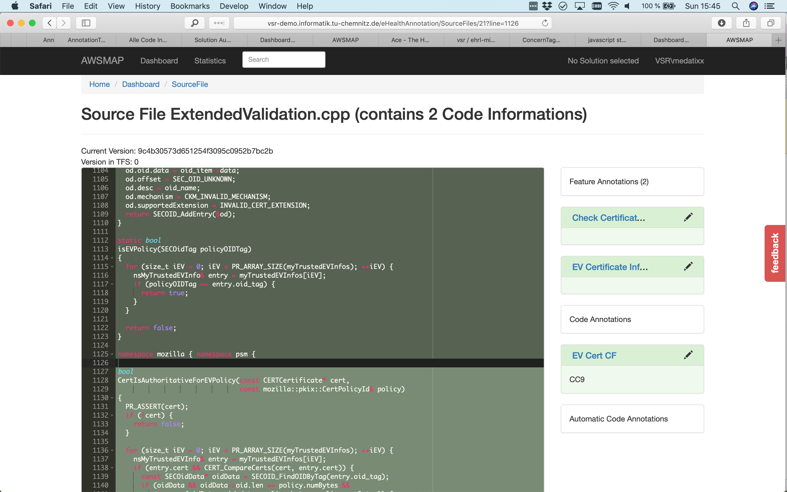{#fig:awsmap.editor}


ConcernTagger [@Eaddy2008aConcernTagger] is a conceptually similar tool, but it does not provide a web-based user interface and is a separate tool in contrast to the integrated AWSMAP platform.

One of the core concepts of AWSMAP derived from principle P1 is referenceability of all artifacts and knowledge through URLs. This implements a hypertext-based navigation of the legacy information hyperspace [@Tilley1996ProgramUnderstanding] and fosters integration by making knowledge linkeable in internal email or chat communications, intranet wikis, blogs etc.

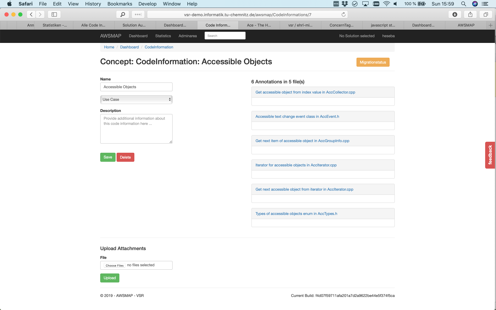{#fig:awsmap.concept}

For Management stakeholders, AWSMAP provides a user interface with different statistics to monitor progress and visualizations of the concept structure. [@fig:awsmap.statistics] show Annotator statistics. [@fig:awsmap.sankey] shows a Sankey Diagram of artifact (left side) feature (right side) interlacing, other available visualisations are Force Graphs, and Chord diagrams.

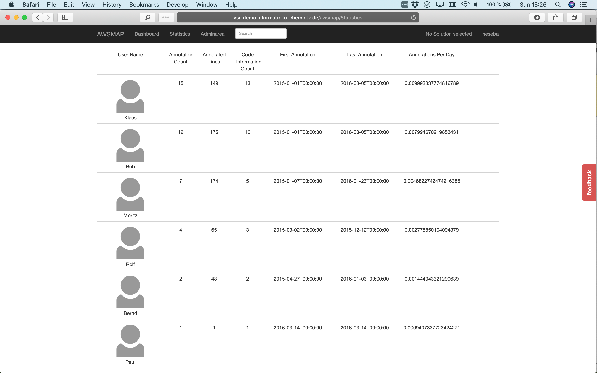{#fig:awsmap.statistics}


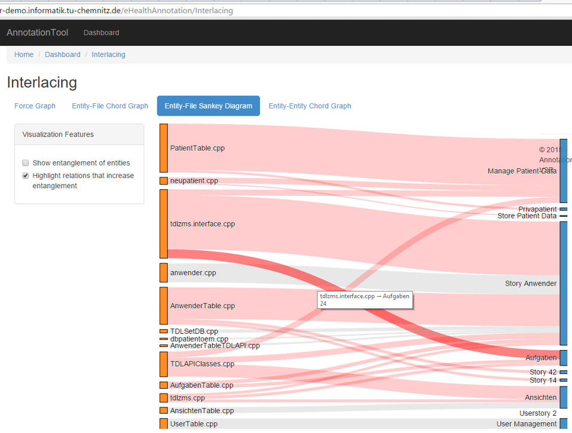{#fig:awsmap.sankey}

#### Integration {#sec:re.impl.integration}

{#fig:awsmap.integration}

This subsection addresses integration aspects of AWSMAP as shown in [@fig:awsmap.integration]. Software engineers of ISVs create and manage artifacts of a software system using an environment of development tools. To support creation, typically *Integrated Development Environments (IDEs)* are used. Reverse engineering tools should be integrated into development environments to facilitate adoption by migration engineers instead of being built as separate tools [@Muller2000]. Thus, AWSMAP supports integration into IDEs via its RESTful API. The implementation in the context of [@sec:scenario] is realised as Visual Studio Extension. Paper prototypes and interactive MS PowerPoint-based wireframes were used for collaborative design (cf. Co-Creation [@HCD2015]) of the IDE integration with ISV Software Engineers. [@fig:awsmap.ide] shows creation of a new annotation in the Visual Studio Extension.

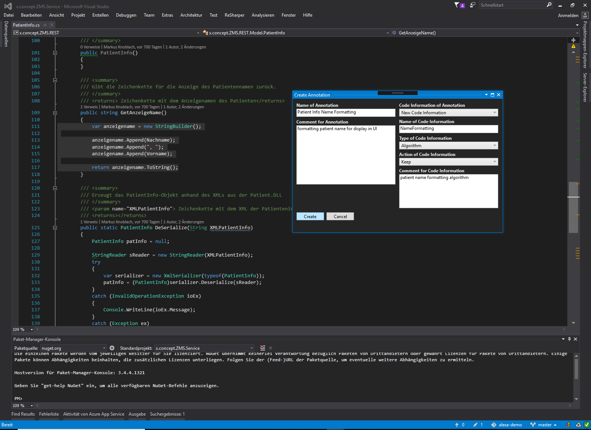{#fig:awsmap.ide}

For typical ISVs, the artifacts of legacy system $\mathfrak{L}$ are under version control using a *Version Control System (VCS)*. AWSMAP supports VCS-integration by implementing the "load codebase" step in [@#fig:awsm.re.setup] as import from an existing VCS repository. In the context of [@sec:scenario], VCS integration was implemented using the Team Foundation Server (TFS) REST API^[https://docs.microsoft.com/en-us/rest/api/azure/devops/?view=azure-devops-rest-5.0]. The operator specifies the TFS instance configuration and repository URL in the AWSMAP web.config in the "configure toolchain" step of [@#fig:awsm.re.setup] and can then trigger import and parsing of the codebase from TFS VCS via the Admin Dashboard.

For tool integration for Management stakeholders, AWSMAP integrates with TFS *project management* capabilities via the TFS REST API. Integration with ongoing agile development is achieved in the context of the TFS Scrum Process Template. The migration packages described in [@sec:re.conceptual.integration] are represented as work items of type feature, its contents as backlog items with parent relationships to the migration package. URLs pointing to the corresponding entity in AWSMAP are added to the descriptions and URLs to the entity in the TFS web UI are added to AWSMAP entities in order to allow switch between the two contexts. [@fig:tfs-integration] shows a screenshot of the definition of a migration package in AWSMAP.

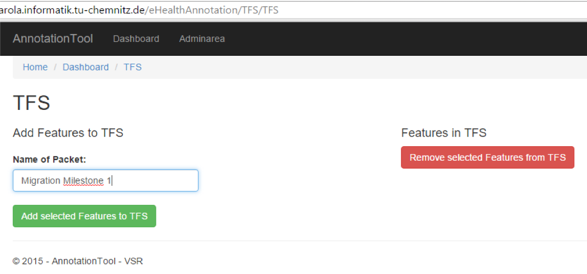{#fig:tfs-integration}

The last integration aspect is *authentication and authorisation* of users. ISVs typically operate an Identity Provider to restrict access to their company-internal resources. In the context of [@sec:scenario], *Active Directory (AD)*^[https://docs.microsoft.com/de-de/windows-server/identity/active-directory-federation-services] is used, thus AWSMAP integrates with AD for federated authentication.

#### Queryable External Representation {#sec:re.impl.representation}

As introduced above, the external representation of the SCKM is achieved through an *ontology of knowledge in legacy systems*. Following principle P1, the representation is based on open web standards: for describing the ontology OWL and SWRL^[https://www.w3.org/Submission/SWRL/] is used, querying is supported via a SPARQL endpoint, the OWL classes referring to legacy system artifacts are a mapping from KDM to OWL and for modelling annotations the W3C Web Annotation Data Model^[https://www.w3.org/TR/annotation-model/] (OA) is used, to allow for portability and sharing across tools as in [@Diaz2019OpenAnnotationInSLRs]. Usage of OA is in line with recent efforts addressing standards-based data portability for research data [@Diaz2019OpenAnnotationInSLRs] and sharing platforms like hypothes.is^[https://hypothes.is]. The ontology was designed using Protégé^[https://protege.stanford.edu/]. [@fig:ontology] shows a UML visualisation of the main OWL classes. The two main classes, Feature and DomainKnowledge and the knowledge types are mappings of the KDM-based SCKM and have been defined in [@sec:formalisms]. The SCKM annotation $a=(k, l)$ is modelled as OA annotation, with the object properties `oa:hasBody` pointing to the knowledge payload $k$ and  `oa:hasTarget` to location $l$. Valid bodies are `Feature` and `Knowledge`. To model the target $l = (s,f)$, an `oa:SpecificResource` is used, that references the legacy artifact $f$ (a KDM SourceFile) as URI via `oa:hasSource`. Segment $s=(\alpha, \omega)$ (a KDM SourceRegion) is represented as `oa:TextPositionSelector` via the `oa:hasSelector` property. The start $\alpha$ and end $\omega$ of the segment are 0-based index numbers in the character stream of $f$ represented as `oa:start` and `oa:end`.

{#fig:ontology}


The external representation of the knwoledgebase $\mathbb{K}_{B}$ for system actors is thus a set of RDF^[https://www.w3.org/RDF/] triples according to the ontology introduced above, serialised in one of the RDF notations (e.g. N3, Turtle, XML etc.) available. This allows for interoperability based on open web standards and supports querying via SPARQL. In particular, reasoning capabilities can support complex use cases. This can be demonstrated with the following example. When querying the knowledgebase via the AWSMAP SPARQL endpoint, queries can become unnecessarily complex due encoding location-related semantics in the query. Querying all knowledge within a certain area $s_a$ in an artifact $f$, the semantics of containment need to be expressed like:

```FILTER((?end > ?astart && ?end <= ?aend) || ?start >= ?astart && ?start < ?aend ).```

This definition of 1-dimensional containment is part of the domain modelled by the OWL ontology and should not need to be encoded, neither in queries nor explicitly in the data. Similar to GeoSPARQL^[http://www.geosparql.org/], a query should simply state

```?annotation sckm:within ?area```

Likewise, complex relationships like knowledge-influences-feature should be interfaced as simple triple patterns. To realise this, the ontology defines additional rules using the *Semantic Web Rule Language (SWRL)*. It allows to define inference rules based on which additional triples are asserted into the knowledge graph. The following shows the SWRL rule for the influences relationship:


``` {#lst:swrl}
oa:Annotation(?AF) ^ oa:Annotation(?AR) ^ sckm:Feature(?F) ^ sckm:Knowledge(?R) ^ oa:body(?AF, ?F) ^ oa:body(?AR, ?R) ^ oa:SpecificResour- ce(?SR) ^ oa:SpecificResource(?SF) ^ oa:target(?AF, ?SF) ^ oa:target(?AR, ?SR) ^ oa:source(?SF, ? S) ^ oa:source(?SR, ?S) ^ oa:TextPositionSelector(?TR) ^ oa:TextPositionSelector(?TF) ^ oa:selector(?SF, ?TF) ^ oa:selector(?SR, ?TR) ^ oa:start(?TR, ?sr) ^ oa:start(?TF, ?sf) ^ oa:end(?TR, ?er) ^ oa:end(?TF, ?ef) ^ swrlb:greaterThanOrEqual(?er, ?sf) ^ swrlb:lessThan(?sr, ?sf) ^ swrlb:greaterT- hanOrEqual(?ef, ?er) => sckm:influences(?R, ? F)
```

#### Crowdsourcing {#sec:csre.impl}

This subsection outlines the implementation of CSRE Concept Assignment by addressing the three challenges introduced in [@#sec:csre]. For experimentation with CSRE Concept Assignment on the bespoke crowdsourcing platform *microWorkers*^[ https://microworkers.com/], AWSMAP was extended with the following features. CSRE Management facilities were added for defining scope, configuring and starting CSRE projects. Crowdworker views (cf. [@fig:crowdview]) were added as external representation for crowd Annotators, showing information required for the microtasks, and handling token-based authentication of crowdworkers. Result Analysis views were added for judging the progress and outcome of CSRE as in [@fig:crowdstatistics] and [@fig:crowdrationales]. Finally the features described in the follwing were implemented to address the three main challenges of CSRE. A more detailed description can be found in [@Heil2018CSRE;@Heil2019CSRECCIS]. 

**Automatic Extraction and Creation of Crowdsourcing Tasks from $B$** 

In [@#sec:csre] the AWSM:RE Concept Assignment was reformulated as classification problem and the similarity with microtasking was demonstrated. To apply the microtasking model, self-contained, simple, repetitive, short microtasks are required by automatically dividing $B$ into *code fragments* for classification through static analysis. Three *classification task extraction properties* are required: Automation, Legacy Language Support and Completeness of References [@Heil2018CSRE;@Heil2019CSRECCIS]. *Automation* means that no additional user interaction must be required. This can be achieved by documentation tools, syntactic analysis tools or syntax highlighters. *Legacy Language Support* is important since static analysis is language-specific. Relevant commonly used^[cf. https://spectrum.ieee.org/at-work/innovation/the-2018-top-programming-languages] legacy languages, in particular C, C++, Java should be supported. Crowdworkers require sufficient information for classification: control and data flow need to be available. Thus, *Completeness of References* for the code referenced in a code fragment is required. A comparative feasibility study with students showed that documentation tools are the best suited alternative, since production-grade implementations exist for most programming languages, they keep track of referenced parts of source code and they work completely automatic. The implementation of step 2 in [@fig:crowdprocess] runs Doxygen^[https://www.stack.nl/~dimitri/doxygen/] on $B$ and parses the generated documentation artifacts to identify relevant code fragments and referenced code.

**Balancing Controlled Disclosure of Proprietary Source Code with Readability**

The open classification call to a potentially large and unknown group of workers [@Latoza2016] means publishing task contents, bearing the risk of uncontrolled use of the code fragments, e.g. through competitors of the ISV. Proper source code anonymization is required to prevent unintended use, but must be balanced with the readability of the source code allowing the crowd to achieve the classification. This balance is reflected in the following three *anonymization properties*, a suitable approach must: *prevent identification of software provider, software product and application domain*, *maintain control flow and all information relevant for classification*, and *avoid negative impact on readability of the source code* [@Heil2018CSRE;@Heil2019CSRECCIS]. Common code obfuscation techniques are not sufficient as they target readability, but an adapted form of *identifier renaming* [@Ceccato2014] is required, extended to all parts of code that contain *identification information* residing in three loci: identifiers, strings and comments. *Classification information*, that represents relationships between entities in the code should be kept. The CSRE Anonymization Algorithm [@Heil2019CSRECCIS] in TODO:Algorithm_from_CCIS implements  step 3 in [@fig:crowdprocess] and takes a PSM resulting from the static analysis of the task extraction step and a list of identifiers and automatically generates a replacement mapping for the different types of identifiers. The mapping represents simple relationships like generalization and class-instance. We assessed the readability of the anonymised code through a brief experimental validation [@Heil2019CSRECCIS] with employees of an SME-sized ISV who rated the readability of anonymized code fragments on a five-level Likert scale (agreement 1-5 for ”The code is easy to read”). Code obfuscation ranked near-unreadable (0.7), CSRE Anonymization (3.7) performed slightly better than the naive approach using dictionary replacements (3.2).

TODO:ALGORITHM

**Aggregation of Results and Quality Control** 

Aggregating potentially contradicting results from unknown crowdworkers and ensuring quality is a challenge [@Stol2014;@Weidema2016CrowdDesign;@Nebeling2012] to be addressed to justify the ISV'S investment. Originating in different experience levels of the crowdworkers and fake answers may lead to poor classification precision. Thus, quality-control design-time (Worker selection, Effective task preparation) and quality control run-time approaches (*Ground truth, Majority consensus*) are required [@Allahbakhsh2013], constituting the *Quality control and results aggregation properties*. CSRE Concept Assignment uses *reputation-based worker selection* based on previous crowdworker ratings. For our experiments on microWorkers.com, we restricted participation to the “best workers” group. *Effective task preparation* comprises clear and unambiguous task description and *defensive design* [@Allahbakhsh2013]. The crowd worker view in [@fig:crowdview] provides code fragments and references with syntax highlighting, available concepts to assign and requires min. 50 characters of justification per classification. This slows down fake contributions and enables filtering and analysis. The *compensation policy* is a combination of monetary and non-monetary rewards: quality contributions receive 0.30 USD and a positive rating. The *Ground Truth* approach is used as runtime quality control: classification tasks with known solution are added to allow calculation of the individual user score $S(w_i) \in [0,1]$ for each crowd worker $w_i\in W$ by comparing amounts of correct $C^+_{w_i}$ and incorrect $C^-_{w_i}$ classifications as in [@eq:userscore]. This score can be used as weight factor in results aggregation.

$$S(w_i) = \frac{|C^+_{w_i}|}{|C^+_{w_i}| + |C^-_{w_i}|}$$ {#eq:userscore}

*Majority Consensus* is used for aggregating results from different crowdworkers. For each code fragment, classifications $C\subset W \times A$ are tuples of a worker $w_i \in W$ and an annotation by that worker, expressed as class $c_k \sim a, a\in A$. This creates a voting distribution $V: A \mapsto [0,1]$ for each possible class $c_k$ as in [@eq:voting].

$$V(c_k) = \frac{\sum\limits_{(w,c)\in C | c \in c_k} S(w)}{\sum\limits_{(w,c)\in C} S(w)}$${#eq:voting}

The aggregated result, the consensual classification $c^*$ is then calculated from majority consensus as in [@eq:consensus].	

$$c^*=\underset{c \in A}{\operatorname{arg\,max}}\, V(c)$${#eq:consensus}

For cases where no clear majority can be found, an overview on result distributions ([@fig:crowdstatistics]) and a display of crowdworker rationales (explanations) (@fig:crowdrationales) was implemented.

{#fig:crowdstatistics}


{#fig:crowdview}

## Evaluation

This section evaluates AWSM:RE regarding the requirements in [@sec:re.requirements]. Effectiveness and Efficiency are assessed in detail in [@sec:csre.experiment].

**Effectiveness** The effectiveness of AWSM:RE for knowledge rediscovery is achieved through specification of a concept-assignment-based reverse engineering technique, which systematically discovers, assigns and manages knowledge in the legacy system. A detailed evaluation of results quality is presented in [@sec:csre.experiment].

**Efficiency** The efficiency of AWSM:RE is achieved through reformulation of concept assignment for crowd annotators. This reduces the resource demand for the ISV by moving the work from ISV staff to the crowd. A detailed evaluation showing the results achievable with very limited financial resources is presented in [@sec:csre.experiment].

**Expertise** The expertise requirement is addressed in AWSM:RE by reusing the results of the cognitive process of program comprehension for forward engineering and by automating decomposition of the reverse engineering activity of concept assignment into microtasks that are solved leveraging crowd expertise. While web migration activities always pose some expertise demands for ISV staff in new fields, AWSM:RE conditionally meets the expertise requirement as it is a method that is feasible with available staff assuming a general understanding of software engineering activities and learning capability.

**Integration** Integration is one of the core design maxims of AWSM:RE. [@sec:re.conceptual.integration] presented the conceptual model of integration of knowledge discovery into ongoing development and maintenance activities following the continuous reverse engineering paradigm and [@sec:re.impl.integration] presented implementation of the integration aspects in the AWSM platform through connection of AWSMAP with core components of ISVs' development environment Thus, AWSM:RE meets the integration requirement.  

**Knowledge Management** The knowledge discovered through AWSM:RE is represented based on open web standards like OWL, RDF and OA as described in [@sec:representation] and [@sec:re.impl.representation] and is available for integration with different model-driven or non-model-driven methods as in [@sec:re.conceptual.integration] through its external representation for subsequent human use via the web-based user interface and for system use via the queryable interface based on SPARQL as described in [@sec:re.impl.representation]. Thus, AWSM:RE meets the knowledge management requirement.

### Experimental Evaluation of CSRE {#sec:csre.experiment}

As the concept of CSRE, i.e. application of the crowdsourcing paradigm to reverse engineering, is novel, we conducted evaluation experiments [@Heil2019CSRECCIS]. The results provide a basis for assessing efficiency and effectiveness of AWSM:RE for crowd Annotators. Furthermore, the analysis aimed at exploring suitability of crowdworkers for CSRE and exploring crowdworker behaviours.

**Setup** The automatic task extraction described above was used to pre-process the codebase of BlogEngine.NET^[http://www.dotnetblogengine.net/], from which 10 code fragments were randomly selected. Length distribution of the fragments was between 7 and 57 LOC, average 25.4 LOC. The set of classes $\overline C$ was formed from the 8 domain knowledge types of the SCKM ontology (cf. [@fig:ontology]) as concepts to be assigned to the fragments. All 10 fragments were manually classified, so that the *test dataset* consisted of 10 classified code fragments which formed the ground truth as baseline for assessing crowdworker results. Experiments were run on the crowd-extended AWSMAP with microWorkers as crowdsourcing platform, restricted to the "best workers" group. 

**Procedure** A classification campaign was run for 14 days between March 14th and March 28th 2017 with 0.30 USD - platform average at this time - as financial reward per 3 classifications. The crowdworkers were presented a detailed explanation of the classification task and the available classifications and then used the crowdworker view to perform the classifications. The integration mechanism of microWorkers for external web applications is an IFrame. 3 code fragments were randomly selected from the pool of 10 fragments available and classified by the crowdworkers, who could repeat the classification until less than 3 fragments not classified by them were available. To observe the crowdworkers behaviour, `focus` and `blur` events in the crowdworker view were used to track the time spent.

**Experimental results and descriptive statistics** 

TODO:TABLES

34 unique crowdworkers participated in the experiment, contributing 187 classifications on our test dataset. The results are shown in TODO:table-results [@Heil2019CSRECCIS]. On average, 16 crowdworkers created 18.7 classifications per code fragment. $CF$ are the ten code fragments, Consensus indicates the result of the consensus voting. The numbers of classifications per category are stated in the categories cells. Bold values are the maxima, which are the basis for the majority consensus. Grey background marks the correct classification of the code fragment. Descriptive statistics of the results are shown in TODO:table-statistics [@Heil2019CSRECCIS], where $|C|$ is the number of classifications and $|W|$ the number of crowdworkers. Note that the crowdworker and classification numbers differ due to multi-selections. The code fragment length in LOC is stated in $l$, $\Sigma t$ reports the overall time spent, $\overline t$ is the average time. Times are reported in seconds. The error rate $f_e$ (cf. [@eq:errorrate])

$$f_e = \frac{|C^-|}{|C|}$${#eq:errorrate}

is the ratio between false classifications $C^-$ and all crowdworker classifications $C$ of a code fragment. In order to investigate indicators of (dis-)agreement between individual crowdworkers for quality control, TODO:REF_TABLE_STATISTICS includes Entropy $E$ (cf. [@eq:entropy])

$$E = - \sum\limits^k_{I=1}f_i \lg f_i$${#eq:entropy}

and normalised Herfindahl dispersion measure $H^*$ (cf. [@eq:herfindahl])

$$H^*=\frac{k}{k-1}\left(1-\sum\limits_{i=1}^{k}f_i^2\right)$${#eq:herfindahl} 

from the relative frequencies $f_i$ of the classifications in the $k=8$ classes. $E$ And $H^*$ both indicate disorder/dispersion among the crowdworkers: unanimous classifications yield $E=H^*=0$. The higher the disagreement, the more different classifications, the closer $E$ And $H^*$ get to 1. Thus, they are used as indicators of classification certainty.

**Quality and classification certainty analysis** 

An average error rate of 0.655 seems high at first. However, through majority consensus 7 of 10 code fragments were classified correctly. The minimum error rate was .25 on fragment B and the maximum 1 for fragment I. Provided a small expertise variation of the participating crowd workers, this indicates differences in the difficulty (fragment I was one of the longest) and the understanding of the categories. Rule was the concept most frequently assigned (23.5%), Persistence & Data Handling (21.9%) second, was Deployment the least selected (5.3%). No majorities were achieved for the Business Process and Explanatory concepts, indicating that they might not be described clear enough for the crowdworkers. All other categories were correctly classified by the respective majorities.

Average of entropy and Herfindahl dispersion measure are  $\overline E = 0.639$ and $\overline{H^*} = 0.757$, their minima co-occur with minimal error rate, their maxima with the second-highest $f_e$. There is a significant ($\alpha=0.05$) positive correlation (Pearson's $\rho=0.724$, $p=0.018$) between $f_e$ and $E$ and between $f_e$ and $H^*$ ($\rho=0.757$, $p=0.011$), i.e. the more crowd workers voting a concept, the less likely it is a wrong classification. No clear majorities for wrong classifications were observed, supporting the basic crowdsourcing principle *"wisdom of the masses"* and the majority consensus assumption, that majorities are indicative of correct answers.

No correlation between length of code fragments and classification time was found, indicating influence of other variables such as different levels of difficulty/clarity of the classification. Considering correctness, correct classifications showed fewer time outliers^[we use $Q3 + 1.5 \text{ IQR}$ as outlier threshold] than wrong classifications. A likely interpretation is that longer classification time and explanations are indicative of uncertainty, leading to wrong classifications in most observed cases. Most outliers in [@fig:scatterplots-c] belong to *Persistance & Data Handling*, the second most frequently voted, and indicating that the formulation of this concept is not clear enough.

**Crowdworker behaviour analysis** 

Crowdworker behaviour was analysed through consideration of the distributions of time and explanation length, as well as derived length-time ratio and average explanation similarity per worker as shown in [@fig:csre-boxplots]. Time median was $\tilde t=​$ 117.5s, but the observed times varied widely. The inter quartile range was at IQR = 143.25s while upper outliers reached near half an hour (1606s). The relatively low times (Q1 at 65s,  min time 6s) show the microtask nature, but also point to fake contributions as described below. However, longer times do not imply better accuracy: all but one time outlier in [@fig:csre-boxplots-a] belonged to $C^-​$. The results of one particular crowdworker showed suspiciously identical time measurements (3x14s, 3x33s, 3x515s) and identical explanations in all three groups, most likely resulting from use of a record-and-replay script.

Explanation lengths in [@fig:csre-boxplots-b] range from 51 to 1017 characters (median
$\tilde{d}​$=119) and are relatively close (IQR=100.5) to the min. threshold of 50 chars of explanation. Most of the crowdworkers wrote rather short explanations in short time, as visible from the lower quartile of 76.25 chars and outliers for time and length only appearing above Q3. [@fig:scatterplots] shows explanation length and time in relation, with correct classifications in green and wrong in red.

**Analysis of fake contributions** 

Cheating is an issue for quality of crowdsourcing [@Allahbakhsh2013]. Observations in time and explanation length distributions revealed that some crowdworkers tried to gain the reward quickly through fake contributions. To identify very fast classifications, length-time ratio^[measured in characters per second (cps)] was calculated. As shown in [@fig:csre-boxplots-c], within a range of 0.13 to 61.2 cps, the majority of values is distributed very closely (IQR 0.96 cps) around a median of 0.94 cps. Analysis of the 20 outliers showed that they are likely to have copied texts. These copies were most often copies of own previous explanations and in some cases from the task description. As the measured time does not only include time for typing the rationales in the explanation field, but also source reading, understanding, deciding and selecting the classification, very high length-time ratios were only reachable if little time was spent for thorough consideration, as evident by only 4 of 20 outliers belonging to $C^+$. In any case, speeds are not likely to exceed the upper level of 16 cps measured at competitions^[cf. http://www.intersteno.org/]. However, 7 crowdworkers exceeded this level. Manual analysis of explanations provided by the outliers determined the fastest worker not to copy text and to classify correctly at approx. 6.6 cps. The upper quartile at 1.63 cps, the vast majority of crowdworkers produced results in reasonable time.

To further identify workers completing the tasks very quickly through copying, average similarity of explanations per user was calculated using pairwise Levenshtein distance. The averages range from 39 to 287 and are concentrated (IQR=54.5) around a median of 83.8
(cf. [@fig:csre-boxplots-d]). Identical copies (distance 0) were recorded from 10 of 34 (29.4%) workers, but the minimum Levenshtein average of 39 indicates that crowd workers did not exclusively copy. Normalized with $\overline l​$, two workers had even less than 50% relative changes, copying most explanations with only minor adaptions. Manual inspection of responses showed that 3 of 34 exclusively put code in their explanations, indicating a wrong understanding of the task.

**High crowdworker commitment**

In contrast to the negative cases analysed in detail above, also very thorough workers have been observed: Fragment J was split-voted as Persistence/Deployment assignment. The explanations argued that J is related to persistence because the fragment is part of a class related to persistence. This observation was
very interesting, because our dataset did not include the code of the surrounding class. Thus, several crowd workers looked up the sample on the web and read also the surrounding parts from an external source in order to classify. This level of active commitment and investment of time by the crowdworkers
to complete their task was positively surprising.

**Threats to Validity**

The experiments conducted in the context of this thesis all comprise an analysis of threats to validity. This analysis is structured according to the three different types of validity: construct validity, internal validity and external validity. *Construct validity* is the validity of the experimental design, determining whether the measured indicators are appropriate for the intended construct as abstraction of the latent variables. *Internal validity* is the validity of cause-effect relationships observed in an experiment established by ruling out alternative explanations as originating from systematic error. *External validity* is the validity of generalization based on the results of an experiment. [@Creswell2014ResearchDesign]

*Construct validity* of this experiment is threatened the explanations for the available classes in $\overline C$ which may have lead to differences in the understanding across crowd workers. However, these differences are also expected when operationalising the CSRE method and are addressed by the multiple redundancy of classification results. Another threat to construct validity is the relatively hidden possibility to assign several classes. As only very few crowdworkers used this functionality, their impact on the results is limited. The third threat to construct validity are random classifications. These were, however, expected and addressed both through the quality control measures and our detailed analysis of fake contributions showing, that the vast majority of contributions was appropriate and that the quality control measures are effective in mitigating the effects of fake contributions. The measured error rates are valid indicators of the desired classification quality required for ISV usage, as higher errors lead to more effort for checking the results, lowering the advantage of employing crowdsourcing. 

*Internal validity* of this experiment is threatened through potential subjective biases. This is addressed through a purely tool-based interaction with the test subjects, i.e. the crowdworkers. There was no interaction between the researchers and the test subjects, all test subjects used the exact same experimental setup, which was unchanged throughout the entire experimental timespan. There were no hints towards the correct or expected classification result in the user interface and the test objects, i.e. the code fragments, were randomly assigned to the test subjects, avoiding the bias of improved results through learning over time on specific code fragments. The 14 days experimentation timespan reduces the test subject selection bias, allowing persons of different time-availability, e.g. weekend-only vs. weekdays, business hours vs. evening, to participate. 

*External validity* of the experiment is threatened through limitations in the generalizability of results. The main factor are the test subjects who conducted the experiment. As described above, the two weeks experimentation period reduced test subject selection bias, so that the 34 participating crowdworkers from the microWorkers crowdsourcing platform can be considered sufficiently representative of the quality characteristics for crowdworkers on this general-purpose crowdsourcing platform. While the results cannot be generalised to arbitrary platforms, we would expect an even better quality on a dedicated software development platform such as topcoder^[https://www.topcoder.com]. The test objects, i.e. the code fragments, limit generalisability of results since they are selected from one specific technology and platform, C# and Microsoft .NET. However, we expect results for other technologies and platforms used in legacy systems such as Java Swing, C/C++ MFC to be at least similar due to higher popularity^[cf. TIOBE Index https://www.tiobe.com/tiobe-index/] and therefore greater availability of crowdworkers experienced in this technological base. 

**Conclusion of CSRE Experimentation**

In spite of the cases of low quality and fake contributions reported
above -- a known and expected characteristic of crowdsourcing [@Allahbakhsh2013] -- the CSRE quality control measures proved robust enough to yield 70% overall correctness. The experiment has shown that the expertise level of the best crowd workers group on crowdsourcing platform microWorkers in combination with CSRE quality control is sufficient to perform the reverse engineering classification activity and produce decent results. The overall correctness of 70% is a good result similar to what can be achieved by a single expert performing the same task. However, with less than 20 USD expenses for classifying the ten code fragments, crowdsourcing is a significantly
more cost-effective solution. The results indicate that crowdsourcing can be applied to perform AWSM:RE Concept Assignment reformulated as classification problem, when it is automatically broken down into microtasks and the process is guided by CSRE quality control methods. CSRE Concept Assignment defines a novel manual knowledge rediscovery approach reducing the resource demand for ISVs through crowdsourcing. Thus, the requirements effectiveness and efficiency requirements from [@sec:re.requirements] are met.

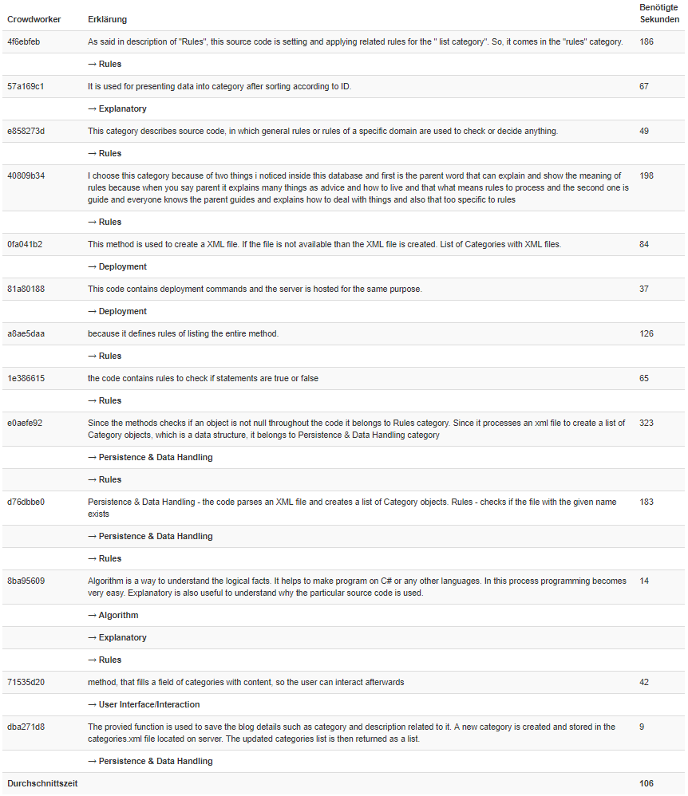{#fig:crowdrationales}


<div id="fig:csre-boxplots">
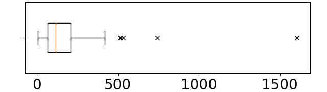{#fig:csre-boxplots-a width=50%}
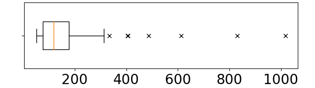{#fig:csre-boxplots-b width=50%}
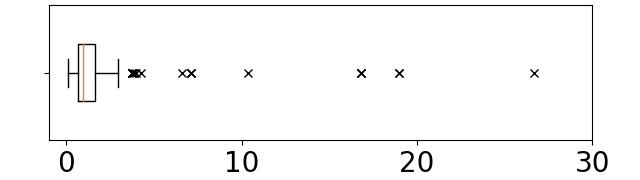{#fig:csre-boxplots-c width=50%}
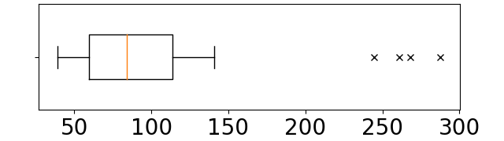{#fig:csre-boxplots-d width=50%}

Classification Time and Explanation Length 1-dimensional Distributions [@Heil2019CSRECCIS]
</div> 

<div id="fig:csre-scatterplots">
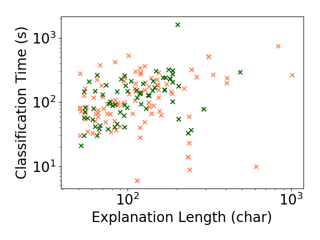{#fig:scatterplots-a
width=52%}
{#fig:scatterplots-b width=50%}
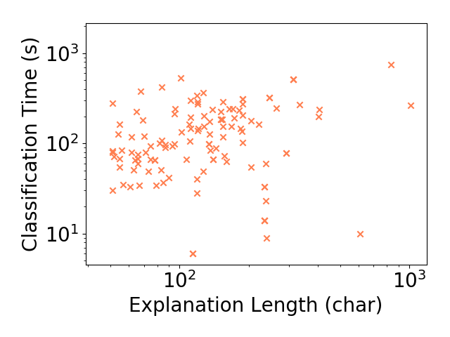{#fig:scatterplots-c width=50%}

Classification Time and Explanation Length (log scaled) [@Heil2019CSRECCIS]
</div> 

## Summary

This chapter presented the AWSM Reverse Engineering method, which facilitates problem and solution domain knowledge rediscovery for ISVs with limited resources, specifying a novel crowdsourced concept assignment strategy. AWSM:RE integrates with ongoing development as well as with other web migration methods leveraging a queryable open web standards based knowledge representation. The conceptual model and implementation of AWSM:RE have been described. Experimental evaluation has shown feasibility of the approach, quality of its results and low related cost and effort. It has furthermore provided insights on crowdworker behavior and suitable quality control measures.