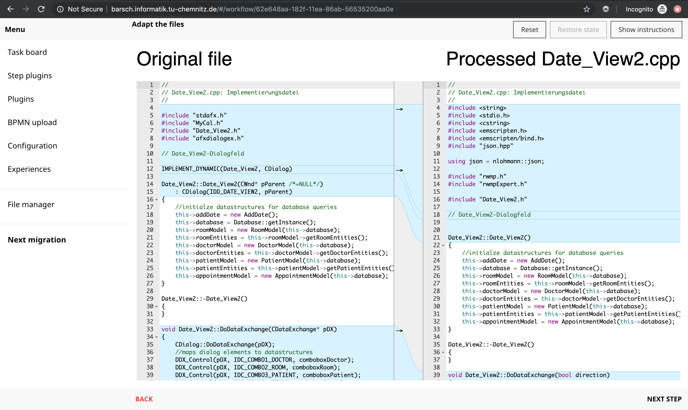
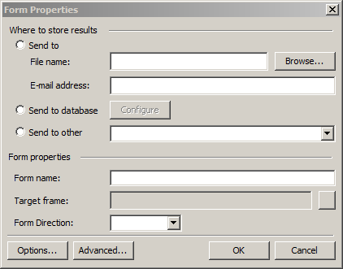
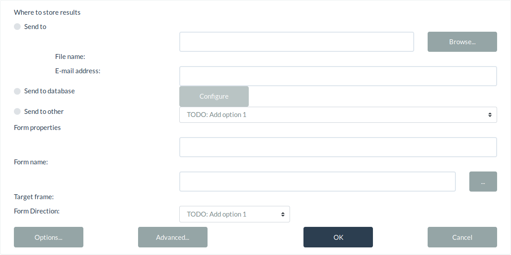

# AWSM Risk Management Method {#sec:awsm-rm}

This chapter addresses research objective RO3:

> To provide a risk management method, models and tools that demonstrate desirability and feasibility of a potential web-based version of the legacy system with limited resources and lack of web engineering expertise.

Following an analysis of the current situation, identification of requirements and a review of related work, a conceptual model and implementation of the AWSM:RM method consisting of three mechanisms to address RO3 are described. The method is evaluated against the requirements and the evaluation is supported by three experiments which include analysis of both empirical evaluations and objective measurements.

## Research Questions

To design and evolve a solution for research objective RO3, this chapter addresses three research questions:

> **AWSM:RM Research Question 1**: How to demonstrate desirability and feasibility of a potential web-based version of the legacy system with limited resources and lack of web engineering expertise?

> **AWSM:RM Research Question 2**: How to transfer the rapid prototyping paradigm into a web migration context? 

> **AWSM:RM Research Question 2**: How to provide guidance and automation for rapid web migration prototyping to enable execution with limited web engineering and web migration expertise? 

## Analysis

The detailed problem analysis conducted in [@sec:problem-analysis-results] on the basis of the field research results has revealed *doubts about desirability* and *doubts about feasibility* as two main factors rendering ISVs hesitant to commence a web migration. *Feasibility studies* are the most common risk management approach, employed by 7 of the 23 approaches assessed in [@sec:approaches]. They are often conducted as *pilot migration projects*, i.e. migration trials with a restricted scope that migrate a small portion of the legacy system in order to identify insuperable technical obstacles as early as possible [@Sneed2010SoftwareMigration], to test the migration process and toolchain [@AmazonWebServices2018Migration] and to facilitate an informed decision in favour or against commencing a full-scale migration [@Sneed2010SoftwareMigration]. Examples of this can be seen in the "first migrations" of AWS Migration [@AmazonWebServices2018Migration], SMART-MP [@CMUSoftwareEngineeringInstitute2013a] in SMART [@Lewis2005SMART;@Lewis2008SMART] and the experimentation-based feasibility studies in IC4 [@Fowley2018Experimentation]. 

However, these feasibility studies and migration pilots put the main focus on technical feasibility of the migration itself. They fail to create *concrete and tangible results* which allow to assess the *plausibility of a web-based version* of the legacy system and the desirability with regard to *advantages of web systems* (cf. also to RIA features in [@Rodriguez-Echeverria2012MIGRARIA]). In forward engineering, Prototyping [@Wallmueller2001SoftwareQuality] and in particular *Rapid Prototyping* [@ISO/IEEE24765Vocabulary;@Gordon1995RapidPrototyping] is used as *effective risk management technique* [@Wallmueller2001SoftwareQuality] for risk reduction [@ISO/IEEE24765Vocabulary] to address desirability and and feasibility in early stages, allowing to create a running software prototype as concrete and tangible result [@Alavi1984]. In Web Engineering, especially through widespread use of agile development [@Abrahamsson2002Agile] and transfer of ideas from HCD/Design Thinking [@HCD2015] putting more emphasis on customers' perspective and feedback, quick creation of cheap, throw-away versions representing the core functionality and characteristics of the envisioned web system has become industry practice as it enables discussing solution alternatives and facilitates communication with stakeholders [@Alavi1984;@HCD2015]. This communication and risk reduction can accelerate modernization plans [@ForresterResearch2011Modernization] by addressing resistance within the organization [@Khadka2014ProfessionalsModernization;@Sneed2010ReMiP] making reasons and consequences of modernization visible. In this way, prototypes represent a concrete and tangible contribution to the business case that serves as means of communication for stakeholders to support decision making.

Web migration, however, is inherently different from forward Web Engineering. While a prototype in forward Web Engineering is created from scratch based on early and potentially unclear versions of requirements, a *web migration prototype* is built based on elaborate requirements represented by and potentially recovered from an existing and mature legacy system already known to stakeholders and source of their expectations. This *brownfield* [@Hopkins2008Brownfield] situation constitutes the main difference between web migration and forward web engineering. An ISV employing Rapid Prototyping for forward Web Engineering can rely on a staff base with Web Engineering expertise that can leverage open web standards like HTTP, HTML, CSS, JavaScript and popular Web Development platforms and frameworks like node.js^[https://nodejs.org/], Rails^[https://rubyonrails.org/], React^[https://reactjs.org/], Angular^[https://angular.io/] to quickly create running prototypes. In contrast, an ISV as described in [@sec:company-characteristics] has a staff base with expertise in legacy platforms like C, C++, Java and desktop application frameworks like MFC, WPF^[https://msdn.microsoft.com/en-us/library/aa663364.aspx], Swing^[https://docs.oracle.com/javase/8/docs/technotes/guides/swing].

Rapid Prototyping is therefore not directly applicable to Web Migration. The Rapid Prototyping paradigm needs to be adapted to the characteristics of migration and the situation of ISVs with non-web legacy desktop software, following principle P4. Thus, the challenge is to specify a suitable risk management method for quick creation of concrete tangible prototypes of a web-based version of the legacy desktop system that can be used to demonstrate desirability and feasibility for communication decision making of migration stakeholders with limited resources and web engineering expertise.  

### Requirements {#sec:rm.requirements}

The following requirements have been derived based on RO3, the analysis presented above and the AWSM principles.

**Effectiveness** Risk management should be enabled through creation of concrete, tangible results allowing to demonstrate desirability and feasibility of web migration.

**Efficiency** Creation of web migration prototypes should be supported by tools to require fewer resources compared to manual creation.

**Expertise** Creation of web migration prototypes should be feasible with available expertise of the ISV's staff.

**Reuse** Creation of web migration prototypes should reuse existing functionality from the source legacy system.

**Plausibility** The web migration prototypes should enable assessment of plausibility of a web-based version of the legacy system by representing major architectural changes: Client/Server communication, URL-based navigation and UI Rendering in a web browser. TODO:extend

### Related Work {#sec:awsm-rm:related-work}

**Prototyping in Software Engineering** is an established practice for requirements clarification and validation of understanding of elicited requirements [@SWEBOK2014;@Wood1992Prototyping]. Prototypes can range from paper *mockups* [@ISO/IEEE24765Vocabulary] to beta-test versions of software products and exist in different styles, varying from throw-away to evolutionary, depending on the particular prototyping life cycle process [@SWEBOK2014]. Prototyping is a method for risk reduction [@ISO/IEEE24765Vocabulary]. IEEE defines *Software Prototyping* as follows:

**Definition Software Prototyping [@SWEBOK2014]** {#def:prototyping}

> Software prototyping is an activity that generally creates incomplete or minimally functional versions of a software application, usually for trying out specific new features, soliciting feedback on software requirements or user interfaces, further exploring software requirements, software design, or implementation options, and/or gaining some other useful insight into the software. 

From the software maintenance perspective, prototyping is an activity of feasibility analysis [@IEEE1219Maintenance]. Software prototypes represent a *functional, demonstrative product*, proving "the relevance of a solution" [@ISO/IEEE24765Vocabulary]. Prototyping is a method for improving software quality [@Wallmueller2001SoftwareQuality] and has been acknowledged to increase the efficiency and effectiveness of software design [@Tripp1990]. *Explorative prototyping* seeks to integrate user feedback in the design process, *experimental prototyping* focuses on technical feasibility and *evolutionary prototyping* incrementally enhances a prototype [@Wallmueller2001SoftwareQuality]. *Horizontal prototypes* are the result of explorative prototyping and focus on user interaction, *vertical prototypes* result from experimental prototyping and implement a small functionality on all application layers [@Wallmueller2001SoftwareQuality]. A *demonstrative prototype* communicates ideas of the user interface and capabilities of the envisioned system, allowing decision makers to assess desirability and benefits [@Wallmueller2001SoftwareQuality].

Prototyping is particularly appropriate for unfamiliar situations with limited experience to draw from [@Tripp1990]. In Web Migration, this situation is a consequence of the new target environment, which significantly differs from the legacy desktop application environment and bears risks regarding feasibility and desirability. Prototyping as a methodology has often seen transfer into new domains. As a concept originating in the hardware development domain (automotive, aviation etc.), it has been transferred to Software Engineering [@Wallmueller2001SoftwareQuality]. Prototyping has been used for the development of *information systems* for a long time [@Wasserman1982;@Alavi1984]. An information systems prototype is defined as "an early version of a system that exhibits the essential features of the later operational system", that might "evolve into the actual production systems" or be used "only for experimentation" [@Alavi1984]. Based on interviews with stakeholders from 12 information systems development projects, a study [@Alavi1984] highlights the *benefits of prototyping*: prototypes are "a tangible means of comprehending and evaluating the proposed system", to elicit and clarify requirements, receive feedback and provide a "common reference point for both users and designers by which to identify potential problems and opportunities early in the development process" [@Alavi1984]. Moreover, prototyping can "cultivate and achieve user participation and commitment to a project" [@Alavi1984]. 

Transfer of these potential benefits into the Web Migration domain is the main motivation of AWSM:RM. The main disadvantage of software prototyping is the "danger of users’ attention being distracted from the core underlying functionality by cosmetic issues" [@SWEBOK2014]. This problem is not relevant in Web Migration contexts as the underlying functionality is well-known, mature and fixed, resulting from long requirements engineering in the legacy system as described in [@sec:scenario], whereas the focus on the changes in user interface and user interaction through the web system target architecture is the main reason for web migration prototype creation. With its intrinsic communication value, rapid prototyping has been used in HCI-related fields such as UI and Instructional Design. Rapid prototyping of *UI Designs* was proposed by the *CrowdDesign* approach [@Nebeling2012] already discussed in [@sec:re.related]. Tripp et al. transfer rapid prototyping to *Instructional Design*, i.e. the design of instructional systems [@Tripp1990], to foster participation of users in the design process.

**Rapid Prototyping in Agile Software Development** is widely used, as it suits the "working software over comprehensive documentation" value [@Fowler2001] and the principles of continuous and frequent delivery of valuable software, collaboration of business people and developers and working software as primary measure of progress of the Agile Manifesto^[https://agilemanifesto.org/]. IEEE defines *Rapid Prototyping* as follows:

**Definition Rapid Prototyping [@ISO/IEEE24765Vocabulary]** {#def:rapidprototyping}

> type of prototyping in which emphasis is placed on developing prototypes early in the development process to permit early feedback and analysis in support of the development process

The *spiral model* [@Boehm1988Spiral], which is a precursor influencing many agile development approaches, advocates the use of rapid prototyping beginning in the early stages of software development and incremental evolution of prototypes towards an *operational prototype* [cf. operational product @ISO/IEEE24765Vocabulary] as central risk management activity. Based on Rapid Application Development (RAD) [@Martin1991RAD], *Dynamic Systems Development Method (DSDM)* [@Stapleton1997DSDM;@DSDMConsortium2014] is an agile software development method to systematically apply rapid prototyping to address unstable or unknown areas [@Highsmith2001]. In DSDM, incremental and iterative prototyping is one of the core techniques to ensure strong involvement of users in ISO 9001 compliant agile software development. The focus on communication aspects of prototyping in DSDM can also be seen in the fine-grained specification of user roles such as Ambassador and Advisor User. Prototyping in different forms is state-of-the-art practice for large software industry companies like Atlassian [@Simpson2016], where prototyping techniques contribute to demo trusts^[https://www.atlassian.com/team-playbook/plays/demo-trust] for communication with senior management stakeholders as codified in the team playbook. Rapid Prototyping can also be used as a starting point for Agile Model-Driven Web Engineering (MDWE) as in MockupDD [@Rivero2013MockupDD;@Rivero2013;@Rivero2014Electra].

**Prototyping in Web Migration**, in contrast, has not received much attention. Among the web migration approaches assessed in [@sec:approaches], only IC4 [@Fowley2017CloudSME] propose the use of prototypes in cloud migration. While the target beneficiary of IC4 is similar to the SME-sized ISV described in [@sec:company-characteristics], IC4's use of prototyping belongs to the experimental prototyping [@Wallmueller2001SoftwareQuality] category. IC4 prototypes focus on technical feasibility, prototypes are created to compare different reengineering options and create performance benchmarks. IC4 takes a more coarse-grain, perspective comparing top-level architectural decisions regarding component allocation, e.g. virtualised relational database vs. PaaS SQL services vs. NoSQL etc. To a lesser extent, rapid relocation approaches like AppCloak [@Tak2014] can be considered a form of rapid prototyping for web migration as they allow to quickly create web (cloud-based for AppCloak) versions of legacy desktop applications. However, the focus is on technical benchmarks and the disadvantages of encapsulation approaches as discussed in [@sec:sota.discussion] apply. Comprehensive web migration methodologies like ARTIST focus on technical feasibility and fail to address benefits and early customer feedback in pre-migration phases [@ARTIST2014Methodology].

The availability of tool support for software prototyping plays a crucial role for its success [@Tripp1990].  In our work, we therefore seek to support the rapid web migration process by an open web standards based infrastructure.

## Method and Tool

This section presents the AWSM:RM method and tools from the AWSM platform which support rapid creation of a web-based functional demonstrative prototype of the legacy system in early stages of web migration with limited resources and lack of web engineering expertise.

### Conceptual Model

This section describes the conceptual model of the AWSM:RM method addressing the four aspects of rapid web migration prototyping, business logic re-use, user interface transformation and integration.

#### Rapid Web Migration Prototyping {#sec:rwmp}

{#fig:awsm.rm.overview}

AWSM:RM is a rapid prototyping method for web migration: a *rapid web migration prototyping* [@Heil2018ReWaMP] method. AWSM:RM prototyping is explorative prototyping [@Wallmueller2001SoftwareQuality] in the web migration domain. The demonstrative prototypes created are *horizontal prototypes* [@Wallmueller2001SoftwareQuality] focusing on the UI and application logic layer to demonstrate capabilities and interaction of a web-based version of $\mathfrak{L}$. Thus, re-use on the upper layers is important in order to achieve the rapidness of prototyping. [@fig:awsm.rm.overview] shows an overview on AWSM:RM prototyping. 

AWSM:RM is based on three **actions**:

1. Re-use oriented migration of legacy business logic leveraging a suitable *web migration support technology (WMST)* for execution in the web browser, described in [@sec:rewamp]
1. Semi-automatic transformation of the legacy user interface into a web user interface, described in [@sec:uitransformation]
1. Rapid prototyping of a RESTful API through integration with the MockAPI approach, as described in [@sec:rm.integration]

AWSM:RM consumes and produces the following **artifacts**:

- Legacy System $\mathfrak{L}$ is the main input source, of which
- Codebase $B$ is used in action 1 and 2
- User Interface $U$ based on its description in $B$ is used in action 2 and $U$ based on the legacy executables in $E$ in action 3
- Persistent data objects $D$ as represented in $U$ are used in action 3
- Annotations are created as intermediary artifacts as part of action 3

**Roles** involved in AWSM:RM are:

- Prototyping Engineer
- Annotator
- WMST Compiler
- WMST Runtime
- UI Transformer
- MockAPI

The Prototyping Engineer is the human actor of the AWSM:RM actions. The role is assumed by a migration engineer of the ISV (cf. [@tbl:stakeholders]). The Annotator is the human actor creating the annotations required for action 3 and is a specialisation of a migration engineer. WMST Compiler is a system actor representing the toolchain for re-use of business logic. It works in combination with the WMST Runtime to allow execution of legacy code in the web browser, based on a suitable WMST. The UI Transformer is a system actor representing the toolchain for transformation of the legacy UI to the web. MockAPI is the system actor representing the toolchain for rapid creation of a RESTful API.

As seen in [@fig:awsm.rm.overview], the resulting web migration prototype is a *hybrid web application*, i.e. it consists of parts of re-used legacy code, a transformed web UI and a generated RESTful API, which demonstrates feasibility and desirability of a web migration with limited effort. The prototype *life cycle* [@SWEBOK2014] can end after serving its purpose of means of communication and web migration decision making, or it can be incrementally improved into a full web application by migrating the business logic contained in the legacy code towards client- or server-side web programming platforms [cf. evolutionary prototyping @SWEBOK2014;@Wallmueller2001SoftwareQuality]. 

#### Re-use of business logic {#sec:rewamp}

Re-use is one of the main requirements of this thesis as introduced in [@sec:requirements]. In the context of AWSM:RM it is a specific requirement introduced in [@sec:rm.requirements] to achieve the rapidness of the prototyping and to make use of the available expertise of ISV staff. Due to the horizontal nature [@Wallmueller2001SoftwareQuality] of AWSM:RM prototypes, the focus is on re-use of behavioural business logic (BBL) on the higher layers of UI and application logic, similar to the controller layer in an MVC architecture.

Re-use of business logic in the approaches assessed in [@sec:approaches] has been achieved through encapsulation - with the shortcomings with regard to representativeness for user interaction with a real web application as outlined in [@sec:sota.discussion] - or through transformation approaches for the server side. Client-side re-use of business logic, in contrast, has not received much attention. However, recently a group of technologies which allow for execution of legacy code on the client side, in a web browser, became available. We refer to these technologies as web migration support technologies, because they can be used as basis for client-side migration of legacy code to the web.

**Assessment of Web Migration Support Technologies**

To assess potential WMSTs, a comparative experiment was conducted based on a medical appointment scheduling scenario application with the characteristics described in [@tbl:legacy_characteristics]. As shown in [@tbl:wmst], we consider seven candidate WMSTs which allow executing legacy C/C++ code in the browser. They can be grouped into compilers producing JavaScript, runtimes, browser plugins and assembly languages.

| Group                          | Technology                                                   |
| ------------------------------ | ------------------------------------------------------------ |
| Compilers producing JavaScript | emscripten [@Zakai2011Emscripten]                            |
|                                | cheerp^[http://www.leaningtech.com/cheerp/]                  |
| Runtimes                       | Google Native Client^[https://developer.chrome.com/native-client] |
| Browser Plugin APIs            | NPAPI^[https://developer.mozilla.org/en-US/docs/Plugins/Guide] |
|                                | PPAPI^[https://developer.chrome.com/native-client/pepper_stable] |
|                                | js-ctypes^[https://developer.mozilla.org/en-US/docs/Mozilla/js-ctypes] |
| Assembly Languages             | WebAssembly [@W3C2018WebAssembly]                            |

: WMST Groups and Implementations{#tbl:wmst}

Following the assessment process in [@fig:awsm.rm.rewamp.asessment], candidate technologies which had not reached end of support were applied for rapid migration prototyping of the scenario application. The observations provided input for the assessment of the following five parameters:

- Migration effort
- Limitations
- Platform and OS support
- Currentness of the technology
- Prevalence and supporting partners

{#fig:awsm.rm.rewamp.asessment}

According to our experiment, WebAssembly is the most promising WMST. *WebAssembly (WASM)* [@W3C2018WebAssembly] is an open web standard (cf. principle P1) currently designed by the W3C WebAssembly Community Group as a format for compilation to the web aiming at portability and size- and load-time-efficiency. The Community Group includes all major browser-developing companies: Google, Mozilla, Apple and Microsoft. WASM combines the experience from previous work on emscripten and Native Client. It defines both a binary format optimized for fast execution and a textual format for pretty-printing for human source readers. Conversion between the two is possible using the WebAssembly Binary Toolkit. Using parts of the emscripten compiler toolchain, C/C++ code can be compiled to WASM instead of asm.js^[http://asmjs.org/spec/latest]. Dynamic linking for loading DLL dependencies at runtime is supported by WASM. As of March 2017, WASM has reached the Cross-browser consensus milestone with preview implementations in all major browsers. In the experiment, WASM showed the fewest limitations, is compatible with all major platforms, is the most current and actively developed technology and sees wide support from major companies due to being an open standard. [@fig:awsm.rm.wasm] shows an overview of WASM. Thus, AWSM:RM addresses client-side re-use of business logic in action 1 based on WASM as described in the following. 

![WebAssembly Overview^[adapted from https://developer.mozilla.org/en-US/docs/WebAssembly/Concepts]](../figures/rewamp/wasm.pdf){#fig:awsm.rm.wasm}

**ReWaMP: Rapid Web Migration Prototyping leveraging WebAssembly**

ReWaMP [@Heil2018ReWaMP] specifies a process and toolchain for rapid web migration prototyping enabled through client-side re-use of business logic leveraging WASM. This section provides an overview on the architecture of ReWaMP prototypes, shown in [@fig:awsm.rm.rewamp.architecture], and the conceptual process model of ReWaMP, shown in [@fig:awsm.rm.rewamp.process]. The implementation of this process, the supporting toolchain and the guided prototyping assistance system are described in [@sec:rewamp.implementation].

![Architecture of ReWaMP Prototypes [adapted from @Heil2018ReWaMP]](../figures/rewamp/rewamp-prototype-architecture.pdf){#fig:awsm.rm.rewamp.architecture}

One ReWaMP prototype is created per user interface $u \in U$. ReWaMP prototypes [@Heil2018ReWaMP] consists of the following components: The *WUI* (Web user interface) is a set of HTML/CSS definitions of layout and content structure as created in action 2 of [@fig:awsm.rm.overview]. The *WASM Module* is created through compilation of the legacy business logic to WASM. For each $u \in U​$, the corresponding WASM Module contains all UI functionality and semantics. For communication with other components, it is bound to the JS glue code. The *JS glue code* is created during compilation of legacy code to WASM by the emscripten compiler. It realises the *JS API* of WASM, providing standard functionalities like memory management and serialization of strings for message exchange. The *ReWaMP JS code* contains infrastructure for communication with the server and for abstraction of the generated WUI. Thus, it provides web migration prototyping-specific API extensions for the JS API of WASM required to control the behaviour from legacy code compiled to WASM. 

![ReWaMP Process [adapted from @Heil2018ReWaMP]](../figures/rewamp/BPMN_RWMP.pdf){#fig:awsm.rm.rewamp.process}

The ReWaMP process [@Heil2018ReWaMP] in [@fig:awsm.rm.rewamp.process] produces a ReWaMP prototype by creating the WASM Module, JS Glue Code and ReWaMP JS Code for each selected user interface $u\in U$ - in the following these top-level UI container elements without parents (cf. [@sec:ui-formalism]) are referred to as *view*, as they correspond to views in the MVC pattern. This is done by extraction of relevant information from the legacy codebase $B$, transformation into a WASM-compilable version and compilation to the WASM target using emscripten. To support the rapid creation of WASM Modules, the *WASM Transformator (WASM-T)* provides infrastructure for C++ codebases using MFC as in [@sec:scenario-code]. The responsibilities of the Prototyping Engineer and WASM-T are represented as separate lanes in [@fig:awsm.rm.rewamp.process].

The Prototyping Engineer (1) extracts the source files $f \in B_u, B_u \subset B$ containing view-related BBL from the legacy codebase $B$ and (2) provides WASM-T with the file location and the main BBL file $f^* \in B_u$ per view. Like main functions in C$++$, *main BBL files* $f^*$ are those which directly interact with the view $u$, defining event handlers for UI elements. WASM-T transforms the extracted legacy code to make it compilable with WASM. It uses a semi-automatic process since automated semantic analysis of source code is complex and the BBL in $f_i \in B_u$ can reference dependencies $dep_j \in Dep$, i.e. $\underline D_{i,j} = 1$, which are not available for compilation because they are binaries (KDM: *BinaryFile*). In (3), WASM-T pre-processes the BBL by deleting/rewriting GUI framework-specific segments $s_{fs} \in f ​$ and extracting UI coupling information for introducing the Web UI.

Then, the Prototyping Engineer re-engineers segments $s^* \in f$ which WASM-T was not able to transform, either through *expert changes* in situ (4) or within a separate *expert file* (5). Expert changes replace or remove complex constructs to resolve missing dependencies. The expert file contains missing declarations and definitions of code items (KDM: *CodeItem*) such as classes, variables and functions. 

The required information can be found in the related BBL files $f\in B_u$ from step 1. The Prototyping Engineer *mocks*^[cf. *mock object* [@ISO/IEEE24765Vocabulary]] classes and functions, as the classes require only DTO-like (data transfer object) versions and the bodies of server-side functions are filled by WASM-T in (6). WASM-T completes the transformation (6) through generation of function bodies in the expert files and ReWaMP JS code for communication support between WASM and WUI and WASM and the server side, respectively. Finally, the code is compiled to WASM (7).

#### User interface transformation {#sec:uitransformation}

TODO: this is a model-driven transformation process, from PSM to PIM to PSM

This section presents the conceptual model of the UI Transformer in action 2 of [@fig:awsm.rm.overview]. As described in [@sec:ui-formalism], the layout $l_{legacy}$ of a legacy user interface $u$ is a pixel-based mapping of controls $c$ into two-dimensional cartesian space, representing the euclidean plane. Modern WUIs adhere to the *Responsive Web Design* paradigm [@Marcotte2010Responsive;@Nebeling2013Responsive]: they dynamically adapt to different viewing environments, i.e. aspect ratios, resolutions, screen sizes etc. This is realised through fluid grids [@Marcotte2010Responsive;@Nebeling2013Responsive], defining the WUI as *grid layout* $l_{grid}$ consisting of *rows* and *columns*. Implementations of grid layouts are based on popular frameworks like bootstrap^[https://getbootstrap.com/] or on the CSS Grid Layout standard [@W3C2017CSSGrid]. Compared to pixel-based layouts, the rows and columns of grid layouts divide the continuous euclidean plane into discrete *cells*, thus imposing constraints on the placement of controls. A grid layout can have an infinite number of rows, but it has a fixed number of columns $n_{grid} \in \mathbb{N}^+$, distributed equally within the width of the viewport $w_{viewport}$. A control $c$ is assigned to one or more cells. 

The bounding box $b = (x,y,w,h)$ defined in [@eq:bounding-box] of a control $c$ in $l_{grid}$ reflects these grid constraints as follows 

TODO:join into multi-line equation

$$x \in \{i \cdot \frac{w_{viewport}}{n_{grid}} \text{ }|\text{ } 0 \leq i < n_{grid} \}\}​$$

$$y \in \{j \cdot h_{row} \text{ }|\text{ } j \in \mathbb{N}_0 \}​$$

$$w \in \{k \cdot \frac{w_{viewport}}{n_{grid}} \text{ }|\text{ } 1 \leq i < n_{grid} - x \}\}$$

$$h \in \{l \cdot h_{row} \text{ }|\text{ } l \in \mathbb{N} \}$$

Valid bounding boxes have horizontal positions $x​$ that are a multiple of the column width $\frac{w_{viewport}}{n_{grid}}​$, vertical positions $y​$ that are a multiple of the row height $h_{row}​$, a width $w​$ as multiple of column width that ensures that $c​$ is assigned to at least one column and that prevents a row overflow by ensuring the constraint $x + w \leq w_{viewport}​$ and a height $h​$ a multiple of $h_{row}​$ that ensures that $c​$ is assigned to at least one row. $L_{grid}​$ is the set of all valid grid layouts. The grid constraints also define a mapping from a pixel-based onto a grid layout, as the values of indices $i,j,k,l​$ determining the position in the grid allow calculation of the cartesian coordinates and vice versa.

Transformation of a legacy user interface $u​$ to a web-based version $u'​$ thus requires a transformation from the pixel-based $l_{legacy}​$ to a grid layout $l_{grid}​$, mapping the cartesian pixel space to the constrained grid-cell space. In the context of rapid web migration prototyping, this transformation needs to be automated, in order to address the efficiency, expertise and reuse requirements in [@sec:rm.requirements].

{#fig:awsm.rm.uitransformation.process}

This layout transformation is an *optimisation problem* with discrete variables: it tries to minimise an *objective function* under a set of *hard and soft constraints*. The objective function is a similarity measure. This optimisation is implemented as *evolutionary algorithm* [@Weise2009Optimization]. [@fig:awsm.rm.uitransformation.process] shows the conceptual process of the transformation using evolutionary optimisation. Based on an *initial population* $P_0 \subset L_{grid}$, a cycle of *evaluation*, *fitness assignment*, *selection* and *reproduction* is repeated, incrementally creating new populations $P$. The process ends by selecting an individual $p$ from the last population. An individual is defined by its *genotype* $p$.$g$ from *genome* $\mathbb{G}$ which defines the optimisation's *search space*, and its *phenotype* $p$.$x$ from *phenome* $\mathbb{X}$ which defines the optimisation's *problem space* in which solutions of the optimisation are contained. The phenotype $p$.$x$ represents the observable characteristics of individual $p$ derived from its genotype through genotype-phenotype mapping $p.x = gpm(p.g)$. Genotype $p.g$ is an instance $l_{grid} \in L_{grid}$. As all information of $l_{grid}$ is observable, genotype and phenotype are identical $p.x = gpm(p.g) = p.g$ and thus populations are $P \subset L_{grid}$.

**Initial population** $P_0​$ created in steps 1 and 2 by calculating an initial grid layout from mapping legacy bounding boxes $b_l = (x_l, y_l, w_l, h_l)​$ onto grid bounding boxes $b_g = (x_g, y_g, w_g, h_g) ​$ with the following *index approximations*:

$$x_g =  \Big \lfloor \frac{x_l \cdot n_{grid}}{w_{viewport}} \Big \rceil​$$

$$y_g = \Big \lfloor \frac{y_l}{h_{row}} \Big \rceil​$$

$$w_g = \max(1, \Big \lfloor \frac{w_l \cdot n_{grid}}{w_{viewport}} \Big \rceil)​$$

$$h_g = \max{(1,   \Big \lfloor \frac{h_l}{h_{row}} \Big \rceil)}$$

**Evaluation** (3) of individuals $p$ is calculated according to a set of objective functions $f$, the resulting vector $F(p.x)$ is used for the calculation of the fitness function $v(p.x)$, mapping the objective vector to $\mathbb{R}$. This multi-objective optimisation follows *pareto optimality*: To calculate the **fitness** (4) of individual  $p \in P$, let

$$P^* = \{p_i \in P \setminus\{p\}  \text{ }|\text{ } f_k(p_i) \leq f_k(p) \forall f_k \in F \}$$

be the set of all individuals $p_i \neq p$ that are dominated by $p$, then the fitness of $p$ is

$$v(p.x) = |P^*|$$ 

defined by the number of individuals dominated by $p$ [@Weise2009Optimization]. Ordering $P$ by this fitness value, pareto-optimal solutions are put first in the ordered population. 

**Selection** (5) is realized as *truncated selection*: A subset of the ordered population $M \subset P$ forms the *mating pool* which comprises the fittest $|M| = 0.5 \cdot |P|$ individuals.

**Reproduction** (6) is realised with the individuals of $M$, producing the new generation of the population $P_{next}$ through search operations identifying new genotypes in $\mathbb{G}$. For any pair $p_1, p_2 \in M$, the following search operations can be applied: *duplication* by adding $p_1$ to $P_{next}$, *mutation* by modifying a random characteristic of $p_1.g$ and adding the resulting $p_1'$ to $P_{next}$, *recombination* by creating a new individual $p_3$ with characteristics from $p_1$ and $p_2$. Recombination occurs with probability $P_{r}$, mutation with $P_m$, independently, i.e. a new individual created through recombination can also be mutated. Else duplication occurs. Mutation is realised as one incremental change of one parameter of the bounding box $b_{grid}$ of one randomly selected control $c \in p_1$, i.e. movement by one column or row, increase/decrease of size. Recombination assigns vertical position and size of corresponding controls in $p_2$ to $p_1$. The recombination selects individuals based on the Neighborhood Cultivation Genetic Algorithm (NCGA) [@Watanabe2002NCGA], which defines an ordering of $M$ according to one $f_k\in F$ selected round-robin. This makes genotypes more similar to their parents [@Weise2009Optimization], which puts more emphasis on searching around possible solutions compared to random selection of individuals.

**Final selection** (7) is computed after reaching the maximum $n_{generations}$ reputations of the optimisation cycle from the final generation $P_{last}$ based on $F$:

$$p_{opt} = \underset{p \in P_{last}}{\operatorname{arg\,max}}\, F(p.x)​$$

The conceptual process presented above is a model-to-model transformation between two CIMs. [@sec:uitransformation.impl] discusses the implementation aspects of the UI transformation, to apply the evolutionary algorithm described above to concrete legacy user interfaces and generate grid-based WUIs as model-driven reengineering process.

#### Integration {#sec:rm.integration}

This subsection addresses integration aspects of the AWSM:RM method.

**Integration with existing API prototyping methods - MockAPI**

As described in [@sec:rwmp], web migration prototypes are horizontal prototypes [@Wallmueller2001SoftwareQuality], i.e. they focus on UI and application logic on the client side. The persistence layer and server side are not the main concern of a horizontal prototype. However, to achieve the demonstrative [@ISO/IEEE24765Vocabulary] nature in a web migration context, the client/server communication via a public API needs to be represented. Public APIs of modern web applications facilitate serendipity through third-party development of applications and enable integration with third party services, coining the term API economy [@Tan2016APIEconomy]. According to a recent survey, the vast majority (95.8%) of public Web APIs are REST APIs [@Neumann2018PublicApis]. Therefore, AWSM:RM integrates with an existing method for agile prototyping of REST APIs, MockAPI [@Rivero2013;@Rivero2014Electra].

{#fig:awsm.rm.mockapi.process}

MockAPI as shown in [@fig:awsm.rm.mockapi.process] is an agile MDWE approach for rapid creation of RESTful API prototypes based on the annotation of *user interface mockups*. These visual sketches of an envisioned user interface are annotated with *tags* according to the *domain-specific language* (DSL) defined in the MockAPI metamodel [@Rivero2013] and its extended version, ELECTRA [@Rivero2014Electra] supported by a web-based tagging tool^[http://agilemdd.lifia.info.unlp.edu.ar/mockapi/]. The DSL allows to specify the data model in terms of data objects and CRUDS^[Create, Read, Update, Delete, Search] operations, as well as additional constraints and filters. Based on the specifications in tags, a running RESTful API prototype is then generated for different backends like WebComposition/DataGridService [@Chudnovskyy2010DGS] or node.js^[https://nodejs.org/].

Integration of AWSM:RM with MockAPI on process level is achieved by following the MockAPI process for action 3 in [@fig:awsm.rm.overview]. Integration on artifacts level is achieved by using screenshots of legacy UIs $u$ instead of UI mockups as input for MockAPI. As described in [@sec:formalisms], these visual artifacts can be retrieved from the executables $E$ of legacy system $\mathfrak{L}$. As MockAPI was designed to support different levels of mockups, hand-drawn sketches as well as digital mockups created using tools like balsamiq^[https://balsamiq.com/], legacy UI screenshots and mockups can be used interchangeably.

**Integration with ongoing Development**

To address requirement C4 Agile, the AWSM:RM method needs to be integrated with ongoing daily development activities of the ISV on the process and also on the artifacts level. In forward engineering, rapid prototyping is applied early in the development process due to its feedback function supporting the development process [@ISO/IEEE24765Vocabulary]. Many iterative and agile development approaches therefore place rapid prototyping at the early stages of software development  and most advocate iterative and incremental prototyping towards an operational prototype as continuous risk management activity [@Boehm1988Spiral;@Martin1991RAD;@Simpson2016;@Stapleton1997DSDM;@DSDMConsortium2014;@Rivero2013MockupDD;@Rivero2013;@Rivero2014Electra]. Thus, integration of AWSM:RM is intended in the early stages of a web migration project. As the rapid prototyping paradigm is widely practiced in agile development in industry, AWSM:RM fits nicely in ongoing agile development processes. The paradigm itself, i.e. its motivation, value and high-level process, is known to the developers and does not require further introduction efforts. The activities required for its three actions can be integrated with ongoing forward engineering activities in the same context where explorative or experimental prototyping [@Wallmueller2001SoftwareQuality] activities for implementation of a new functionality or testing new technologies are scheduled. In the context of the scrum-based development process in [@sec:company-characteristics], AWSM:RM prototyping activities can be integrated as backlog items in a sprint. As will be shown in [@sec:rm.evaluation], the required effort is limited so that an initial AWSM:RM web migration prototype can be achieved within one sprint in parallel to other development activities without blocking too many resources. On artifacts level, the resulting prototype represents a product increment.

**Integration with existing web migration methods**

This section briefly outlines integration of AWSM:RM with existing web migration methods as required by principle P2. AWSM:RM can be integrated with the model-driven methodology of *REMICS* [@Mohagheghi2011REMICS]. While REMICS focuses on specifying the core migration activity areas of recover and migrate, it follows the SMART methodology [@Lewis2008SMART] in initial phases [@Mohagheghi2011REMICS;@REMICS2013Handbook] embedding the *establish context* activity [@Lewis2008SMART] and adding sub-activities for describing benefits and describing disadvantages of a migrated solution [@Mohagheghi2011REMICS] to provide information for the *feasibility decision point*. In the REMICS context, this belongs to the *requirements and feasibility* activity area and the *requirements* phase of the REMICS methodology lifecycle. In REMICS' agile extension [@Krasteva2013REMICSAgile], a *requirement scrum* realizes this phase, with a dedicated requirements ScrumDemo task [@REMICS2013Handbook]. The requirements phase is the integration context and the ScrumDemo task the concrete integration point for AWSM:RM on process level. On artifact level, the rapid migration prototyping method can enhance REMICS methodology through providing a concrete artifact for assessing benefits and disadvantages of a migrated solution for the front-end at the feasibility decision point. While the back-end services focus of REMICS makes demonstration of advantages for non-technical stakeholders hard, AWSM:RM would provide a way to advocate modernization by making advantages visible in the front-end.  
Integration with *ARTIST* [@ARTIST2014Methodology] can be achieved in the *Pre-migration phase* of the ARTIST process by including AWSM:RM to its tasks. In particular, within the *BUSFEAS* task, activity *BUSFEAS.A3* aims to estimate cost and benefits of the migration as key metrics for decision making [@ARTIST2014Methodology]. In the way specified through ARTIST, this requires well-informed staff in order to derive profit estimates without a clear understanding of benefits in terms of functional and non-functional advantages for customers without feedback mechanism. Only at a much later stage, after the migration decision, activity *VALPRO.A1* addresses customer needs through interviews, surveys etc., but
it also lacks a method for providing a concrete, tangible prototype to serve as means of communication. Therefore, integration of AWSM:RM can enhance ARTIST by facilitating a more informed migration decision and providing a means for gathering customer feedback in initial phases prior to migration. This integration would embed AWSM:RM into the BUSFEAS task, either as separate activity or as an extension of BUSFEAS.A3 on process level. On artifacts level, AWSM:RM prototypes would represent an additional *output artefact* of BUSFEAS.A3 classified as \[Software\] or extending the ARTIST artefact classification taxonomy as dedicated \[Prototype\].
The *UWA/UWAT+* approach [@Distante2006a;@Distante2006CaseStudy] does not specify migration decision making. Its first phase, *requirements elicitation*, however has a strong focus on stakeholders, their goals and corresponding requirements. Thus, AWSM:RM could be integrated either at the beginning of this phase, or, similar to REMICS, by adding the *establish context* activity from SMART [@Lewis2008SMART] and integrating AWSM:RM in this activity.
Integration with other approaches can be achieved in a similar fashion, as activity in phases prior to the migration decision, where AWSM:RM prototypes provide an artifact demonstrating the web-based version and thus facilitating communication, assessment and feedback. To identify these integration points, a concrete approach can be mapped onto the *ReMiP* reference model [@Sneed2010ReMiP;@Gipp2007ReMiP], where AWSM:RM belongs to the *Preliminary Study* phase, the *Target Design* core discipline and the *Project Management* base discipline. For instance, in the context of AWS Migration [@AmazonWebServices2018Migration], integration of the AWSM:RM method would provide a concrete and tangible contribution to the *building a business case for migration* activity. 

### Implementation

This section describes the implementation of the AWSM:RM method presenting the parts of the AWSM Platform that provide supporting infrastructure for rapid web migration prototyping, in particular the WASM-based ReWaMP toolchain, guided prototyping assistance and the generation of web user interfaces.

#### ReWaMP Toolchain and Guided Prototyping Assistance {#sec:rewamp.implementation}

Implementation of ReWaMP based on WASM introduces four technical challenges, which we will briefly outline in the following. *WASM data serialization*, owing to its focus on accelerating computation-intensive web applications like in-browser games, is a challenge since WASM only supports 32 and 64 bit integers and floats. Passing more complex data like arrays or objects into and out of the WASM Module must be implemented via memory allocation (heap-based) and passing of pointers via JS Glue Code. For strings, JS Glue Code provides an UTF  API. ReWaMP uses this API to serialise any non-numerical data to UTF strings in JSON. *Client/Server Communication* between WASM Module and REST API is implemented via the ReWaMP JS Code in a transparent way: it handles the data serialization, communication via AJAX and object instantiations based on responses to the WASM Module as synchronous method invocation. *DOM Access* from WASM Module for reading input data from the WUI and changing the UI state is supported by ReWaMP JS Code similar to the Client/Server communication mechanism. *UI event handling* is provided by the ReWaMP runtime by forwarding events to automatically exported methods of the WASM Module within ReWaMP JS Code.

**WASM-T Transformation Toolchain**

{#fig:awsm.rm.wasmt.architecture}

[@fig:awsm.rm.wasmt.architecture] shows the architecture of WASM-T, the toolchain supporting the ReWaMP process. WASM-T was implemented in python and uses the python bindings of libclang^[https://clang.llvm.org/docs/Tooling.html] for parsing the legacy code.

The main components are the ReWaMP processor and the C++ parser. The *configuration* interacts with the Prototyping Engineer as in step 2 in [@fig:awsm.rm.rewamp.process] and stores the list of all main and related BBL files and the tool paths of libclang and emscripten.

The *C++ parser* component parses the codefiles $f\in B$ using libclang to identify segments $s \in f$ for transformation and provides a custom interface for the ReWaMP processor. The clang parser creates an AST representation of $f$ which is traversed to identify segments $s$ representing program elements (KDM: *CodeItem*) like includes, variables, functions, classes and provide the ReWaMP processor with this information. [@fig:rewamp-parser] shows the C++ parser classes.

Algorithm 1

The *ReWaMP processor* is the core component of WASM-T, implementing the code transformation. It is controlled via a console interface and uses the emscripten compiler to compile all related BBL files to the WASM Module. [@alg:rwmp] shows the pseudo code of the  algorithmic realisation of WASM-T transformation in the ReWaMP processor. It implements steps 3 (line 4-12), 6 (line 15-30) and 7 (line 31) of [@fig:awsm.rm.rewamp.process]. *BBL preprocessing* manages the includes in related files $f \in B_u$ by replacing GUI framework-specific types, function calls and extracts message maps representing module communication. Following the manual steps of the Prototyping engineer, for *Tranformation completion* the ReWaMP processor fills function body stubs with generated code for calling functionality on server side, serialization, and to expose code for the UI event handling from JavaScript. The WASM-T support of semi-automatic transformation is based on the technical assumptions listed in [@tab:rewamp-assump].

**RWMPA Guided Prototyping Assistance System**

Initial experiments with ReWaMP and its toolchain WASM-T (cf. [@sec:rewamp.experiment]) identified the need for providing guidance due to the complexity of the ReWaMP process and an improved tool support compared to the console-based interaction with WASM-T and external editor-based manual interventions. This has led to the implementation of the *Rapid Web Migration Prototyping Assistance (RWMPA)*, an assistance system which guides Prototyping Engineers through the ReWaMP process. The ReWaMP process guided through RWMPA is referred to as *RWMPA workflow* in the following. It contains adaptions to the conceptual ReWaMP process based on the feedback from experimentation with ReWaMP to implement the process at a higher level of detail for better usability. The detailed RWMPA workflow is shown in TODO:REF_APPENDIX, [@tbl:rewamp-rwmpa] shows the mapping between ReWaMP and RWMPA workflow tasks. RWMPA is implemented as extensible model-driven web-application: the basic workflow was modelled in BPMN 2.0 and is instantiated using the Camunda Workflow Engine^[https://camunda.com/products/bpmn-engine/] on top of which the RWMPA web application provides a WUI guiding the Prototyping Engineer. In this way, the process can be adapted and extended to specific requirements diverging from the scenario in [@sec:scenario] when integrated with specific web migration approaches as described in [@sec:rm.integration]. 

RWMPA is designed in a modular style: each step in the workflow is interfaced in the WUI in detail and in the context of the overall process. RWMPA provides a default implementation for the details of each step (*step worker page*) that displays a description of required activities. Via its Plugin Service, specific implementations of workflow steps can be registered, consisting of frontend *plugins* and backend *migration services* . RWMPA manages the context of the plugins, e.g. providing the required input and storing the output artifacts and invokes the plugin implementation when the Prototyping Engineer reaches the corresponding step. This allows for extension of RWMPA with additional automation and with rapid web migration tools with improved usability. The RWMPA frontend is implemented in TypeScript with Angular-based Ionic 4^[https://ionicframework.com/]. Plugins are compiled to W3C WebComponents [@W3C2018WebComponents] (cf. principle P1) for embedding in a step worker page using on the stencil^[https://stenciljs.com/] compiler, migration services are based on node.js.

RWMPA provides a set of plugins including file management based on elFinder^[https://github.com/Studio-42/elFinder] and source code editing for steps 4 and 5 in [@fig:awsm.rm.rewamp.process] with syntax highlighting using Ace. [@fig:awsm.rm.rwmpa.screenshot] shows a merge view of RWMPA supporting the Prototyping Engineer to review and accept or reject changes from WASM-T preprocessing.

{#fig:awsm.rm.rwmpa.screenshot}

| ReWaMP                            | RWMPA workflow                                        |
| --------------------------------- | ----------------------------------------------------- |
| 1M extract view-related BBL files | 5S find related files, 6U select files                |
| 2M configure WASM-T               | done automatically, not in workflow                   |
| 3T preprocess view BBL            | 7S preprocess                                         |
| 4M expert changes                 | 10U delete code, 11U replace code, 16U expert changes |
| 5M expert file                    | 16U expert changes                                    |
| 6T complete transformation        | 17S save                                              |
| 7T compile to WASM                | 14S compile to WASM                                   |

: ReWaMP tasks and realisation in RWMPA workflow. M and T indicate manual tasks and tasks by WASM-T in ReWaMP, U and S designate user and service tasks in RWMPA {#tbl:rewamp-rwmpa}

TODO:rwmpa architecture to appendix

TODO:rwmpa process to appendix

#### UI Transformer {#sec:uitransformation.impl}

The user interface transformation for rapid prototyping described in [@sec:uitransformation] is implemented in a component of the AWSM platform called *UI Transformer*. It supports conversion of pixel-based legacy layouts based on the MFC framework (cf. @sec:scenario) to responsive fluid grid layouts based on bootstrap. UI Transformer was implemented in python 3 with a C implementation of computationally complex transformation and objective functions evaluation. To implement the transformation process based on evolutionary optimisation as described in [@sec:uitransformation], UI Transformer requires three stages as shown in [@fig:awsm.rm.uitransformer.horseshoe]. These three stages represent the three parts of an automated, model-driven reengineering horseshoe known from ADM [@Perez-Castillo2011MARBLE]: reverse engineering as CIM creation, restructuring as model-to-model transformation between two CIMs, forward engineering as model-to-text transformation from CIM to PSM.

{#fig:awsm.rm.uitransformer.horseshoe}

**Layout Analysis**

The first stage of UI Transformer extracts the required information according to the CIM-level formalisms introduced in [@sec:formalisms] and [@sec:uitransformation] from the input artifacts, i.e. the files $f \in B_u, B_u \subseteq B$ describing user interface $u \in U$ of $\mathfrak{L}$. In the context of the MFC framework used in the scenario, these files are *Resource Files*^[https://docs.microsoft.com/en-us/cpp/ide/resource-files-cpp] containing definitions of various application resources. Using a tool like *Resource Hacker*^[http://www.angusj.com/resourcehacker/] they can also be retrieved from executables in $E$. Descriptions of user interfaces $u$ are expressed in *dialog* elements. UI Transformer parses the resource definitions to extract viewport, controls, types, positions and sizes. Parsing is done based on *regular expressions (RegEx)*. To determine the *hierarchy* of controls, which occur non-nested in resource files, bounding boxes are tested for complete containment, identifying container and nested container elements, i.e. the parent controls $c_p$. The result of layout analysis is an instance $l_{legacy}$ according to the formalism introduced in the conceptual model.

**Layout Transformation**

Layout transformation takes $l_{legacy}$ as input and implements the optimisation algorithm in TODO:REF. The transformation is computationally complex due to the complexity of the search space $\mathbb{G}$ with increasing numbers of controls. Therefore, parallel programming was employed to leverage multi-core processors: transformation is run in parallel for several layout instances $l_{legacy,i}$ and the calculation of several objective functions $f_k$ on one $l_{legacy}$ is also run in parallel. Our experiments have shown that *processes* are required, since *threads* did not improve performance due to the *Global Interpreter Lock*. Objective functions $f_k$ are calculated based *measurements* so that they can re-use measurement results. An example of a complex measurement is *Levenshtein distance* TODO:REF, used to identify variations in the order of controls $c \in u$. A C-based implementation^[https://github.com/ztane/python-Levenshtein/] was used for Levenshtein distance calculation. 

*Objective Functions* $f_k : L_{legacy} \times L_{grid} \mapsto \mathbb{R}_0^+$ compare a legacy layout instance with a grid layout based on calculation of measurements on both layouts and a calculation to aggregate the two measurements into a non-negative real number. The transformation aims at creating grid-based layouts that represent the legacy layout. Similarity of layouts is a phenomenon highly related to human perception, not yet very well understood and thus an active field of research (cf. also @sec:awsm-ci). Evolutionary optimisation, however, needs a basis for calculation of fitness. The objective functions therefore represent a set of features (cf. *Feature Engineering* [@Domingos2012]) that can be automatically calculated from the layout instances without human intervention for fitness calculation. Five objective functions are implemented: Whitespace Ratio, Control Density, Order of Controls, Edge Alignment and Area Loss. Whitespace Ratio $f_W$ sums the area covered by all visible controls and determines the ratio between this sum and the entire viewport area. Control Density is a local spatial feature calculated based on Gini coefficient $f_{D,G}$ and Herfindahl Index $f_{D,H}$. Order of Controls $f_O$ counts changes in order by mapping controls to strings, determining sequences in 8 different orientations (left to right top to bottom, bottom to top right to left, etc.) and calculating the Levenshtein distance of these sequences. Edge Alignment $f_A$ identifies aligned vertical and horizontal edges of controls and counts alignment violations in the generated layout. Area Loss $f_L$ compares bounding box sizes of controls in both layouts and sums up the differences.

A prototypical alternative implementation of the transformation in C exists, comprising the evolutionary algorithm and the objective function Order of Controls, which is part of experimentation related to performance aspects. The C-based optimizer integrates with the core python implementation via runtime loading of the library using ctypes^[https://docs.python.org/3/library/ctypes.html].

**Layout Generation** 

The third stage of UI Transformer is a model-to-text generation, taking the $l_{grid, opt}$ CIM resulting from the final selection step in [@fig:awsm.rm.uitransformation.process] and generating the PSM of the WUI, i.e. an HTML file with corresponding CSS directives, which can be rendered in a web browser. In spite of principle P1, layouts are generated using bootstrap, as CSS Grid is not supported by older browsers. Field research in [@sec:research-process], however, showed that the ISV customers do not frequently use current operating systems and browsers. In particular, Internet Explorer 11, does not support CSS Grids. 

The HTML output is generated using the Mako^[https://www.makotemplates.org/] template engine, allowing to separate design and implementation to facilitate adaption of the output structure without changes to the generation code. Generation is based on the hierarchy of controls as represented in the $c_p$ parent relationships of the CIM, as nested sub-grids can occur. Controls $c_1, c_2$ with a common parent element $c_{1,p}= c_{2,p}$ are grouped by the parent row and then ordered by column. Iteration over the hierarchy starts with root-level elements (having $c_p = 0$) based on a pointer indicating the current position within the grid for cell offset calculation. The text is generated using the template engine, line by line and cell by cell and a recursion for each container element, creating a sub-grid. Representation of controls is based on a mapping from MFC controls to HTML elements. A placeholder is generated for controls without HTML equivalent (e.g. scrollbar), which can be implemented as custom element using Web Components.

{#fig:uitransformer.sample-a width=50%}

{#uitransformer.sample-b width=50%}

Layout Transformation Sample

 

## Evaluation {#sec:rm.evaluation}

This section evaluates AWSM:RM regarding the requirements in [@sec:rm.requirements]. Additional experimental evaluations further address effectiveness, efficiency and expertise.

**Effectiveness** The effectiveness of AWSM:RM is achieved through specification of a web migration prototyping technique that creates concrete, tangible web migration prototypes which can be used to demonstrate desirability and feasibility of web migration. A detailed evaluation of results quality is presented in the following evaluation experiments.

**Efficiency** The efficiency of AWSM:RM is achieved through re-use of business logic via a semi-automatic WebAssembly-based compilation process and runtime environment and an automatic model-driven transformation process converting legacy pixel-based user interfaces into grid-based web user interfaces. A detailed evaluation showing the results achievable with limited and no manual interventions is presented in the following evaluation experiments, reporting on time measurements.

**Expertise** The expertise requirement is addressed in AWSM:RM in two ways: the business logic reuse process focuses on existing expertise of the Prototyping Engineer in the legacy platform and lowers the required web engineering and migration expertise requirements by providing a semi-automatic process with a guidance system including explanations and support tools. The web engineering expertise normally required for creation of web-based user interfaces is avoided through a fully automatic process without manual interventions. The following evaluation experiments demonstrate applicability of AWSM:RM with test subjects with limited web engineering and no web migration expertise. AWSM:RM meets the expertise requirement as it is a feasible method based on available expertise with limited web engineering and no web migration expertise.

**Reuse** The AWSM:RM method focuses on reuse as key enabler for the rapidness of web migration prototyping. It reuses both legacy business logic through the WebAssembly-based ReWaMP process and legacy user interface through the automatic creation of WUIs based on an automated model-driven transformation abstracting from the legacy UI PSM to a pixel-based layout CIM, transforming it into a grid-based layout CIM and generating the WUI PSM. AWSM:RM fulfils the reuse requirement as it is based on reuse on both layers of horizontal prototypes: the user interface and the business logic. 

**Plausibility** The web migration prototypes resulting from AWSM:RM are web applications using the common web technology stack of HTML, CSS and JavaScript in addition to the new WebAssembly standard. Unlike wrapper approaches, they run completely independent of the legacy system and they run in any major web browser without additional requirements such as extensions, plugins etc. The architecture of the web migration prototypes represents the major architectural changes of web migration: client/server communication, URL-based navigation, encapsulation of the persistence layer behind a RESTful API. AWSM:RM fulfils the plausibility requirements as its prototypes are demonstrative web applications representative of all major web application characteristics. 

#### Experimental Evaluation of ReWaMP {#sec:rewamp.experiment}

Experimental evaluation of ReWaMP focuses on the aspects of time and effort for ReWaMP, on required expertise of the Prototyping Engineer, on a detailed understanding of the longest/most difficult tasks in ReWaMP and on possible results from application of ReWaMP.

**Setup** The basis for experimentation is the medical appointment scheduling scenario application as characterised in [@sec:scenario-code]. The scenario codebase $B$ comprises 3373 LOC, of which the *test dataset* $B_T \subset B$  the 3 main views $B_T = \{u_{cal}, u_{appointments}, u_{new}\}$ shown in TODO:Figure 1.1 MA Valentin. The test dataset $B_T$ comprises 937 SLOC defining 35 types, 237 methods and using 177 third-party elements. Additionally, an executable $e \in E$ of the legacy application was available. The evaluation platform was a Windows 10 Education N x64 running on an Intel i7 930 CPU (2,8GHz), 14 GB RAM.

The experiment was conducted through observed test runs of the ReWaMP process with test subjects. The *test subjects* impersonated the role of Prototyping Engineer and were observed during execution by a *researcher*. [@tbl:rewamp.guidelines] shows the guidelines for interaction of the researcher and the test subject.

| Guideline     | Description                                                  |
| ------------- | ------------------------------------------------------------ |
| Questions     | Answer all questions of the test subject, but stay as neutral and objective as possible. The answer should not influence the test subject. |
| Syntax Errors | Point out all apparent syntax errors a test subject made. The note can be given to the test subject as soon as it continues in another line. |
| Misdirection  | Evince the test subject if it is apparently on the wrong way or performs useless actions. So for example if the test subject reads in details about the data persistence implementation in action 1 instead of concentrating upon the task. |
| Expertise     | Help the test subject at missing programming experience or other program- ming issues. Thereby it does not play a role if it is related to C++, MFC or web development. Only point out common structures, the support should not influence the test subject. |

: ReWaMP Evaluation Guidelines {#tbl:rewamp.guidelines}

The questionnaire shown in TODO:REF implemented as Google Form was set up to capture test subject data and subjective perceptions of the ReWaMP process and WASM-T tool support.

TODO:Questionnaire to Appendix

**Procedure**

Each test subject attended to a brief introduction to the scenario, its context visualized as [@fig:awsm.rm.overview] and the ReWaMP process visualized as [@fig:awsm.rm.rewamp.process]. The executable $e \in E​$ of the scenario application was available for the test subjects to explore the functionality. The researcher supervised the test run by setting up the required tools, backing up intermediate restsults and providing the same environment state for each step for each test subject, strictly following the guidelines. The test subjects followed the sequence of steps of ReWaMP and performed the manual tasks, extracting BBL files from $B​$, configuring WASM-T and applying expert interventions (expert changes and expert files). Clion^[https://www.jetbrains.com/clion/] was used by the test subjects to navigate the codebase and perform expert interventions, Windows Explorer was used for task 1: one window showing the codebase $B_T​$ and one window the working directory of WASM-T. To reduce the time required for one evaluation run, tasks 2, 4 and 5 were conducted only for the two more complex views $u_{cal}​$ and $u_{new}​$. At the end of each test run, the test subject had 5 minutes to familiarise with the migration prototype, before answering the questionnaire.

In addition to the subjective perceptions captured in the questionnaire, objective observations were made through measurements. As rapid prototyping implies quick and easy creation of prototypes, time and effort were measured during the experiment for each task.

*Time* $t = t_M + t_T$ has two main components, $t_M$ the time required by the Prototyping Engineer to perform the manual tasks (1,2,4,5) in [@fig:awsm.rm.rewamp.process], and $t_T$ the time required by WASM-T to analyze and transform the legacy code. $t_M$ was measured by stopwatch, $t_T$ was measured programmatically. Time measurement started at the start of manual tasks after preparation of the tools, was interrupted if WASM-T started or resumed processing and ended by finishing the last expert interventions. $t_T$ is a system environment-dependent measure: on the evaluation platform described above, 87 other processes were active during measurement, and an average load of 13,8% was determined. 

*Effort* evaluates the amount and extent of changes to the existing legacy code required by ReWaMP, measured in terms of $e_T​$ - the lines of code added/changed/deleted by WASM-T and
$e_M​$ - the SLOC added/changed/deleted manually by the Prototyping Engineer. $e_M​$ was measured through observation of the test subject and $e_T​$ by comparison of inputs and results of one continuous task set completion. All efforts were measured per task and per category (create, update, delete).

**Experimental results and descriptive statistics**

| $\overline{t_M}$ | $\overline{t_T}$ | $\sigma(t_M)$ | $\sigma(t_T)$ | $\overline{t1}$ | $\overline{t2}$ | $\overline{t4}$ | $\overline{t5}$ |
| ---------------- | ---------------- | ------------- | ------------- | --------------- | --------------- | --------------- | --------------- |
| 00:49:36h        | 00:00:47h        | 00:10:06h     | 2s            | 00:11:22h       | 00:02:20h       | 00:30:49h       | 00:05:06h       |

Table: ReWaMP Time Measurement Statistics {label="tbl:rewamp-timeresults"}

<!-- TODO:UPDATE NUMBERS LIKE EFFORT -->

The experiment was conducted with 6 test subjects (5 male, 1 female), with an age range of 23 - 35 (mean 26), 2-10 years of programming experience (mean 6.33) and web engineering expertise (mean 2.83 on  Likert scale 1-5). [@tbl:rewamp-timeresults] provides an overview on the time results. The test runs' overall time was between 01:14:27h and 02:06:36h, (mean 01:38:27), which includes processing views as described above. Averaged for one complete process instance of one view, time $t$ was between 00:38:07h and 01:05:13h ($\overline t$ = 00:50:24h), of which an almost constant (​$\sigma$ = 2s) time of ​$\overline{t_T}$ = 00:00:47h was required by WASM-T. The average time for manual tasks was ​$\overline{t_M}=$ 00:49:36h (​$\sigma$ = 00:10:06h). Considering time distribution on the tasks shown in [@fig:awsm.rm.rewamp.timetask], task 4 (expert changes) took the longest (​$\approx$ 61% of ​$t$), followed by task 1 (​$\approx$ 23% of ​$t$). For task 4 and 5, times for ​$u_{cal}$ (​$t4.1, t5.1,$) and  ​$u_{new}$ (​$t4.2, t5.2$) are shown separately. While task 4 times are close, for task 5 (expert file) ​$u_{cal}$ was faster than ​$u_{new}$. 

{#fig:awsm.rm.rewamp.timetask}

| $\overline{e_M}$ | $\overline{e_T}$ | $\sigma(e_M)$ | $\sigma(e_T)$ | $\overline{e_M^C}$ | $\overline{e_M^U}$ | $\overline{e_M^D}$ | $\overline{e_T^C}$ | $\overline{e_T^U}$ | $\overline{e_T^D}$ |
| ---------------- | ---------------- | ------------- | ------------- | ------------------ | ------------------ | ------------------ | ------------------ | ------------------ | ------------------ |
| 121              | 338              | 4.5           | 4.5           | 34                 | 22                 | 65                 | 224                | 62                 | 54                 |

Table: Effort Measurement Statistics, in SLOC {label="tbl:rewamp-effortresults"}

TODO:UPDATE NUMBERS FROM TABLE

[@tbl:rewamp-effortresults] provides an overview on the effort results, averaged over the test subjects per on view. [@fig:efforts] shows the effort distributions. WASM-T performs almost $3/4$ of all required changes ([@fig:efforts-a]). The manual effort $e_M$ ([@fig:efforts-c]) distribution shows that the Prototyping Engineer mainly performs delete operations, whereas $2/3$ of the automatic changes $e_T$ from WASM-T ([@fig:efforts-d]) add code.

{#fig:efforts-a width=50%}
{#fig:efforts-b width=50%}
{#fig:efforts-c width=50%}
{#fig:efforts-d width=50%}

Effort Distributions

 

[@fig:rewamp.boxplot] shows the questionnaire results. As can be seen, understanding of the ReWaMP process was rated very differently across the test subjects, but overall not easy (median 2). The manual work required is considerable, rated medium (median 3), but test subjects agreed that WASM-T took over a large share of work and that without WASM-T the work would have been significantly more extensive (both median 4). The process was considered medium short (median 3) and subjects agreed that without WASM-T it would have taken significantly longer (median 4.5).  

{#fig:rewamp.boxplot}

A live example of a ReWaMP prototype created during evaluation and its WASM source are available online^[https://vsr.informatik.tu-chemnitz.de/demos/ReWaMP]. 

**Analysis**

The measured times show a high variation in the time for manual tasks ($\sigma$ about 10min, i.e. about 20% of $t_M$). These variations are highly dependent (Pearson's $\rho=-0.823$, $p=0.0442$, highly significant at $\alpha = 0.05$) on the programming expertise of the Prototyping Engineer: the more experienced the test subject, the lower $t_M$. Considering that the ReWaMP process was new to the test subjects, the measured times are rather short with the first view, $u_{cal}$ finished in less than 45 minutes. As expected, the expert interventions took the largest share of time. The relatively long time for task 1 was not expected and may be the result of two factors: low decomposability and readability of the legacy code and unfamiliarity with the code base. While the latter problem would not be faced to the same extent by Prototyping Engineers from the ISV, the former represents a relevant characteristic in web migration. The clear increase in time for task 5 (expert file) between $u_{cal}$ and $u_{new}$ represents a difference in the complexity of these views: while the expert file for $u_{cal}$ must contain only two empty functions, the expert file for $u_{new}$ is considerably more complex as it requires mock classes for room, doctor, patient etc.

Effort measurements show little variation, neither for manual nor WASM-T tasks ($\sigma = 4.5$ for both), because for the same views, very similar code changes were required. This is also an indicator of a relatively low complexity of the changes, since more complex code would show more variety, depending on the test subjects expertise. The overall manual effort of 121 SLOC per view is relatively small, in particular compared to the 338 SLOC of changes by WASM-T. Analysis of the effort distribution in the create/update/delete categories shows that the Prototyping Engineer performs mainly simple delete operations. In contrast, WASM-T mainly adds code. Similar to time analysis, the higher complexity of  $u_{new}$ shows in the difference of manual efforts for task 5: $u_{cal}$ has $\overline{e_M^{5,1}}=7$ SLOC, compared to $u_{new}$ with $\overline{e_M^{5,2}}=59$ SLOC, due to the more complex expert file required. There is no significant correlation between measured times and measured efforts. The subjective perceptions of test subjects ranked manual work effort medium, but are in agreement with the objective effort distribution that WASM-T took over a large share of work and without the tool support their work would have been more extensive.

 **Threats to Validity**

*Construct validity* of this experiment is threatened by possible variations in the execution of the test runs. This was addressed through the provision of the same, well-defined state for all test subjects. Identical execution of the test runs was achieved due to the underlying formalized ReWaMP process. The time and effort measurements of the experiment address the two main characteristics of rapid prototyping.

*Internal validity* of this experiment is threatened through potential subjective biases. This was addressed through the establishment of guidelines that strictly governed interactions between test subjects and the researcher. While some test subjects might have been biased towards providing rather positive responses to the survey, the design of the evaluation experiment combining the subjective perceptions with objective time and effort measurements still provides a reasonable basis for analysis of overall complexity, comparison of tasks and effort distribution between manual tasks and tasks automated in the toolchain.

*External validity* of the experiment is threatened through limitations in the generalizability of results. The main factor are the test subjects, that are from a similar age and experience range. However, the low web engineering expertise in comparison to general programming expertise represents an important characteristic of the Migration Engineer stakeholder group. To increase generalizability, a large-scale study with test subjects from different ISVs would be required. While these studies are feasible in the context of funded research projects - a single test run requires between 1.25 to more than 2 hours - they are out of scope for this thesis. The second factor is the legacy code base from which the two test objects were taken. This was indeed representative, as the two main views from the scenario application described in [@tbl:legacy_characteristics] were selected as test objects.

**Conclusion of ReWaMP experimentation**

The experiments have shown that ReWaMP can successfully produce web migration prototypes, reusing legacy business logic through compilation to WebAssembly and the ReWaMP runtime environment. All test subjects were able to successfully complete the test run. The ReWaMP process and WASM-T toolchain supports the Prototyping Engineers to successfully and rapidly create web migration prototypes. Observations show that the initial understanding of ReWaMP is still not easy for test subjects. Thus additional guidance in the process is required. Automation and tool support have significant impact on both objective measurements and the subjective perceptions. Thus, adding more support for the most complex manual tasks, task 1 and 4 is desirable. Task 1 could also benefit from knowledge extraction results of AWSM:RE. It can be argued that a comparable prototype can be created by an experienced web engineer in comparable time. The main contribution of ReWaMP, however, is to enable software engineers without significant web engineering expertise from the existing ISV staff to achieve similar results. The experiment showed that experience of the legacy programming language and legacy UI framework are important. Basic web engineering expertise is helpful but not required. 

#### Experimental Evaluation of RWMPA

The following experimental evaluation of RWMPA focuses on the aspect of improving support for manual interventions by the Prototyping Engineer.

**Setup** Experimental evaluation of RWMPA was based on a similar setup like the ReWaMP evaluation with the test dataset $B_T \subset B$ consisting of the 2 views $B_T = \{u_{cal}, u_{new}\}$ from the scenario application also used in all tasks of the ReWaMP evaluation. TODO:Numbers The experiment was conducted through observed test runs of the guided ReWaMP process in RWMPA with test subjects. The *test subjects* impersonated the role of Prototyping Engineer and were observed during execution by a *researcher*. [@tbl:rwmpa.guidelines] shows the guidelines for interaction of the researcher and the test subject.

| Situation                                                    | Interaction                                                  |
| ------------------------------------------------------------ | ------------------------------------------------------------ |
| Test subject does not understand the task at hand            | The researcher points the test subject to the help section. If the test subject still cannot understand the task, the researcher takes a note and explains the task. |
| Test subject writes a line with an apparent syntax error     | When the test subject continues to another line, the researcher points out the syntax errors to the test subject. |
| Test subjects wants to leave the RWMPA workflow before successful completion | The researcher points out the problem to the test subject. This situation can only occur in the final task of the RWMPA workflow: *evaluate migration using a preview*. |
| Test subject gets stuck due to missing expertise.            | The researcher helps the test subject by providing knowledge on common structures, while not influence the decisions of the test subject. |
| Test subject runs the correction cycle at least twice because of ignoring the compiler errors | The researcher points the test subject to the compiler errors and the possibility to reset the code to its original state. |

: RWMPA Evaluation Guidelines {#tbl:rwmpa.guidelines}

The questionnaire shown in TODO:REF implemented as Google Form was set up to capture test subject data and subjective perceptions of the RWMPA workflow, RWMPA tool support and task-related data.

TODO:RWMPA Questionnaire to Appendix

**Procedure**

Each test subject attended to a brief introduction to the scenario and the RWMPA workflow. The researcher prepared the test run by resetting RWMPA to its start state: the scenario migration was in the RWMPA backlog, all migration services running, all help systems activated, the data from previous evaluation runs backed up and removed and the measurement data reset. Interaction strictly followed the guidelines. The test subjects started the workflow and read the workflow explanation page which visualises and explains the entire RWMPA workflow. Then, the test subjects were asked to explain the workflow in their own words. If all user tasks have been described correctly, the researcher took record of the workflow being *understood*. Then, the test subjects followed the sequence of steps of ReWaMP by performing the user tasks of the workflow. After reading the instructions provided by RWMPA for each user task, the researcher asked the test subjects for an explanation in the their own words and took record if the specific user task was understood or not and, intervened according to the guideline if required. All user tasks were performed within RWMPA, no external tools were used. After completion of the evaluation runs, test subjects responded to the questionnaire. Similar to the ReWaMP evaluation, objective observations were made through measurements. The focus of the measurements was on the workflow and guidance, capturing time measurements $t = t_U + t_S$ for each user and service task respectively. A stopwatch was used to measure $t_U$, $t_S​$ was measured in RWMPA via the JavaScript `performance` object and stored in `localStorage`.

**Experimental results and descriptive statistics**

| $\overline{t_U}$ | $\overline{t_S}$ | $\sigma(t_U)$ | $\sigma(t_S)$ | $\overline{t6}$ | $\overline{t10}$ | $\overline{t11}$ | $\overline{t16}$ |
| ---------------- | ---------------- | ------------- | ------------- | --------------- | ---------------- | ---------------- | ---------------- |
| 00:37:00h        | 00:00:52h        | 00:05:43h     | 7s            | 00:01:11h       | 00:01:58h        | 00:16:59h        | 00:08:30h        |

Table: RWMPA Time Measurement Statistics {label="tbl:rwmpa-timeresults"}

The experiment was conducted with 7 test subjects, with an age range of 22-40 (mean 26), 7-15 years of programming experience (mean 10.29) and web engineering expertise (mean 2.71 on  Likert scale 1-5). The test runs' overall time^[time measurements reported are based on five test subjects due to invalidity of measurements for $u_{new}$ for two test subjects] was between 00:59:12h and 01:30:54h. On average per view, $\overline{t}=$ 00:37:52h, of which $\overline{t_S}=$ 00:00:52h ($\sigma =$ 7s) was required by the service tasks. The average time for user tasks was $\overline{t_U}=$ 00:37:00h ($\sigma =$ 00:05:43h). Considering time distribution on the tasks for $u_{cal}$, 11 *replace code* took the major share of time (mean 00:23:58h), in contrast, task 6 *select files* was the shortest (mean 00:01:35h). For $u_{new}$, 16 *expert changes* was the longest (mean 00:14:11h), followed by 11 *replace code* (mean 00:10:01h). The number of correction cycles (complete sequences of tasks 14, 15, 16, 17) was higher for $u_{cal}$ (mean 3.4) than for $u_{new}$ (mean 7). The times of tasks early in the workflow are noticeably reduced.

As shown in [@fig:rwmpa.boxplot], the subjective perceptions captured in the questionnaire show high agreement for the statements "The workflow is easy to understand" (median 4 on a 5-level Likert scale), "The workflow has reduced my work effort a lot" (median 4) and "The workflow guidance supported me in understanding the workflow" (median 4). The perceived manual interventions were considered medium (median 3). Test subject were aware of what is they are required to do (median 4) which was supported by the task guidance (median 4). Expert changes were considered the most difficult task by 4 test subjects, followed by replace code (3 test subjects). Manual configuration of migration tools was considered very low (median 1).

TODO:FIGURES

{#fig:rwmpa.boxplot}

**Analysis**

In comparison to ReWaMP, the time for manual interventions of the Prototyping Engineer was reduced from $\overline{t_M}=​$ 00:49:36h ($\sigma =​$ 00:10:06h $\approx 20\% \overline{t_M}​$) in ReWaMP to $\overline{t_U}=​$ 00:37:00h ($\sigma =​$ 00:05:43h $\approx 15\% \overline{t_U}​$). The time distribution across tasks in comparison to equivalent tasks of ReWaMP [cf. @tbl:rewamp-rwmpa] shows some differences. In particular, the long time for ReWaMP task 1 (BBL file extraction,  mean 00:11:22h) was highly reduced in RWMPA task 6 (select files, mean 00:01:11h) due to automatic dependency analysis in service task 5, reducing the complexity of user task 6 to mainly accepting or rejecting the automatic results. Likewise, the time for the main activities of the Prototyping Engineer in ReWaMP, task 4 (expert changes, mean 00:30:49h), and 5 (expert file, mean 00:05:06h), requiring an average of 00:35:55h in total, is reduced in RWMPA workflow, in equivalent tasks 10 (delete code, mean 00:01:58h), 11 (replace code, mean 00:16:59) and 16 (expert changes, mean 00:08:30), with an average of 00:27:28h in total. This can be an indication that the automatic suggestions for deletion and replacement autocompletion based on WASM-T provided methods based on the extended preprocessing in RWMPA task 7 provided an acceleration for the expert interventions. The clear increase of the time for task 16 (expert changes) and of the correction cycles between $u_{cal}​$ and $u_{new}​$ is a consequence of differences between the two views in terms of dependencies already pointed out in ReWaMP evaluation.

The results of the subjective evaluation based on the test subjects' feedback shows a rather high agreement to the usefulness of the RWMPA process guidance. In particular, compared to ReWaMP, the required sequence of tasks and the tasks themselves are better understood by the test subjects. The higher degree of automation and the consistent UI of RWMPA for the underlying WASM-T toolchain can be seen in the low perceived manual configuration of migration tools. 

**Threats to Validity**

Due to the high similarity of this experiment with the ReWaMP experiment, the same threats to validity as in [@sec:rewamp.experiment] hold. This paragraph outlines the differences with regard to *construct validity*. Identical execution of the test runs was not only guaranteed due to the underlying formalized RWMPA workflow but also through the RWMPA process guidance. Due to an error in time measurements, the test runs on $u_{new}$ of two test subjects were not measured correctly. To address this, measurements of these subjects on both test objects were excluded from the results. As both test subjects however completed both test runs, their feedback in the questionnaire has been considered. The comparisons between ReWaMP and RWMPA evaluation results should not be considered a comparative study, since the test subjects were not the same. While this was not feasible and subsequent test runs of ReWaMP and RWMPA would have influenced the measurements due to experience transfer, the test objects, i.e. $u_{cal}$ and $u_{new}$ are identical.

**Conclusion of RWMPA experimentation**

The experiments have shown that RWMPA can improve the ReWaMP process of rapid web migration prototyping. In addition to successful completion of all test runs as in the ReWaMP experiment, observations showed a better understanding of the workflow and its tasks by the test subjects. Due to the significantly extended guidance, they were aware of their context and what to do next and understood what was required in the tasks. The increased degree of automation and support for performing the tasks has successfully reduced the required time, in particular for task 1.

#### Experimental Evaluation of UI Transformer

The following experimental evaluation of UI Transformer focuses on two aspects: it explores the performance impact of the computational complexity of UI transformation as well as perceived similarity and its influence factors in the transformed grid-based WUIs.

**Setup**

The *test dataset* $L_T$ comprises 50 pixel-based legacy layouts $L_T = \{l_1, \ldots, l_{50}\}$ with different levels of complexity (amount of controls $\#c$ between 2 and 130, $\overline{\#c} = 22.42$) and depth (levels of nesting $d$ between 0 and 2, $\overline d = 0.32$) represented as MFC resource files. To reach the high variety required for testing the automatic transformation, these have been extracted from executables of various desktop applications using Resource Hacker. The test platform for the performance evaluation is an Intel Xeon E5-2670 CPU (2,6 GHz) with 16GB DDR3-1333 RAM running a minimal Arch Linux installation (Kernel version 4.15) without Desktop environment. Hyperthreading supports 16 threads on 8 CPU cores. For empirical evaluation, a subset $L_T' \subset L_T$ of 5 layouts was used with complexity from 7 to 130 controls ($\overline{\#c} = 8.24$, median $\#\tilde c = 26$). The full test dataset $L_T​$ is used for performance analysis. The questionnaire shown in TODO:REF implemented as Google Form was set up to capture subjective perceptions of the similarity of legacy and transformed layouts in 7 criteria, each measured on a 5-level Likert scale of agreement.

**Procedure**

For performance analysis, the full test dataset $L_T$ was transformed with UI Transformer and time measurements were taken. Three times were measured corresponding to the three stages in [@fig:awsm.rm.uitransformer.horseshoe]: time for layout analysis $t_A$, time for layout transformation $t_T$ and time for layout generation $t_G$. Time $t_T= t_0 + t_{opt} $ is further divided into the time for the initialisation $t_{0}$ and the time for the optimization $t_{opt}$. These times were measured programmatically using pythons `time` object with a precision of one millisecond. Each test object (legacy layout) was transformed using 11 different combinations of objective functions: 1 $\{f_O, f_A\}$, 2 $\{f_W, f_A, f_L\}$, 3 $\{f_{D,H}, f_A, f_L\}$, 4 $\{f_{D,G}, f_A, f_L\}$, 5 $\{f_W, f_{D,H}, f_{D,G}\}$, 6 $\{f_O\}$, 7 $\{f_A, f_{W}, f_{D,G}\}$, 8 $\{f_{D,H}, f_O\}$, 9 $$\{f_W, f_{D,G}, f_L\}$$, 10 $\{f_W, f_{D,H}, f_{D,G}, f_O, f_A, f_L\}$, 11 $\{f_O\}$. Combination 10 comprises all objective functions. Combination 11 was measured on the C-based implementation to evaluate the potential for performance improvement. The following parameters were used for the performance evaluation of each combination: 900 iterations of the evolutionary cycle, population size $|P| = 30$, mating pool size $|M| = 22$, recombination probability $P_r = 0.5$, mutation probability $P_m =  0.15$.

For empirical evaluation, $L_T'$ was transformed to $L_{T, grid}'$ using combinations 1-5. Along with the initialisation approximation described in [@sec:uitransformation], this created $|L_{T, grid}'| = 5 \cdot(5+1)=30$ grid layouts for evaluation through test subjects. Screenshots were taken from these layouts to ensure that all test subjects would see the same visual layout, independent of browser, platform etc. The study was conducted with 10 *test subjects* with an age range of 21 to 52 (median. Each test subject was shown in random order pairwise combinations of a legacy layout from $L_T'$ and a corresponding transformed layout from $L_{T, grid}'$ and was asked to rate the pair with regard to the seven questionnaire criteria for each pair.

**Experimental results and descriptive statistics**

The entire benchmark took about 2.5h to complete and produced 50 grid layouts as outputs, based on $50\cdot 30\cdot 900 = 1.35$ million intermediate layouts in 900 generations. [@tbl:uitransformer.performance] shows the results of the performance evaluation per combination, aggregated over the 50 test objects. 

| Measure  | Min   | Max     | Mean   | $\sigma$ | $\sum$ (mm:ss) |
| -------- | ----- | ------- | ------ | ------------ | --------------- |
| $t_1$    | 13826 | 343834  | 60029  | 48040        | 14:31           |
| $t_2$    | 11275 | 454761  | 75610  | 67207        | 19:39           |
| $t_3$    | 19827 | 532608  | 107487 | 80564        | 26:12           |
| $t_4$    | 26228 | 519752  | 111868 | 77746        | 26:17           |
| $t_5$    | 32520 | 1040988 | 178444 | 152766       | 46:59           |
| $t_6$    | 11046 | 312285  | 45344  | 42799        | 11:43           |
| $t_7$    | 26766 | 745364  | 137568 | 111041       | 35:10           |
| $t_8$    | 20692 | 635362  | 107390 | 91441        | 27:22           |
| $t_9$    | 24792 | 663514  | 124481 | 98935        | 30:58           |
| $t_{10}$ | 42196 | 1165719 | 206154 | 166035       | 50:47           |
| $t_{11}$ | 62    | 15843   | 1501   | 2304         | 00:31           |

: UITransformer Performance Evaluation, all times but $\sum​$ in ms {#tbl:uitransformer.performance}

{#fig:uitransformer.boxplot}

TODO:full evaluation data to appendix

Each test subject contributed $30 \cdot 7 = 210$ ratings, resulting in $2100$ ratings overall, $300​$ per question in the questionnaire. [@fig:uitransformer.boxplot] shows the results of the questionnaire, the descriptive statistics on the averages aggregating the test subjects, layouts and combinations grouped by the 7 criteria are shown in [@tbl:uitransformer.empirical].

| **Criterion** | **Min** | **Max** | **Mean** | **$\sigma$** |
| ------------- | ------- | ------- | -------- | ------------ |
| Q1            | 1.5     | 3.9     | 2.59     | 0.65         |
| Q2            | 2.8     | 4.6     | 3.92     | 0.42         |
| Q3            | 1.2     | 5       | 3.11     | 1.14         |
| Q4            | 1.2     | 5       | 3.09     | 1.15         |
| Q5            | 2.1     | 5       | 3.77     | 0.79         |
| Q6            | 1.9     | 5       | 3.37     | 1.07         |
| Q7            | 1.5     | 4.9     | 2.85     | 0.97         |

: UITransformer Empirical Evaluation {#tbl:uitransformer.empirical}

TODO:RAW_DATA_BA_WEBER_C4_APPENDIX

**Analysis**

The results show that layout transformation through evolutionary optimisation is a computationally complex task due to the high number of iterations (900 generations) and intermediate results (1.35 million for 50 layouts) required. The time is highly dependent from the combination of objective functions, varying from about 45s for the single-function combination 6 to 206s for combination 10 of all 6 objective functions, with some functions like $f_W$ (compare $t_2$ and $t_3$) having significantly less performance impact than others. The measured times vary significantly not only between combinations, but also within the measurements of the same combination. For instance, $t_6$ ranges from 11046ms to 312285ms, with a standard deviation of more than 0.94 of the mean. These fluctuations are due to the different complexities of the user interfaces, which is the main influence factor on the transformation times. The time measurements $t_i$ and the number of controls $\# c$ all show highly significant ($\alpha = 0.001$), very high correlations (Pearson's $\rho \geq 0.945$, $p < 3.28 \cdot 10^{-5}$ for all $t_i$). The overall transformation time of about 2.5h for 50 user interfaces seems high. However, this layout transformation is a one-time-only process which is not required to be run repeatedly. The comparison between $t_6$ and $t_11​$ shows that the potential performance increase through implementation in a low-level hardware-oriented platform like C can significantly accelerate the transformation.

The empirical results show that the transformed grid layouts are rated only medium with regard to the 7 criteria. In particular, criterion Q7 (agreement to "the layouts are identical") was rated with an average of 2.85 by the test subjects. The perceived similarity was dependent of the layout complexity. While for $l_1$ ($\#c=7$) similarity was rated at 3.53, for $l_5$ ($\#c=130$) it drops to 2.15. There is a significant (at $\alpha = 0.05$) strong negative correlation between Q7 and $\# c$ ($\rho=-0.915, p=0.0294$). Combination 1 ($\{f_O, f_A\}$) was rated best by the test subjects ($Q7_1=3.08$), combination 5 $\{f_W, f_{D,H}, f_{D,G}\}$ received the lowest rating ($Q7_5=1.94$). The highest similarity rating overall was achieved by the initial approximation ($Q7_6=4.1$). Comparison of Q7 with the other criteria allows to identify influences on the similarity perception of the test subjects. Kendall tau ranking correlation analysis was used for this aspect. The strongest correlations exist with Q6 ("elements have the same order", Kendall's $\tau = 0.605$, $p<10^{-3}$) and Q5 ("elements are assigned with the same labels", $\tau = 0.522$, $p<10^{-3}$). However, these correlations differ widely across test subjects: for test subject 1, the strongest correlation with Q7 is Q1  ($\tau = 0.592$, $p<10^{-3}$), for test subject 3 it is Q3 ($\tau = 0.657$, $p<10^{-3}$). All correlations are highly significant at $\alpha = 0.001$.

**Threats to Validity**

*Construct validity* of this experiment is mainly influenced by the difficulty to measure subjective similarity perceptions. The seven criteria of the questionnaire attempt to map similarity onto concrete sub-aspects. Interpretation of these aspects, however, is subjective. This situation, however, is characteristic for empirical surveys on subjective perceptions. Formulation of Q7 ("identical") might have been too strong, leading to lower overall ratings compared to "very similar". However, the main focus of the experiment was on comparative statements as in the analysis above. Rankings do not represent absolute values well. 

*Internal validity* of this experiment refers to potential biases. While subjective biases from the researcher to the test subject were not a threat as there was no interaction between them during the experiment, some other factors are relevant. Test subjects' understanding of criteria might have changed over the time of the experiment. This was addressed by the relatively high number of overall rankings and the order randomization so that these effects are reduced by averaging. Identical viewing conditions were ensured by providing screenshots of the layouts to avoid bias by rendering differences in different platforms, screen sizes etc.

*External validity* of the experiment is threatened through limitations in the generalizability of results. The main factor are the test subjects, that are from a similar age range. However, since subjective perceptions of similarity do not require specific knowledge or experience, evaluating with more test subjects might not significantly improve generalisability, similar to Poisson relationship between test subjects and usability problems identified [@Nielsen1993], which also only requires relatively low numbers of test subjects without specific qualifications. The second factor is the legacy layout dataset $L_T$ which provided the test objects for both performance and empirical evaluation. To improve generalisability, these were taken from 6 different legacy MFC desktop applications and representing a wide range of different layout complexities.

**Conclusion of UI Transformer Experimentation**

The experimentation with UI Transformer has shown that the approach can be used to rapidly create grid-layout-based web versions of pixel-based legacy user interfaces. The ordinal ranking scales from the empirical evaluation facilitated comparisons between different optimisation variants. The index approximations of the initial population [cf. @sec:uitransformation] were rated the highest with regard to similarity ($Q7_6=4.1$ of 5) which means that it provides a reasonable quality, which can be achieved with high performance. Optimisation comes at the cost of lower performance, but is still acceptable for a process run once and the acceleration potential of low-level programming languages has been demonstrated. The experiment has shown that user interface similarity is not yet well understood and requires more research to map subjective similarity perceptions onto objectively measurable functions. This is addressed in TODO:REF_CI. It was observed that complexity of user interfaces plays an important role for similarity perception and computational complexity.

Improved objective functions with regard to higher similarity and better performance can be easily integrated in the model-driven UI transformation framework of UI Transformer to enhance the web migration prototypes created by AWSM:RM. An alternative would be investigation of crowdsourcing layouts for web migration prototyping as explored by Nebeling [@Nebeling2012], in particular as a tool-supported adaption process similar to CrowdAdapt [@Nebeling2013CrowdAdapt] based on the initial index approximations.

## Summary

TODO

AWSM:RM can address the intra-organisational resistance [@Khadka2014ProfessionalsModernization;@Sneed2010ReMiP] by concretising an abstract vision of a web-based version of the legacy system into a tangible software prototype which demonstrates feasibility and desirability thus helping to create culture that is more open towards this transformation process [@Gartner2016Culture]. 

With Mozilla's ongoing development of the *WebAssembly System Interface* (WASI)^[https://wasi.dev/], WASM is becoming an increasingly relevant technology no longer limited to the client side^[cf. https://github.com/CraneStation/wasmtime/]. For the WASM-based infrastructure of AWSM:RM, support for POSIX-like system functions in the browser^[currently available as polyfill: https://wasi.dev/polyfill/] will increase the capabilities of ReWaMP prototypes and further reduce the manual code adaption effort. 

**Existing technologies**

HCD, Agile Development: Rapid Prototyping

Open web standards (WASM)

Prototyping in reengineering [@Cagnin2003] 

- small and medium procedural Business Resource Management Systems to OO
- Using framework and pattern language