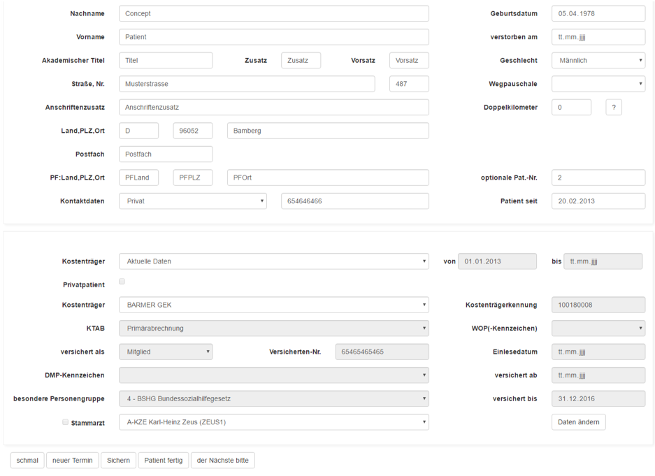
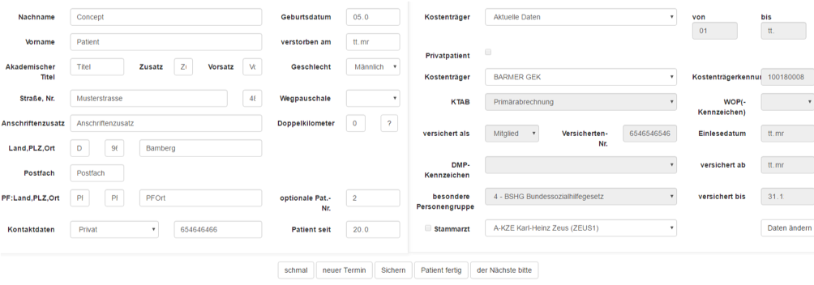

# AWSM Customer Impact Control Method {#sec:awsm-ci}

This chapter addresses research objective RO4:

> To provide an HCI method, models and tools to control the impact of web migration on customers with limited resources and lack of web engineering expertise.

Following an analysis of the current situation, identification of requirements and a review of related work, a conceptual model and implementation of the AWSM:CI method consisting of three mechanisms to address RO4 are described. The method is evaluated against the requirements and the evaluation is supported by an experiment which includes analysis of both empirical evaluations and objective measurements.

## Research Questions

To design and evolve a solution for research objective RO4, this chapter addresses three research questions:

> **AWSM:CI Research Question 1**: How to control the impact of web migration on customers with limited resources and lack of web engineering expertise?

> **AWSM:CI Research Question 2**: How to measure the similarity of non-web and web versions of a user
> interface? 

> **AWSM:CI Research Question 3**: How to provide automation of visual analysis of UI similarity through objective measurements? 

## Analysis

ISVs as described in [@sec:scenario] are successful in their market segment and their legacy software has accumulated large userbases, with long-running customer relationships and contracts for updates and maintenance. These existing users are familiar with the use of the legacy system and well-adapted to its legacy user interface. This adaption can extend up to the business process level: one of the observations from field research [cf. @sec:research-process] is that the business processes in many doctors' offices are governed by the processes represented in the PMS. This makes it hard to introduce larger changes in user interaction or even replace the PMS because of the potential *customer impact* [cf. also @fig:problem-tree]. When conducting Web Migration in industry contexts, it is therefore often a requirement to limit differences and maintain the *look and feel* of the legacy user interface to avoid forcing end-users to change their working habits [@Lucia2008;@Lucia2006;@Distante2002]. Customers often "require new applications to look like the old ones through similar screens and interaction ways even if new
applications are Web-based" [@Remics2013RecoverToolkit]. In the forward engineering phase of a traditional horseshoe reengineering approach, it is "important to comply with the cognitive characteristics of the legacy application" [@Distante2006a]. Learning how to use a new web user interface requires an effort, which ISV customers are not immediately willing to take. Thus changing the user interface poses a risk for the ISV as it can mean, in the worst case, to lose customers. The awareness of this risk contributes to intra-organisational resistance [@Khadka2014ProfessionalsModernization].

Web Migration visibly impacts the user interface and thus the users. The legacy user interface consists of one or more windows, rendering its controls according to the desktop GUI framework and platform in use. A web user interface, in contrast, is rendered in a web browser in one or more browser tabs, rendering its controls according to the web UI framework, platform and specific CSS styles in use. Changing the legacy interaction paradigm towards a navigational paradigm is one of the most important challenges of web migration [@Distante2002]. The industry requirement of maintaining a similar look and feel [@Lucia2008;@Lucia2006;@Distante2002] is formally expressed as *UI Similarity*. Analysis of UI Similarity is a research area of HCI application of which exceeds web migration: it is used to support software quality tasks such as testing, cross-platform GUI matching, GUI modernization and project effort estimation [@Grechanik2018].

In order to "avoid presenting the user with a drastically different application" [@Distante2006a], changes need to be controlled, favouring an incremental transition evolving the software over abrupt changes (cf. also [@fig:problem-tree]). Design decisions with regard to the user interface need to be informed through analysis of UI Similarity. Changes that affect UI Similarity can occur in several dimensions: *Task* [@Bakaev2017WebIntelligence;@Stroulia2002], i.e. the workflow required to achieve a specific user goal on the UI, *Behavior* [@Stroulia2002], i.e. the way the user interacts with the user interface, *Thesaurus*, i.e. the textual vocabulary used in the user interface for labels etc. and the visual vocabulary such as icons, images etc., *Layout*, i.e. how UI controls are placed and sized, and *Material*, i.e. how UI elements look like [@Bakaev2017Kansei]. The goal is to "preserve the old (established) mode of operation *as far as possible*" [@Distante2006a]. This possibility defines the target scope for UI Similarity in the context of web migration: it focuses on dimensions in which changes cannot be avoided, to allow for an informed choice within the degrees of freedom of the UI design space.

In the specific context of web migration, not all dimensions of UI Similarity are equally important. For instance changes of Thesaurus such as renaming elements or Task, i.e. modifying the business processes can and should be avoided [@Sneed2010SoftwareMigration;@Sneed1995CostBenefit] during web migration. On the other hand, changes in Layout and to some degree in Behavior and Material follow conclusively from the *change of environment* [@SWEBOK2014] through web migration. Layout changes result from the different layout paradigms (pixel-based to grid-based, cf. [@sec:uitransformation]), material-changes (GUI framework UI controls to CSS-styled UI controls) and viewing conditions (fixed-size desktop window to variable sized browser window), which cause changes in the positioning and size of UI controls. Positions and sizes of UI controls define the degrees of freedom of the design space for creating a web-based version of a legacy UI. As Layout describes the visual organization of content, it provides orientation for the user and has a huge impact on the Behavior dimension. Thus, similarity of Layout is particularly relevant for UI Similarity in the context of web migration: capturing the legacy UI layout is a "preponderant requirement" of modernization to regenerate the legacy look and feel [@Rodriguez-Echeverria2012MIGRARIA].

*Measurability* is a recognized necessity when dealing with legacy systems to quantify their state [@Masak2006], however existing legacy metrics are based on the legacy system only and do not consider target and source system together. To control the customer impact of user interface changes through web migration, changes affecting UI Similarity must be made measurable. The importance of measurement for engineering in general and software engineering in particular is widely acknowledged [@SWEBOK2014]. Existing web migration approaches as presented in [@sec:approaches] barely consider UI Similarity. Those which do [@Remics2013RecoverToolkit;@Rodriguez-Echeverria2012MIGRARIA;@Lucia2008;@Distante2006a;@Lucia2006;@Distante2002], consider UI Similarity, often referred to as a similar "look and feel" [@Rodriguez-Echeverria2012MIGRARIA;@Lucia2008;@Lucia2006] on abstract level, without providing a concrete way of measuring it, or for TUIs only [@Bodhuin2002DesktopWebMVC] which have a significantly reduced design space.

Existing approaches for measuring UI similarity cannot be applied to legacy and web UIs because they are based on code analysis or target a different degree of similarity. Measurement of UI Similarity is therefore not directly applicable to Web Migration and needs to be adapted to the characteristics of migration and the situation of ISVs with non-web legacy desktop software. Thus, the challenge is to specify a suitable customer impact method for measuring the UI similarity between the legacy UI and  web-based versions of the UI that can be used to inform design decisions, control the amount of changes introduced and incrementally evolve the user interface towards a modern web user interface with limited resources and web engineering expertise.

### Requirements {#sec:ci.requirements}

The following requirements have been derived based on RO4, the analysis presented above and the AWSM principles.

**Effectiveness** Customer impact control of web migration should be enabled through measurement of UI similarity between legacy and web user interfaces.

**Efficiency** Measurement of UI Similarity should be supported by analysis tools to automate the measurement process.

**Expertise** Measurement of UI Similarity should be feasible with available expertise of the ISV's staff.

**Applicability** Measurement of UI Similarity should be applicable to a wide range of legacy and web user interfaces, including user interface design prototypes (UI mockups), independent of the specific UI technology.

**Calibratability** UI Similarity measurement results should be calibratable to the perceptual characteristics of specific customer target groups.

### Related Work {#sec:ci.related-work}

UI Similarity has been of interest in various fields of research. In the following, an overview on related work that addresses aspects of UI Similarity is presented.

**Web Application Feature Matching.** FMAP [@RoyChoudhary2014Matching] is an approach for automatic matching of features across different UI versions of a multi-platform web application, in particular between desktop and mobile WUI. FMAP addresses unintended differences in feature sets to prevent negative impact on user experience through inconsistencies. It defines *consistency* of WUI versions based on correspondence of features, with features referring to a functionality provided through a set of services invoked in a defined order. This can be determined in the *traces* of HTTP communication between frontend and backend, so the *feature mapping problem* is defined based on abstraction and canonicalisation of traces. Abstraction is achieved through recognition of *actions* based on clustering using Jaccard distance. Canonicalisation is done by identification and removal of tandem repeats of action sequences. Finally, the features are mapped using maximum bipartite matching. Web application feature matching considers UI similarity, but with a focus on user interaction. It abstracts from the behaviour to the task dimension. Applicability for web migration is not achievable since it requires near-identical versions of a web application with the same backend in order to analyse interaction traces based on HTTP communication. Source and target system in web migration are significantly more different, the source system is not a web system, and they do not share the same HTTP-based backend. 

**GUI Differencing.** Grechanik et al. [@Grechanik2018;@Grechanik2009ICSE;@Grechanik2009ICSM] contributed insights on UI Similarity through their work on GUI differencing for GUI test script adaption. They propose an automated approach for differencing versions of GUIs without requiring the source code, called GUIDE [@Grechanik2018]. Automatic *GUI differencing* means computation of a mapping function that maps each GUI control in one version of a GUI to at most one control in another version. This identification of GUI differences is difficult due to the richness and heterogeneity of controls across various frameworks and platforms. GUIDE makes use of accessibility interfaces to reconstruct tree-based GUI models from running instances of user interfaces. Empirical experiments [@Grechanik2009ICSM] revealed that manual GUI matching is a time-consuming perceived as difficult by test subjects, even for GUIs with less than 30 controls. In [@Grechanik2009ICSE], Grechanik et al. use a pair-wise match score between all combinations of UI controls in subsequent releases of a GUI calculated as weighted sum of object property differences to match UI controls based on the highest score  inconsistent overall precision results [@Grechanik2018]. Generally, automated *sound* (precision=1) and *complete* (recall=1) GUI differencing is *undecidable* [@Grechanik2018]. The approximation presented in GUIDE uses uses tree-edit-distance and through experimentation shows that tree-edit algorithms are more effective than the baseline approach and that precision decreases with increasing number of differences.

**Cross-Browser Inconsistencies (XBI) detection** is the automatic detection of variations in layout and functionality of web user interfaces when rendered in different browsers or on mobile platforms with different viewports. *DOM-based strategies* [@Watanabe2018;@RoyChoudhary2014XPERT;@RoyChoudhary2010WebDiff] require the DOM for segmentation of the WUI and/or identification of XBIs, *computer-vision strategies* [@Saar2016Browserbite] work based on visual analysis of screenshots of WUIs. *WebDiff* [@RoyChoudhary2010WebDiff] was one of the first XBI detection tools, and introduced the blueprint two-step *differential testing* [@Mckeeman1998DifferentialTesting] strategy followed by various other XBI approaches: 1) segmentation of the WUI according to its DOM structure and 2) comparisons of corresponding UI controls across different versions. WebDiff uses comparison of DOM attributes of UI control pairs detecting changes in position and size in combination with visual analysis using histogram-based Earth Mover's Difference (EMD) [@Rubner1998EMD] with a threshold.

X-PERT [@RoyChoudhary2014XPERT;@Choudhary2013XPERT] follows the WebDiff strategy, but extends it towards *behavioural XBIs*. A crawler extracts navigation models in different browsers and *graph isomorphism checking* detects behavioural XBIs in the state graphs. Controls are matched using the *match index metric* based on DOM attributes. Structural XBIs are detected using layout comparison in *alignment graphs*, which represent relative layout information extracted from the DOM. Visual XBIs are detected using the histogram based $\chi^2$ distance on screenshots of DOM leaf nodes.

[@Watanabe2018] propose an XBI detection approach based on classification of DOM elements. It follows the WebDiff strategy, using DOM-based segmententation and applying incompatibility classification. *Outer incompatibilities* refer to differences in position and size, *inner incompatibilities* are differences in the inner content like text formatting, background position, visual effects. The classification is based on a rich feature set, representing position, size, viewport, alignment, complexity and screenshot comparisons using Image Diff, $\chi^2$ distance and pHash distance.

*Browserbite* [@Saar2016Browserbite;@Semenenko2013Browserbite] is a computer-vision-based XBI detection available as commercial tool^[http://browserbite.com/]. In contrast to DOM-based strategies, it uses *image segmentation* to identify *regions of interest* (ROIs) in screenshots of WUIs and applies computer vision techniques to extract features representing these ROIs. This requires a four-step process of screenshot capture, image segmentation, image comparison and XBI classification. Segmentation is achieved through edge and corner detection in the grayscale screenshot forming a binary corner pixel image, vertical and horizontal *dilatation transforms* to combine dense corner pixels into connected regions and blob analysis for grouping contiguous pixels. Rectangular bouding boxes around these groups are the segmented ROIs. Comparison of corresponding ROIs is calculated based on position, size and raw moments based on histogram comparison. Incompatibilities are detected using binary and quaternary supervised machine learning classification. An experimental comparison of decision trees and *artificial neural networks* (ANNs) showed better F-measures for the ANN implementation.

Both GUI Differencing and XBI detection overlap with analysis of UI similarity. However, they target differences between variants of a UI, for GUI Differencing within a fixed environment, i.e. on the same platform, framework etc., for XBI detection within different HTML rendering engines. The UI variations  introduced are more subtle compared to the consequences of migration from a desktop GUI to the Web: GUI Differencing addresses intended UI changes through perfective maintenance activities, XBI detection addresses even more subtle unintended changes through differences in how a WUI with identical description is rendered in different browsers. While UI similarity analysis for web migration requires a similar basis of matching UI controls across different UI versions, these changes are more coarse-grain and prominent. Thus, the aspect of subjective perception of similarity is more important in contrast to the technical focus of detailed detection of fine-grain UI changes for test script adaption or XBI detection. Smaller and fewer differences allow for higher precision [@Grechanik2018].

**Page Segmentation.** As shown above, for analysis of similarity of UI layouts, it is required to identify the visually and semantically coherent two-dimensional segments (cf. ROIs in Browserbite) that constitute the UI. UI controls form atomic segments of a UI and form a hierarchy through containment and alignment relationships (cf. alignment graphs in X-PERT). Page Segmentation approaches address the problem of identification of these segments in WUIs and is employed in web data extraction, crawling, archiving, accessibility, visual quality evaluation and automatic page adaption or retargeting [@Sanoja2014;@Talton2011Bricolage;@Liu2010VIDE;@Cai2003VIPS].

The *Vision based Page Segmentation algorithm (VIPS)* [@Cai2003VIPS] is a DOM-based page segmentation approach that addresses also visual perception aspects. It aims at extracting the semantic structure of a web page as a hierarchy of non-overlapping *blocks* (ROIs), each block is assigned with a *Degree of Coherence (DoC)* value representing its visual perception based coherence. The VIPS algorithm identifies blocks from the DOM tree, then identifies horizontal and vertical lines that are not intersecting blocks as *separators* and uses the separators to identify the semantic content structure. Block identification is done top-down starting with the page as block, recursively until a threshold DoC is reached. It uses a rule-based approach, with rules based on DOM properties. Separators are identified by incrementally adding the identified blocks and distinguishing areas not occupied by the blocks, their weight is assigned according to *visual cues* like size, color etc. The semantic page structure is derived through merging of blocks based on the separator weights, creating a *visual block tree*. VIPS was one of the first approaches to emphasise the importance of visual perception for segmenting pages into their semantic structure, combining DOM with visual cues. Thus, DOM tree and block tree are not structurally similar, as the block structure identified through VIPS groups elements independent of their position in the DOM tree. A revised version of VIPS is used in the Vision-based Data Extractor (ViDE) [@Liu2010VIDE] adding layout features specific for identification *data records* in WUIs.

*Bricolage* [@Talton2011Bricolage] is an approach for web design retargeting, i.e. transferring content of a web page into the design of another. This requires a mapping between the two WUIs which Bricolage achieves through supervised learning with a generalised perceptron algorithm. Input of the mapping are segmented web pages, derived through Bricolage's page segmentation algorithm *Bento*. Bento re-arranges the DOM in order to align the tree structure better with visual perception for consistent segmentation. It re-arranges parent-child relationships to correspond to visual containment by calculating bounding boxes and assigning DOM subtrees to parents with the minimal bounding box containing all child bounding boxes. The tree is pruned from nodes without visual representation and finally adjusted according to separator identification similar to VIPS. In contrast to VIPS, Bento follows a bottom-up strategy for page segmentation, starting at the DOM leaf nodes.

*Block-o-Matic (BoM)* [@Sanoja2014] proposes a hybrid page segmentation approach combining document processing methods with visual-based content segmentation. It aims at integrating perceptual *flow order* (reading order). BoM defines a three-phase process of analysis, understanding and reconstruction. Analysis derives the *content structure* from the DOM, understanding maps content structure to *logical structure*, reconstruction results in the segmented page. BoM reports an average improvement of 7% over VIPS accuracy.

While the above page segmentation approaches highlight the importance of visual perception by considering visual aspects/cues for improving understanding of the semantic structure of a WUI, they all require the page's DOM as input. In web migration, the DOM is only available for the target system, but not the source system. Thus, a full computer-vision based approach using image segmentation techniques  independent of the DOM is required. The approach proposed in [@Kong2012] addresses shortcomings of DOM-based segmentation approaches through application of image processing for recognition of atomic interface objects. It follows a bottom-up strategy based on spatial graph grammars (SCG). SCGs represent atomic interface objects as vertices and their relationships (e.g. touch, containment) as edges. Recognition of atomic interface objects using image processing requires two phases: segmentation into candidates using edge detection and analysis of geometric shapes, and classification of GUI element type or rejection of the candidate through nearest-neighbor classification based on distance metrics and pairwise comparisons against a database of labelled samples. Interpretation of the  user interface is then achieved through pre-defined grammars. While the bottom-up strategy based on image processing and classification is promising for application in web migration, [@Kong2012] targets WUIs, does not provide implementation or the nearest-neighbour database and does not report precision/recall measures.

**UI Generation from Images** was recently presented by Microsoft Research's AI Lab in the Sketch2Code^[https://sketch2code.azurewebsites.net/] tool. It aims at supporting user interface design by transforming hand-drawn UI mockups into HTML wireframes. Sketch2Code is a computer-vision approach implemented using the Azure Custom Vision Service and was trained on millions of images^[according to https://www.ailab.microsoft.com/experiments/sketch2code] for object detection of hand-drawn UI controls combined with text recognition. The HTML is generated heuristically based on positions of recognised objects and texts. While Sketch2Code is a strong example for the power of computer-vision based approaches and the use of Artificial Intelligence (AI) in UI Similarity, it is specifically targeted for hand-drawn mockups. Screenshots of legacy desktop GUIs are significantly harder to analyse, due to more visual noise - mockups already represent a near-perfect edge representation of a UI whereas this requires heuristic edge detection through image processing, which significantly facilitates object recognition. Our experiments with Sketch2Code could not produce any useable results when using legacy GUI screenshots^[the result for a legacy interface used in our own evaluation experiments [@Heil2016Similarity] is available here: https://sketch2code.azurewebsites.net/generated-html/350d13fa-6bf3-43e4-9e6d-04a58d77bb0c]. Similar projects have been presented by AirBnB^[https://airbnb.design/sketching-interfaces/] and in pix2code^[https://github.com/tonybeltramelli/pix2code].

**UI Similarity in Web Migration** has received less attention. Among the web migration approaches presented in [@sec:approaches], only few have considered aspects of UI Similarity for migration. CelLEST [@Stroulia2003;@Stroulia2002;@Stroulia2002Book;@El-Ramly2002;@Stroulia1999;@Kong1999] aims at creation of similar WUIs from the legacy system. Based on interaction traces, behaviour and task models are extracted and the WUI is specified for the identified functionalities. A clustering-based similarity of legacy UI screenshots is used to identify compound states in state-transition interaction model [@Stroulia2002] based on custom feature set [@Stroulia1999]. Runtime interpreters translate the XML GUI specification into XHTML. However, CelLEST is for mainframe systems with TUIs which are simpler, and less diverse and screenshots from the same system just in different UI states. The generated WUIs are therefore very simple representations of TUIs in the browser, so UI similarity is easier to achieve compared to GUIs. While not officially part of it, the authors of MELIS present an approach an approach for identifying similar web pages within legacy web application to support comprehension for reengineering [@Lucia2007SimilarPages]. The approach is based on clustering using a Winner-Takes-All approach based on a Self-Organising feature Map (SOM). The input for the clustering is the structural model of the page as represented by the abstract syntax tree comprised of HTML tags and scripting expressions. For clustering, distances are calculated using Levenshtein distance of canonical concatenated string representations of the syntax trees. This approach is more static than even the DOM-based page segmentation and XBI detection approaches, as is only focuses on the server-side of WUIs. The HTML page structure resulting from a server-side scripting language (JSP was used in the experiments) does not represent any dynamic aspects such as computed properties through the use of client-side scripts like CSS and JavaScript. [@Cajas2019] addresses re-arranging of widgets for migration of web applications to mobil applications based on Task and Behavior models using Markov heuristics. UWAT+ acknowledges the importance of compliance between the cognitive characteristics of legacy and web user interface for reengineering [@Distante2006a], but does not provide a concrete approach for measuring and ensuring this similarity. Legacy user interaction is taken into account to some extent by mapping business process and web transactions  to create the navigation model, but similarity of layout is not regarded.

As shown above, consideration of UI similarity in web migration is sparse. The few approaches which do, focus on interactions, i.e. the Behavior and Task dimension of UI similarity, disregarding layout and visual aspects, are targeting legacy systems with TUIs or which have already WUIs and do only use static page structure information which is significantly behind the state of the art in other fields like XBI detection or page segmentation. 

## Method and Tool

This section presents the AWSM:CI method and tools from the AWSM platform which support measuring the UI similarity of layouts between legacy non-web and web versions of graphical user interfaces throughout the web migration with limited resources and lack of web engineering expertise.

### Conceptual Model

This section describes the conceptual model of the AWSM:CI method addressing the four aspects of visual UI similarity analysis, calibration, visual GUI segmentation and integration.

#### Visual UI Similarity Analysis {#sec:visual-analysis}

For web migration, a computer-vision based approach is required as shown in [@sec:ci.related-work]: the multitude of GUI-frameworks in use in desktop legacy systems, at times even within one system, inhibit use of existing DOM-based analysis. Custom parsers per framework to support mapping onto DOM as metamodel are undesirable due to related effort, possible GUI model mismatch and increasing heterogeneity of the DOM. With client-side component frameworks such as Angular and React and the increased use of Custom Elements for Web Components, even the DOM structure is becoming more dynamic and heterogeneous, making DOM-based analysis more difficult and error-prone. The limitations of code-based analysis on both the legacy and web side, i.e. futility of static parsing due to a high dependence on runtime state and a plethora of platforms and languages, can be addressed through a computer-vision approach [@Grechanik2018]. The advantages are that no modifications on the underlying platforms, code or executables are required, and independence on parsing changing semantics of GUI structure and scripts allows for a more generic and uniform solution [@Grechanik2018], thus addressing the applicability requirement in [@sec:ci.requirements]. The computer-vision based approach relies on visual input only, which enables it to operate on visual input that is closer to human perception.

*Visual UI Similarity Analysis* in the context of web migration aims at measuring the similarity between the non-web legacy GUI $u_{legacy}$ and the web-based versions of the GUI $\{u_{web,1}, \ldots, u_{web,n}\}$ created throughout web migration based on *visual aspects* [@Heil2016Similarity;@Bakaev2017Kansei]. These visual aspects are *features* $x_i$ [@Kumar2013Webzeitgeist] defined through *feature engineering* for a *design mining* [@Bakaev2017WebIntelligence;@Jahanian2017;@Kumar2013Webzeitgeist] process [@Bakaev2017WebIntelligence] and used as features, i.e. vector components, for a *vector-space representation* $\vec x_u \in \mathbb{R}^d$ of UI $u$ required for comparison and classification. Calculation of similarity measurements is based on these features, following the *local descriptors* approach of identifying *regions of interest* $R_u=\{r_1, \ldots, r_l\}$ and extracting visual features for these regions [@Chechik2010OASIS]. There are two categories of features: *atomic features* (equivalent to *base measures* [@ISO/IEEE2017Measurement]) which can be assessed per UI independently such as density [@Heil2016Similarity] or complexity [@Bakaev2017Kansei] and *relative features* (equivalent to *derived measures* [@ISO/IEEE2017Measurement]) which are assessed on a pair of UIs and describe differences such as order or orientation [@Heil2016Similarity].

These two feature types closely relate to different levels of UI similarity. Atomic features require a lower structural and content similarity than relative features. For instance, complexity can be assessed of two arbitrary UIs and compared, whereas changes in order can only be assessed on a pair of UIs sharing a common subset of UI controls. GUI Differencing and XBI detection focus on a very narrow notion of UI similarity of UI versions with little to no changes based on relative features such as position and size changes. A design repository and search engine like Webzeitgeist [@Kumar2013Webzeitgeist] on the other hand requires a wide notion of similarity to be applicable to arbitrary UIs mainly based on atomic features such as GIST features. Web migration is located between these two extremes, as the UI differences are higher than between versions of the same UI (GUI Differencing) or WUIs rendered in different browsers (XBI detection), but lower than between arbitrary UIs (Design Search Engines) and legacy and web-based UI share a common subset of controls. Thus, UI Similarity in the context of web migration requires both atomic and relative features. Based on these features, a *similarity function*

$$sim: \mathbb{R}^d \times \mathbb{R}^d \mapsto \mathbb{R}​$$ {#eq:sim} 

needs to be calculated, similar to the metric learning approach in OASIS [@Chechik2010OASIS]. However, an image-based similarity using edge and color histogram comparisons [@Chechik2010OASIS] is not applicable due to the conclusive differences particularly in the *Material* dimension of similarity and the non-hold of its *relevance sparsity assumption*: assuming a relevance score of zero for unknown combinations makes sense for arbitrary image comparisons, but not for comparisons between non-web and web versions of the same GUI. Instead, the similarity function needs to be an approximation (*Indicator* [@ISO/IEEE2017Measurement]) of *perceived UI Similarity* $\mathfrak{S}$ (a *Measurable Concept* [@ISO/IEEE2017Measurement]), which is influenced by subjective cognitive aspects [@Bakaev2017Kansei] and semantic structure of the GUI:

$$\mathfrak{S}: U \times U \mapsto \in \mathbb{R}$$ {#eq:perceived-sim}

As shown in [@sec:ci.related-work], UI Similarity is an active field of research and perceived UI Similarity is not yet well understood. $\mathfrak{S}​$ can be empirically measured, e.g. using a set of Kansai scales [@Bakaev2017Kansei] and pair-wise comparisons. Yet, empirical measurement requires test subjects from the target user group, i.e. the ISV's customers in [@sec:scenario]. If a similarity function $sim​$ calculated from feature vectors is indicative of $\mathfrak{S}​$, then it can be used to replace tedious empirical comparisons of UI pairs in web migration and thus facilitate predicting perceived similarity compared to manual assessment. For $sim​$ to perform as approximation of $\mathfrak{S}​$, at least a positive monotonic (*concordant*) relationship is required, i.e. an arbitrary (but unknown) monotonic function can describe the relationship between $\mathfrak{S}​$ and $sim​$ for larger samplesets (*generalisation assumption*):

$$sim(\vec x_u, \vec x_{u^+}) > sim(x_u, \vec x_{u^-}) \implies \mathfrak{S}(u, u^+) > \mathfrak{S}(u, u^-)$$ {#eq:sim-assumption} 

That means that *Visual UI Similarity Analysis for web migration* is a process of constructing a similarity function $sim​$ based on vector-space representations of two user interfaces derived from visual features, that is indicative of perceived UI Similarity $\mathfrak{S}​$. The conceptual model of this process is shown in [@fig:ci-process]. Like [@Kong2012], this process follows a visual bottom-up version of the WebDiff strategy, starting with screenshots of both UIs in (1), the Visual UI Element Detection phase, which consists of locating  ROIs (2) and classification (3) as described in [@sec:segmentation], followed by the similarity approximation phase based on feature extraction (4) and computation of $sim​$ (5) as described in [@sec:computing-sim] which can be then used to drive design decisions and refine (6) the WUI and repeat the cycle.

{#fig:ci-process}

#### Calibration {#sec:calibration}

Visual perception is highly human-dependant and subjective by definition. Experiments show different influence of visual features in perceived UI Similarity $\mathfrak{S}$ for different test subjects. Thus it is unlikely to construct a similarity function $sim$ that will generalise well on larger populations. Instead, $sim$ needs to be a *parametric function* allowing for *calibration* on a *limited target group*, i.e. ISV's customers, through adjustment of parameters with representatives of the target group. These parameters assign weights to the visual features in [@sec:visual-analysis]. Adjusting weights based on a set of samples is equivalent to *training a model*, shown as input artifact in step (5) of [@fig:ci-process], in *supervised machine learning* contexts. As alternative solution design, a complete supervised learning of $sim$ can be considered, i.e. a supervised regression taking a pair of screenshots from two user interfaces as input and learning to predict the value of $sim$ as output. This strategy requires a *deep neural network* (DNN) architecture, in particular convolutional neural networks (CNNs), which have been shown to be effective for computer vision [@Liu2017DNNSurvey]. DNNs require large sample sets for training [@Liu2017DNNSurvey] in order to model the relationship from the independent variables (the pixels of the screenshots) to the dependant variable (the value of $sim$). For instance, the popular *ImageNet* dataset [@Deng2009] contains well over 14 million labeled samples. Creation of a sample set for DNN-based visual similarity analysis would require a large amount of pair-wise similarity evaluations by human test subjects and is therefore not feasible as it would violate the limited resources constraint of RO4. Instead, AWSM:CI tries to find an adjustable mapping onto a limited number of influence factors (visual relative features) which can be computed algorithmically and calibrate the weights of these factors, constituting the model, with a limited number of empirical evaluations in the target group. This restricts the generalisation assumption in [@eq:sim-assumption] to a much smaller scope and allows calibration of the model for the perceptual characteristics and viewing conditions, i.e. devices, screensizes etc., of the target group. 

The calibration process is shown in [@fig:ci-calibration]. It creates WUI prototypes (1) for a set of evaluation GUIs from the legacy system, e.g. using AWSM:RM. Then, these WUIs are systematically altered with regard to different visual features, similar to the genome mutation strategy in [@sec:uitransformation]. Representatives of the target user group provide pairwise similarity evaluations for pairs of one legacy GUI and one WUI variant through empirical assessment (3). This step is equivalent to the evaluation of fitness in [@sec:uitransformation]. The calibration process uses the same feature extraction (4) like step (4) in [@fig:ci-process], producing a feature vector. Through combined analysis of the feature vector and the pairwise evaluations, a *calibrated model* is derived, representing weights according to the impact of features. This calibrated model can then be used as input model for step (5) in [@fig:ci-process].

{#fig:ci-calibration}

Section [@sec:computing-sim] describes the implementation of calibration through computation of  similarity measures with adjustable weights for different perceptual features. 

#### Visual GUI Segmentation {#sec:segmentation}

This section describes the conceptual model of steps (2) and (3) of [@fig:ci-process]. The user interface formalism in [@sec:ui-formalism] introduced the concept of user interfaces $u$ being composed by a set of UI controls $C_u$, with controls $c\in C_u$ forming a hierarchy through parent-child relationships. These controls represent the *technical perspective* on a user interface $u$ and are derived from their descriptions (KDM SourceFiles, ConfigFiles, Documents) in codebase $B$. To represent the *visual perception perspective*, *UI Elements* are introduced. UI Elements are the constituents of $u$ visually perceived by human users forming its *logical/semantic structure* [@Sanoja2014;@Cai2003VIPS]. There is no direct mapping between UI Controls and UI Elements: a UI Control may not be visually perceived as UI Element, a UI Element may be composed from several UI Controls. 

UI Elements form a similar hierarchical structure like UI Controls defined through spatial relationships like containment, alignment and proximity [@RoyChoudhary2014XPERT;@Kong2012;@Talton2011Bricolage]. To represent aspects of *visual complexity* [@Bakaev2019JWE] in this hierarchy, which is known to have significant influence on perception [@Tuch2009VisualComplexity], we introduced four distinct levels of UI Elements: Regions, Blocks, Groups and atomic Elements [@Heil2016Similarity]. *Atomic Elements* [@Bakaev2019JWE] are UI Elements without nested UI Elements like buttons, inputs or checkboxes [@Kong2012]. Through alignment and proximity, they form *Groups* like vertically aligned labels in a form. *Blocks* are formed from Groups and typically represent domain entities, e.g. entire forms. *Regions* are formed from Blocks and represent the top-level visual structure of a page such as navigation, header, content area.

To automate visual analysis, an automatic recognition of UI Elements is required. This introduces the third perspective on a UI: the *recognition perspective*, which represents the perspective of a technical solution to approximate the visual perception perspective. Visual GUI Segmentation tries to simulate human understanding of a user interface through identification of its constituents based on visual aspects. This consists of two tasks: identification of Regions of Interest [@Saar2016Browserbite] (called blocks in [@Sanoja2014;@Cai2003VIPS]) and classification of the type of these ROIs. Thus, ROIs are the recognition perspective concept on a similar level like UI Control and UI Element. However, the completeness and correctness of the mapping between UI Elements and ROIs depends on the quality of the GUI Segmentation. Also, ROIs can be smaller than Atomic Elements, e.g. the text label on a button is an ROI detectable through Optical Character Recognition (OCR). [@fig:ci-concepts] provides an overview on the extended conceptual model of user interfaces.

{#fig:ci-concepts}

This conceptual model allows for a visual bottom-up reverse engineering process of the user interface that works across legacy and web platforms, addressing the applicability requirement in [@sec:ci.requirements]. As it focuses on identification of ROIs and deriving the structure through computer vision techniques instead of parsing the technical structure, the segmentation is independent of specific GUI technologies. Implementation of the visual segmentation process is described in [@sec:segmentation.impl].

#### Integration {#sec:ci.integration}

This section describes integration aspects of the AWSM:CI method.

**Integration with ongoing Development**

The AWSM:CI method specifies a measurement-based technique to be used during the forward engineering phase, i.e. the creation of the target system, of a web migration, corresponding to a *design measurement* of the implementation phase of software maintenance [@IEEE1219Maintenance]. Thus, it's integration into ongoing forward development activities can be easily achieved. The measurement method is based on automatic computer vision-based analysis and computation of similarity measures and does not require manual interaction apart from triggering the measurement. The measurement activity should be repeatedly triggered during creation of web versions of user interfaces to guide design decisions. The integration point can be parallel to other software quality measurements [@SWEBOK2014;@Wallmueller2001SoftwareQuality] like cyclomatic complexity or function points [@Kan1996Metrics] for both model-driven and non-model-driven development processes (cf. principle P3). If no dedicated measurement activities are specified in the ongoing development model, integration of AWSM:CI has to be achieved in an ad-hoc manner into user interface design activities following the IEEE recommendations on performing measurement processes [@SWEBOK2014]. While the measurement process itself [cf. @sec:visual-analysis] can be started by any migration engineer, the calibration process in [@sec:calibration] should be executed by staff with some expertise in empirical methods. For an ISV as in [@sec:company-characteristics], the usability experts and UIX designers, forming a dedicated team called Team U in medatixx, are well-suited due to their understanding of user interaction and qualification for empirical user analysis. Thus, when dedicated UIX experts are available in the ISV, integration of AWSM:CI can be achieved in the context of the ongoing forward engineering UIX analysis and approval activities. On artifacts level, the similarity measures represent another software quality measurement, if measurement activities are present, and are to be integrated into the corresponding set of measurement artifacts. If no measurement activities are present, the similarity measures represent a new type of artifact which should be integrated into configuration management and expressed using an open standard (cf. principle P1) such as SMM [@OMG2012SMM] or the IEEE measurement information model [@ISO/IEEE2017Measurement] to allow for interoperability.

**Integration with existing web migration methods**

This section briefly outlines integration of AWSM:CI with existing web migration methods as required by principle P2. AWSM:CI can be integrated with *REMICS* [@Mohagheghi2011REMICS]. On process level, the AWSM:CI method belongs to the migrate activity area, migration phase [@REMICS2013Migrate]. While AWSM:CI does recover layout information from the legacy system, it cannot be put into the recover activity area, as the nature of similarity measurements requires a comparison between legacy and target UI, with the latter not being available before the migration phase. However, integration of AWSM:CI in REMICS has impact on the pre-migration phase of "establishing the context" [@Mohagheghi2011REMICS] which REMICS borrows from SMART [@Lewis2008SMART], where availability of AWSM:CI influences the "describe the disadvantages of the migrated solution" activity by providing a means to control disadvantageous customer impact (cf. customer impact risk problem subtree in [@sec:problem-analysis-results]). In the agile extension of REMICS [@Krasteva2013REMICSAgile], the cyclic nature of [@fig:ci-process] fits well to the iterative migration scrums. AWSM:CI similarity measurements can be provided feedback for iterative transformation and forward engineering implementing incremental refinement (6) in [@fig:ci-process].

On artifacts level, AWSM:CI integrates well with the the model-driven methodology of REMICS, as it is designed for compatibility (cf. principle P3) with model-driven reengineering approaches: the process in [@fig:ci-process] represents a model-driven reverse engineering process as it abstracts a CIM, the vector-space representation, from concrete UIs and uses them to compute a similarity measure. With REMICS being based on ADM, the SMM metamodel [@OMG2012SMM] could be used for representing similarity measurement information by defining a custom similarity metric^[metric in SMM terminology, see discussion of measurement vs. metric in [@sec:computing-sim]]. The analysis is based on the REMICS presentation implementation model, with a feedback into the presentation component model *page*. Page is substructure according MVC, so the relevant part is view, addressing the "graphical organisation of the page" [@REMICS2013Migrate]. In this way, AWSM:CI is complimentary to REMICS, which focuses on similarity of Task and Behavior, addressing the lack of consideration of Layout similarity.

In ARTIST [@ARTIST2014Methodology], AWSM:CI can be integrated into the Migration phase to fill the gap of lacking consideration of UI similarity. The cyclic refinement integrates well with ARTIST's Modernization-Optimization cycle as specified in Migration Artefacts Reuse & Evolution [@Menychtas2013ARTIST]. In particular, the similarity measurement process is relevant for the non-functional requirements consideration in task NFVALML, activity NFVALML.A2 [@ARTIST2014Methodology], as similarity between the source legacy and target web user interface is a non-functional requirement. AWSM:CI calibration would require a new task being added to the Target Environment Specification phase, as the resulting calibrated model represents characteristics of the target group. On artifacts level, the calibrated model would be a new ARTIST output artefact of the calibration task and the similarity measurements would be added as output artefact of NFVALML.A2 and as input artefact for GSCODE.A5, as additional information for the manual code completion.  

In *UWA/UWAT+* [@Distante2006a;@Distante2006CaseStudy], AWSM:CI belongs to the Forward Design Phase. Following the same argumentation like for REMICS reengineering, the AWSM:CI recovery cannot be achieved in the Reverse Engineering phase prior to existence of a web user interface for similarity computation. Within Forward Design, AWSM:CI integrates into the UWA Publishing Design activity. While UWA/UWAT+ focuses on preserving similarity in the Task dimension, integration of AWSM:CI would add consideration of layout similarity. On artifacts level, AWSM:CI similarity measure provide input to the presentation model of the pages specified in Publishing Design [@Distante2006CaseStudy].

In the context of MELIS [@Lucia2008] and MIGRARIA [@Rodriguez-Echeverria2012MIGRARIA], AWSM:CI is a concretisation of the objective to achieve a smilar "look and feel" [@Rodriguez-Echeverria2012MIGRARIA;@Lucia2008;@Lucia2006]. For the identification of similar web pages to support comprehension for reengineering [@Lucia2007SimilarPages], AWSM:CI can be integrated as a parallel alternative to the static parser-based approach, allowing use with more modern WUIs whose visual aspects are determined at runtime at the client side through computations using script languages. 

### Implementation

This section describes the implementation of the AWSM:CI method by describing the realisation of Visual UI Similarity Analysis and Calibration through computation of adjustable similarity measures and the Visual UI Element Detector as part of the AWSM Platform.

#### Computing Visual UI Similarity {#sec:computing-sim}

*Similarity measures* play a crucial role for Case-based reasoning (CBR) systems, also known as similarity searching systems [@Liao1998]. A similarity measure quantifies the "degree of resemblance between a pair of cases" [@Liao1998], for AWSM:CI these cases are user interfaces. To compute the AWSM:CI similarity measure, the *distance-based (computational) approach* is applied, which defines the similarity measure based on a *distance* calculated from objects (features) of the cases (UIs) [@Liao1998] in three variations: $sim_E​$ based on Euclidean distance:

$$sim_E(\vec x_{u_1}, \vec x_{u_2}) = 1- \text{DIST}_E(\vec x_{u_1}, \vec x_{u_2}) = 1 - \sqrt{\sum\limits_{i=1}^{d} w_i^2 \text{dist}^2(x_{u_1,i}, x_{u_2,i})}, \vec x_{u_1}, \vec x_{u_2} \in \mathbb{R}^d, w_i \in \mathbb{R}^+$$ {#eq:sim_e}

$sim_H​$ based on Hamming distance:

$$sim_H(\vec x_{u_1}, \vec x_{u_2}) = 1- \text{DIST}_H(\vec x_{u_1}, \vec x_{u_2}) = 1 - \sum\limits_{i=1}^{d} w_i \text{dist}(x_{u_1,i}, x_{u_2,i}), \vec x_{u_1}, \vec x_{u_2} \in \mathbb{R}^d, w_i \in \mathbb{R}^+$$ {#eq:sim_h}

and $sim_R​$ based on Tversky ratio mode:

$$sim_R(\vec x_{u_1}, \vec x_{u_2}) = \frac{\alpha \times \text{common}}{\alpha \times \text{common} + \beta \times \text{different}}, \text{common},\text{different} \in \mathbb{N}_0, \alpha, \beta \in \mathbb{R}^+ ​$$ {#eq:sim_r}

The similarity functions $sim_E$, $sim_H$ and $sim_R$ are similarity *measures* [@ISO/IEEE2017Measurement], not *metrics*, because a metric requires a *metric space* fulfilling the three axioms of positive definiteness, symmetry and triangle inequality. This is not the case for $sim_E$, $sim_H$ and $sim_R$. However, $\text{DIST}_E$ and $\text{DIST}_H$ can be shown to be a *pseudo-semimetrics*, i.e. fulfilling positivity, symmetry and the relaxed positive definiteness axiom as one-sided implication $\vec x = \vec y \implies \text{DIST}_E(\vec x, \vec y) = \text{DIST}_H(\vec x, \vec y) = 0$.

*Feature-based normalised distance functions* $\text{dist}​$ define the calculation of $\text{DIST}_E​$ and $\text{DIST}_H​$ and the weight factors $w_i​$ allow for the calibration process in [@sec:calibration] to adjust the impact of different features. AWSM:CI uses three distances in the Layout dimension of UI similarity: Orientation, Order and Density [@Heil2016Similarity]. All three distances are normalised to percentages using Tversky difference ratios with $\alpha = \beta = 1​$:

$$\text{dist}(x_{u_1,i}, x_{u_2,i}) = \frac{\text{different}}{\text{different} + \text{common}}, \text{common},\text{different} \in \mathbb{N}_0​$$ {#eq:dist}

These distances represent *base measures* [@ISO/IEEE2017Measurement] and are computed on the four different levels of the UI hierarchy introduced in [@sec:segmentation], region, block, group and atomic elements. For *Orientation*, this results in the share of ROIs that have a different visual orientation. These orientations can be one of $\{\text{vertical}, \text{horizontal}, \text{other}\}$. Vertical orientation represents aspect ratios of bounding box $b$ (cf. [@sec:formalisms]) with $w/h < \theta_O$ (i.e. landscape), horizontal orientation represents aspect ratios of $w/h > 1 / \theta_O$ (i.e. portrait), other orientation implies $w/h \approx 1$ (i.e. approximate square). These can be calculated from pair-wise comparison of the bounding boxes using threshold parameter $\theta_O\in\mathbb{R}, 0<\theta_O < 1$. Assignment to class $\text{different}$ or $\text{common}$ is based on equality comparison of the resulting nominal variable. [@fig:orientation] shows an example of a WUI created for [@sec:scenario] and a layout variation with different orientation. *Order* differences can be computed using Levenshtein distances in 8 different orientations on sequences as described in [@sec:uitransformation.impl]. Assignment to class $\text{different}$ is equivalent to a Levenshtein distance of $\text{dist}_L > 0$, else $\text{common}$ is assigned. *Density* represents the share of ROIs with different visual density. Computation is based on bounding boxes, calculating the white space ratio [@Bakaev2019JWE;@Oulasvirta2018AIM] $W$, i.e. the ratio of area occupied by nested ROIs to overall area. Assignment to class $\text{common}$ is based on threshold parameter $\theta_D\in\mathbb{R}, 0<\theta_D < 1$ if and only if $W_1/W_2 \in [ \theta_D, 1/\theta_D]$. As reasoned in [@sec:visual-analysis], these distances are specific for web migration as they require the two compared user interfaces $u_1$ and $u_2$ to share a significant common subset of UI controls: $\frac{|C_{u_1} \cap C_{u_2}|}{|C_{u_1} \cup C_{u_2}|} > 1 - \varepsilon$. 

{#fig:orientation-a width=50%}

{#orientation-b width=50%}

Layout Variations

 

#### Visual UI Element Detector {#sec:segmentation.impl}

This section describes the implementation of the Visual UI Element Detection subprocess in [@fig:ci-process]. Object detection is among the "most widely known sub-domains in computer vision" [@Liu2017DNNSurvey], solving the problem of precisely locating and classifying target objects in an image [@Liu2017DNNSurvey]. Thus, the conceptual process of Visual UI Element Detection is split in two parts:  location of ROIs and classification. Detection of UI Elements is object detection with specific features that distinguish it from other application domains: absence of image phenomena appearing in photos such as noise, glare, uneven lighting, perspective distortion, movement, incomplete or covered objects make analysis easier [@Bakaev2019JWE]. On the other hand, UI Elements are relatively small (e.g. a checkbox) objects, have very similar, non-distinctive shapes (e.g. buttons and input fields), have different stateful visual appearances (e.g. checked and unchecked radio buttons), have different appearances in different platforms (e.g. buttons in MacOS vs. Windows), can occur on top of background images without differences in lighting or focus helping to distinguish layers, and have composite nature requiring context (e.g. checkbox and its label, a group of tabs), which makes UI Element Detection difficult. A *sound* and *complete* (i.e. high precision and maximum recall) mapping of UI Elements in two UIs based on computer vision is an *undecidable problem* [@Grechanik2018].

The *Visual UI Element Detector (VUE-D)* is implemented based on the strategy computer vision in [@Kong2012] as part of the HCI Vision approach [@Bakaev2019JWE;@Bakaev2018ICWE] and is embedded in the UI Metrics integration platform^[http://va.wuikb.online/] [@Bakaev2019ICWE]. [@fig:ci-vued] shows the VUE-D analysis process. The UI screenshot is subject to *preprocessing* (1) to improve detection results. It consists of grayscale conversion, upscaling and black-and-white conversion using thresholding [cf. @RayLiu2002]. OpenCV^[https://opencv.org/] is used for these tasks. *Detection of ROIs* is implemented using OpenCV's edge detection (2) for vertical and horizontal lines in the binary image. The rectangles are identified from edges as convex shapes (3) with 4 corners of a minimum area as boxes $b$ according to [@eq:bounding-box]. For *OCR* (4), VUE-D combines OpenCV close edge detection with *Tesseract^*[https://github.com/tesseract-ocr/tesseract]. It identifies areas of high frequency edges, does up-scaling and then performs OCR using Tesseract. For successful recognitions, the results are represented as bounding boxes $b​$ and the recognized text is annotated as additional information. The *type classification* (5) uses specialised classifiers for different types of UI Elements. Each classifier is trained on one specific type using supervised learning on the Felzenszwalb histogram of oriented gradients (FHOG) latent SVM feature [@Felzenszwalb2010FHOG] extractor implemented in dlib^[http://dlib.net/] which is among the most popular methods [@Liu2017DNNSurvey] and represents each input as 31-dimensional FHOG feature vector. Due to high visual differences, stateful elements like check boxes, radio buttons are trained separately, as are platform variations. The classification result is then annotated as additional information to the ROI. *Composite Analysis* (6) identifies composite UI Elements using alignment, proximity and containment, for instance combining recognised text labels with checkboxes, radiobuttons etc. by merging their bounding boxes. [@fig:ui-recognition] shows application of VUE-D on a GUI screenshot with detection results highlighted.

{#fig:ci-vued}

{#fig:ui-recognition}

## Evaluation

This section evaluates AWSM:CI regarding the requirements in [@sec:ci.requirements]. Additional experimental evaluation further address effectiveness, applicability and calibratability.

**Effectiveness** The effectiveness of AWSM:CI is achieved through specification of a UI similarity between legacy and web user interfaces that produces concrete measurements to assess different versions of user interfaces which can be used as a basis for decision making when comparing design alternatives. A detailed analysis of measurement results is presented in the following evaluation experiment.

**Efficiency** Measurement of UI Similarity should be supported by analysis tools to automate the measurement process. The efficiency of AWSM:RM is supported specification of similarity measures that can be computed based on automatically derived distances. The computer-vision based approach for segmentation of legacy and web user interfaces is automated, but does not yet produce results with production-grade quality. Thus, the efficiency requirement is considered only half-fulfilled.

**Expertise** The computation of similarity measures and the calibration process of AWSM:CI do not require specific expertise and can be conducted using the artifacts (questionnaire) and analysis strategy (factor impact analysis and corresponding model calibration) presented in the following experimental evaluation as blueprint by any ISV staff member with reasonable expertise in basic statistics. Likewise, the test subjects do not have any specific expertise requirements, as the similarity evaluation can be performed by any non-expert target group representative with normal vision.

**Applicability** The AWSM:CI method follows a pure computer vision strategy and does not rely on any specific technology-related analysis. Instead, the proposed distances and similarity measures can be computed on any image representation of a user interface, both conceptual and implemented as they consider solely visual aspects of the user interfaces.

**Calibratability** The AWSIM:CI similarity measures can be calibrated to the perceptual characteristics of the target group following the calibration process described in [@sec:calibration]. The following experimental evaluation shows in more detail how the calibration process can be used to align the similarity measures with empirical evaluation results gathered from a small group of representatives.

### Experimental Evaluation of AWSM:CI {#sec:ci.experiment}

Experimental evaluation of AWSM:CI demonstrates application of the similarity computation and calibration process based on a dataset of user interfaces from the real world scenario application *x.concept* [cf. @sec:scenario] with empirical assessments of perceived similarity by test subjects [@Heil2016Similarity].

**Setup** The *test dataset* $U_T$ comprises 15 user interfaces that are based on 3 legacy user interfaces $U_L = \{u_1, u_2, u_3\}$ at low, medium and high level of complexity respectively (amount of atomic elements $\#c_1=7, \#c_2=22,\#c_3=48 $) and depth (levels of nesting $d_1=0, d_2=1, d_3 = 3$). Interface $u_1$ is a simple graphical shift schedule, $u_2$ represents a calendar for appointment scheduling and $u_3$ is an extensive patient data form. For each legacy user interface $\forall u \in U_L$, a web-based version $u' = \text{web}(u)$ was manually created using HTML, JS, CSS and bootstrap. The web user interfaces $U_W=\{u'_1, u'_2, u'_3\}$ are copies of their original counterparts without any intentional layout changes introduced to them apart from changes due to the changed environment. Following the calibration process in [@fig:ci-calibration], a set of UI variants $U_V$ was derived from $U_W$ applying systematic alterations $V: U \mapsto U$ of Orientation, Order and Density $U_V=\{Vu' | \forall u' \in U_W, \forall V \in \{\text{vorientation},\text{vorder},\text{vdensity}\}\}=\{u''_{1,\text{ori}},u''_{1,\text{ord}},u''_{1,\text{den}}, u''_{2,\text{ori}}, \ldots, u''_{3,\text{den}}\}$. Orientation alteration $\text{vorientation}$ changed the layout from horizontal to vertical and vice versa by repositioning groups of UI Elements. Order alteration $\text{vorder}$ changed positions of atomic elements within regions, maintaining proximity relationships between elements and their labels to avoid unintended Thesaurus changes. Elements were not mixed across regions (e.g. moving patient data inputs to the billing region) to avoid unrealistic changes unlikely to result from web migration. Density alteration $\text{vdensity}$ were achieved through changing the whitespace between elements for $u_2$ and $u_3$ and by replacing solid background fill colors with letters in $u_1$. While each of these three intentional changes has its main effect on its respective layout similarity dimension, the changes are not entirely orthogonal as they influence the other dimensions. The resulting test dataset $U_T = U_L \cup U_W \cup U_V$ of $3+3+9=15$ user interface is available online^[https://vsr.informatik.tu-chemnitz.de/demos/LayoutSimilarity]. All user interfaces from $U_T$ were functionally identical. No changes were introduced in the Task dimension. For Behaviour, only minor changes through the web environment exist. Task lists $T_i = \{t_1,\ldots,t_n\}$ of different tasks for each original user interface $u_i$ were specified. A questionnaire was designed to capture subjective perceptions of the similarity between legacy and web user interfaces in 4 criteria, each measured on a 5-level Likert scale. The *testing environment* contained all web user interfaces from $U_W \cup U_V$ and was set up to present all three web versions per one legacy user interface in random order. In this way, the testing environment fulfils a similar function to the experimental platform of GUIDE, providing the user with random selected GUIs with controlled differentials among them [@Grechanik2018]. [@tbl:ci:hierarchy] describes the detailed complexity measures of the three groups of WUIs.

| UI     | Regions | Blocks | Groups | Elements |
| ------ | ------- | ------ | ------ | -------- |
| $u'_1$ | 1       | 2      | 4      | 7        |
| $u'_2$ | 1       | 3      | 7      | 22       |
| $u'_3$ | 1       | 3      | 7      | 48       |

: Amount of UI Elements in WUI per hierarchy levels {#tbl:ci:hierarchy}

**Procedure** The evaluation experiment is designed as *within-subject* experiment with the distances and similarity measures as independent variables and the test subjects' similarity perceptions as dependent variables. At the start of the experiment, the test subjects were shown how to achieve a task $t_j \in T_i​$ on the correponding legacy user interface $u_i​$. Then, the testing environment randomly selected one of the four (one equivalent version $u'_i​$ and its three variations $u''_{i,V}​$) WUIs and the test subjects were asked to complete the same task $t_j​$ in this user interface. When the task list was completed, test subjects were asked to respond to the questionnaire, providing their subjective impressions. Then the testing environment randomly selected another UI from the remaining WUIs and the process was repteated. The entire process was repeated for all three legacy user interfaces until all 12 WUIs have been assessed. The evaluation sessions were scheduled and conducted within on week in 2016, with one session requiring about one hour of time. All sessions were performed on the same PC and screen in order to ensure consistent visual representation and interaction across all test subjects.

**Experimental results and descriptive statistics**
The experiment was conducted with 7 test subjects (5 male, 2 female), with an age range of 21 - 50 years (mean 28.4, $\sigma = 9.83$). All but one participant were German, all were proficient in German and English. The test subjects did not have prior experience with the test system nor did they have HCI-related expertise. The subjective dataset captured from the test subjects using the questionnaire comprises 252 empirical evaluations, averages per UI are shown in [@sec:computing-sim]. [@tbl:ci:distances] shows the distances and [@tbl:ci:sim] the similarity measures computed according to [@sec:computing-sim]. The Orientation, Order and Density Differences columns in [@tbl:ci:distances] indicate the differences of the UI in comparison to the corresponding legacy UI with regard to the hierarchy levels used for calculating the Tversky distances in [@eq:dist]. The letters R, B, G, E preceded by a number are indicating the cardinality of the $\text{different}$ set per region, block, group and atomic element respectively. 

The distances in [@tbl:ci:distances] have their minima for the basic web versions $u'_i​$ of each UI. The mean distances are between $\overline{\text{dist}_{\text{ord}}}=8.5\%​$ and $\overline{\text{dist}_{\text{den}}}=33.3\%​$, standard deviations between $\sigma(\text{dist}_{\text{ord}})=13.7\%​$ and $\sigma(\text{dist}_{\text{ori}})=20.7\%​$. Density was observed to be the most affected through web migration with even basic versions differing between $8.3\%​$ up to $33.3\%​$ from their legacy counterparts. Also, density is the most affected by all other dimensions.

| UI                     | Orientation Diff. | $\text{dist}_{\text{ori}}$ | Order Diff. | $\text{dist}_{\text{ord}}$ | Density Diff. | $\text{dist}_{\text{den}}$ |
| ---------------------- | ----------------- | -------------------------- | ----------- | -------------------------- | ------------- | -------------------------- |
| $u'_1$                 | 1B                | 0.125                      | none        | 0                          | 1G            | 0.083                      |
| $u''_{1,\text{ori}}$   | 1R, 2B, 2G        | 0.625                      | 1B          | 0.167                      | 1R, 1G        | 0.417                      |
| $u''_{1,\text{ord}}$   | none              | 0                          | 1B          | 0.167                      | 1B, 1G        | 0.250                      |
| $u''_{1,\text{den}}$   | 1B                | 0.125                      | none        | 0                          | 2G            | 0.167                      |
| $u'_2$                 | none              | 0                          | none        | 0                          | 1B, 1G        | 0.159                      |
| $u''_{2,\text{ori}}$   | 1R, 1B            | 0.333                      | none        | 0                          | 1R, 2B, 1G    | 0.603                      |
| $u''_{2,\text{ord}}$   | none              | 0                          | 3B          | 0.333                      | 1B, 1G        | 0.159                      |
| $u''_{2,\text{den}}$   | 1B                | 0.083                      | none        | 0                          | 1R, 2B, 1G    | 0.603                      |
| $u'_3$                 | none              | 0                          | none        | 0                          | 1R            | 0.333                      |
| $u''_{3,\text{ori}}$ | 1R, 2B            | 0.417                      | none        | 0                          | 1R            | 0.333                      |
| $u''_{3,\text{ord}}$ | none              | 0                          | 4G, 24E     | 0.357                      | 1R            | 0.333                      |
| $u''_{3,\text{den}}$ | none              | 0                          | none        | 0                          | 1R, 2B        | 0.556                      |

: UI Differences and distances {#tbl:ci:distances}

As all weights are $w_i=1​$ before calibration, Euclidean and Hamming similarity measures are identical. The means are $\overline{sim_{E/H}}=0.57​$ and $\overline{sim_R}=0.807​$ with standard deviations $\sigma(sim_{E/H})=0.208​$ and $\sigma(sim_R)=0.172​$. While maxima co-occur for basic web version $u'_i​$, $sim_{E/H}​$ provides a more differentiating measurement. Regarding the empirical evaluations, difficulty was rated the lowest (mean 1.94, $\sigma(\text{difficult})=1.057​$) and similarity the highest (mean 3.619, $\sigma(\mathfrak{S})=1.029​$). [@fig:ci.scatter] shows a scatter plot of the similarity measures $sim_{E/H}​$ and $sim_R​$ in relation to $\mathfrak{S}​$.

| UI                     | $sim_{E/H}$ | $sim_R$    | $\overline{\text{Difficult}}$ | $\overline{\text{Like}}$ | $\overline{\mathfrak{S}}$ |
| ---------------------- | ----------- | ---------- | ----------------------------- | ------------------------ | ------------------------- |
| $u'_1$                 | **0.8498**  | **0.8571** | 1.7143                        | 3.4286                   | 4                         |
| $u''_{1,\text{ori}}$   | 0.2306      | 0.4286     | 2                             | 2.5714                   | 2.8571                    |
| $u''_{1,\text{ord}}$   | 0.6995      | 0.7857     | 2                             | 3.5714                   | **4.2857**                |
| $u''_{1,\text{den}}$   | 0.7917      | 0.7857     | 1.5714                        | 2.5714                   | 3.7143                    |
| $u'_2$                 | **0.8413**  | **0.9394** | 1.8571                        | 3.2857                   | **4.1429**                |
| $u''_{2,\text{ori}}$   | 0.3108      | 0.8182     | 2.1429                        | 2                        | 3                         |
| $u''_{2,\text{ord}}$   | 0.6308      | 0.8485     | 1.7143                        | 3.7143                   | 3.2857                    |
| $u''_{2,\text{den}}$   | 0.3911      | 0.8485     | 1.8571                        | 3.1429                   | 3.5714                    |
| $u'_3$                 | **0.6667**  | **0.9831** | 2.1429                        | 3.1429                   | 3.7143                    |
| $u''_{3,\text{ori}}$ | 0.4664      | 0.9322     | 2.8571                        | 2                        | 2.7143                    |
| $u''_{3,\text{ord}}$ | 0.5115      | 0.5085     | 2.1429                        | 3                        | 4                         |
| $u''_{3,\text{den}}$ | 0.4444      | 0.9492     | 1.2857                        | 3.5714                   | **4.1429**                |

: Computed $sim$ measures and empirical Difficulty, Like and $\mathfrak{S}$ evaluations, $w_i=1$ for $sim_{E/H}$ and $\alpha=\beta=0.5$ for $sim_R$, maxima highlighted in bold {#tbl:ci:sim}

{#fig:ci.scatter}

**Analysis**

To test the assumption [@eq:sim-assumption], the relationship between the similarity measures and empirical similarity is analysed. Spearman's $r_s​$ is used on the median values of $\mathfrak{S}​$ and the similarity measures to show the required concordant (i.e. positive monotonic) relationship. There is a strong positive correlation between $sim_{E/H}​$ and $\mathfrak{S}​$ ($r_s=0.7174​$, (two-sided) $p=0.0086​$) which is significant at $\alpha=0.01​$ even for the un-calibrated model with $w_i=1​$. In contrast, the Tversky similarity $sim_R​$ does not exhibit a significant relationship. Also, $sim_{E/H}​$ shows stronger differences between the UIs compared to $sim_R​$, indicating that the Euclidean and Hamming formulations of similarity are a more suitable tool for web migration purposes. This can also be seen in [@fig:ci.scatter].

Analysis of the empirical data shows rather low values for difficulty which can be reasoned with the relatively simple user interfaces and the test subjects' proficiency with computers. A moderate correlation between $\text{Like}$ and $\mathfrak{S}$ ($r_s=0.5753$, $p=0.0504$) significant at $\alpha=0.6$ was found which can imply a preference for familiar interfaces. The Like evaluation expectedly has the largest standard deviation ($\sigma(\text{Like})=1.299$) as it is the most subjective criterion. Analysing influence of the three distances in pairwise relations to $\mathfrak{S}$, the following linear model was found highly significant at $\alpha=0.001$ with good fit ($p=0.001$, $R^2=0.670$): $\mathfrak{S}=3.92 - 2.14 \text{dist}_{\text{ori}}​$. 

For the calibration process in [@sec:calibration], a linear model is assumed. We derive the weight factors from multiple linear regression of the three distances and the median of $\mathfrak{S}​$. The resulting linear model in [@eq:calibrated-linear-model] is highly significant at $\alpha = 0.001​$ and has good fit ($p=0.0001​$, $R^2=0.919​$). The F-Test yields $F=30.26​$ which is $F>f_{\text{crit}}​$ with $f_{\text{crit}}=15.83​$ for $p=0.001​$, 3 degrees of freedom of the numerator and 8 degrees of freedom for the denominator, showing an improved model fit over the intercept-only model hypothesis.

$$\mathfrak{S}=4.61604 -3.24281\text{dist}_{\text{ori}} -1.27447\text{dist}_{\text{ord}} -0.888071\text{dist}_{\text{den}} + e[t] ​$${#eq:calibrated-linear-model}

Using the factors of the distances as weights $w_i$, the similarity measures can be re-calculated as shown in [@tbl:ci:sim-calibrated]. The calibrated similarity measures $sim_{E,\text{cal}}$ and $sim_{H,\text{cal}}$ improve the correlation with median $\mathfrak{S}$ to $r_s=0.8383$, $p=0.0007$, highly significant at $\alpha = 0.001$. [@fig:ci.residuals] shows the results of residuals analysis with good overall alignment. All variance inflation factors are less than $\text{VIF}_{\text{den}} < 1.12​$ showing a low multicollinearity of the distances' factors. [@tbl:ci:sim-calibrated] shows the calibrated similarity measures and [@fig:ci.calibrated] visualises the calibrated measures and their corresponding residuals QQ plots.

| UI                     | $sim_{E,\text{cal}}$ | $sim_{H,\text{cal}}$ | $\overline{\mathfrak{S}}$ |
| ---------------------- | -------------------- | -------------------- | ------------------------- |
| $u'_1$                 | 0,9088               | 0,8999               | 4                         |
| $u''_{1,\text{ori}}$   | 0,5430               | 0,4726               | 2.8571                    |
| $u''_{1,\text{ord}}$   | **0,9611**           | **0,945**            | **4.2857**                |
| $u''_{1,\text{den}}$   | 0,9074               | 0,8906               | 3.7143                    |
| $u'_2$                 | **0,9822**           | **0,9822**           | **4.1429**                |
| $u''_{2,\text{ori}}$   | 0,7487               | 0,6904               | 3                         |
| $u''_{2,\text{ord}}$   | 0,9431               | 0,9282               | 3.2857                    |
| $u''_{2,\text{den}}$   | 0,9093               | 0,8719               | 3.5714                    |
| $u'_3$                 | **0,9627**           | **0,9627**           | 3.7143                    |
| $$u''_{3,\text{ori}}$$ | 0,6952               | 0,6602               | 2.7143                    |
| $$u''_{3,\text{ord}}$$ | 0,9311               | 0,9048               | 4                         |
| $$u''_{3,\text{den}}$$ | 0,9378               | 0,9378               | **4.1429**                |

: Calibrated $sim$ measures for $w_{\text{ori}}=-3.24281$, $w_{\text{ord}}=-1.27447$, $w_{\text{den}}=-0.888071$, maxima highlighted in bold {#tbl:ci:sim-calibrated}

{#fig:residuals-a width=50%}
{#fig:residuals-b width=50%}

Residual Plots, created using [@Wessa2017Statistics]

 

{#fig:calibrated-e2 width=50%}
{#fig:calibrated-h2 width=50%}

{#fig:calibrated-residuals-e2 width=50%}
{#fig:calibrated-residuals-h2 width=50%}

Calibrated Similarity Measures and Residuals QQ plots, created using [@Wessa2017Statistics]

 

**Threats to Validity**

*Construct validity* of this experiment is threatened by possible variations in the evaluation runs. This was addressed by providing a fixed environment: All sessions were performed on the same PC and screen in order to ensure consistent visual representation and interaction across all test subjects. The task list $T_i$ ensured that all test subjects solved the same tasks on the user interfaces and thus had the same understanding of the underlying Task and Behavior models. The tasks were designed as small and self-contained interactions that did not allow for alternative interaction paths. All test subjects received the same introduction and demonstration of the tasks on the legacy user interface. The second important aspect affecting construct validity is the analysis of Likert items in the questionnaire. In the context of discussions about limitations of valid statistical measures on ordinal-scaled Likert items, [@tbl:ci:sim] follows the practical approach commonly used in the HCI field and user research to apply mean as it better supports smaller sample sizes [@Sauro2016]. However, all interpretations are restricted to ordinal statements, no interval or ratio statements are derived. The correlation analysis was conducted on the median values using Spearman's $r_s$ instead of Pearson's $\rho​$ for the same reason.

*Internal validity* of this experiment is threatened through potential subjective biases. In order to avoid participants being biased towards giving higher ratings to the "original" WUIs from $U_W$ in comparison to the variations in $U_V$, we assigned identifiers not disclosing this information ($u'_1 \widehat{=} A3$, $u'_2\widehat{=} B2$ and $u'_3\widehat{=} C2$). Also, the order in which web versions of the same legacy UI were evaluated was randomized to avoid bias through test subjects adjusting to the same sequence of interfaces. The test subjects preference for similar interfaces observed in the $\text{Like}$ evaluations may have been affected by the experiment, hinting that similar equals good. However, we measured this data only as additional information and did not perform further detailed analysis, as the overall preference for similar interfaces through migration has already been well-researched in previous studies. It can be argued that the similarity evaluations of the test subjects are highly subjective. However, this is intended since the measured item, perceptual similarity of UI, is a subjective notion. This is addressed by the model creation and calibration process and the good model fit has shown applicability. 

*External validity* of the experiment is threatened through limitations in the generalizability of results. Evidently, the evaluation results cannot be used as a generalised ready-made model for UI similarity in arbitrary web migration contexts, as the similarity evaluations of the test subjects are highly subjective. However, AWSM:CI aims at providing a strategy for creating and adapting a similarity measurement model tailored for a specific target user group of a specific legacy system to be migrated to the web. In that way, the evaluation experiment has shown that the AWSM:CI method can be successfully applied to achieve this result, without making claims with regards to the generalisability of the concrete numerical results and derived findings. 

**Conclusion of AWSM:CI experimentation**

The AWSM:CI evaluation experiment has shown that the similarity measures based on Tversky distances in the Orientation, Order and Density dimensions of layout similarity can be effectively used to estimate perceived similarity of user interface in web migration. Of the three similarity measures, the Euclidean formulation $sim_E$ and the Hamming formulation $sim_H$ are better applicable than the Tversky mode formulation $sim_R$. Both similarity measures in their initial state (all weights set to one) fulfil the required concordance assumption. It was shown that the AWSM:CI calibration process conducted with only limited effort, i.e. seven users from the target group and three user interfaces with three variations, can be applied to improve the initial similarity measures to an $R^2=0.919$ fit on perceived similarity, highly significant with $p=0.0001$. Different influences of the proposed distances were observed: while Density was found to be the most influenced by changes in other dimensions and having only small influence on similarity, Orientation showed stronger impact. The concrete findings on differences in the influence of the distances have to be seen in the light of a relatively small group of test users and cannot be generalised. However, AWSM:CI calibration can be applied in order to adjust this to specific target user groups and analyse concrete preferences within these groups. The efficiency of AWSM:CI is evident when comparing to the naive approach of a traditional full empirical evaluation of similarity of all different variations of migrated web UIs with test subjects. Instead, AWSM:CI provides a method for automated computation of similarity measures as approximation of perceptual similarity. These measures can be tailored to the target group with a limited effort calibration process on a small group of representatives from the target group.

## Summary

The AWSM:CI method and tools presented in this chapter

[@Donati2019] importance of gradual transitions between WUIs

Similarity in wider context (WUI-WUI) Check Table IV in [@	Bakaev2017Kansei]

Operationalisation of proposed similarity measure could help controlling customer impact in web migration

An Approach for Migrating Legacy Applications to Mobile Interfaces

DOI: 10.1007/978-3-030-16181-1_86

