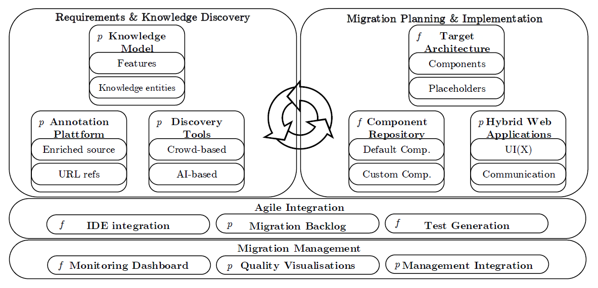
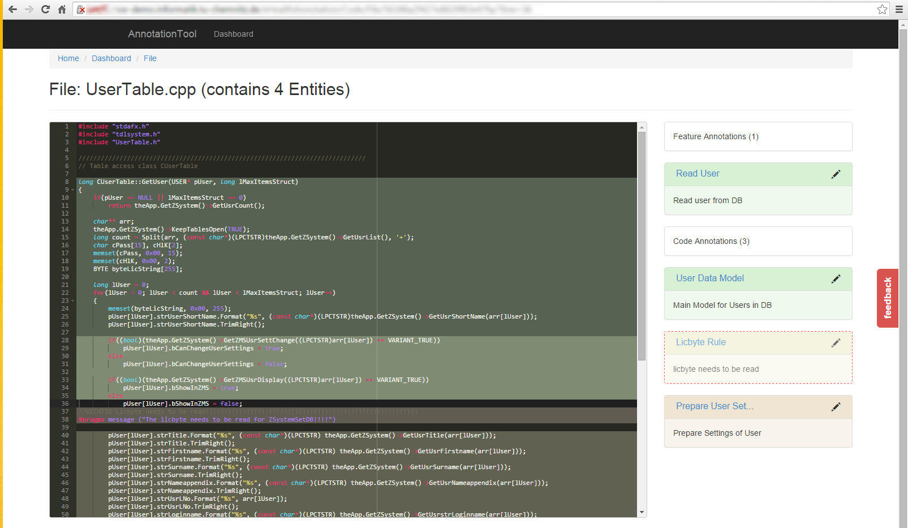
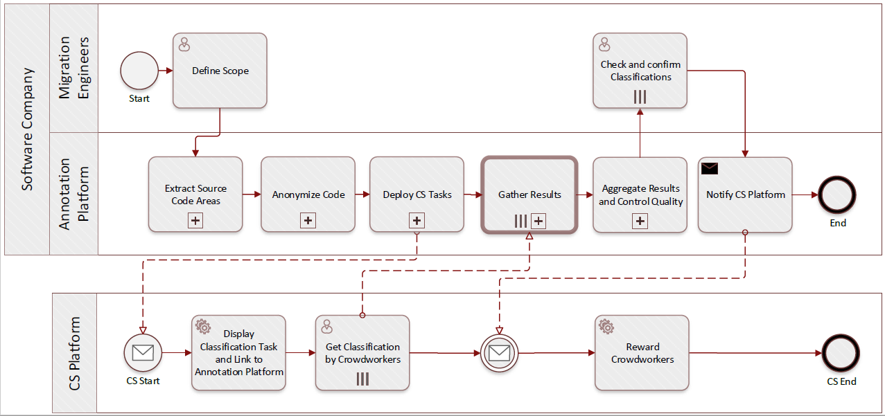
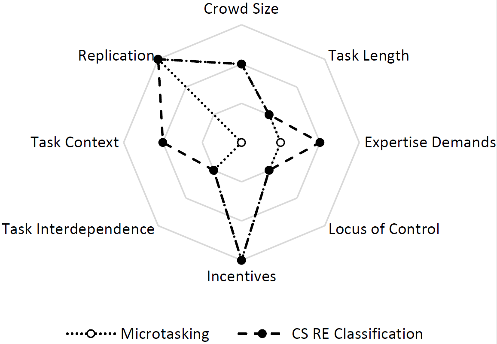
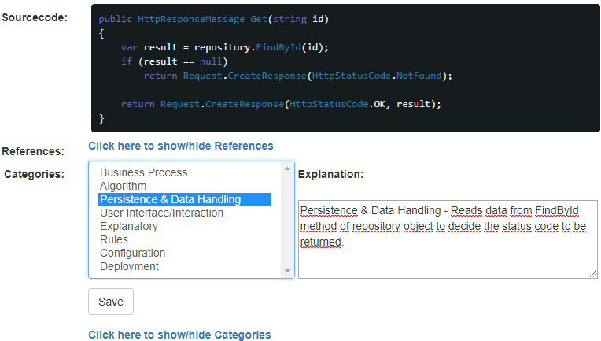

Introduction
============

Situation

-   Web Applications widespread & familiar for users

    -   Web Application definition

        -   Client-Server Architecture

        -   HTTP(S) as main communication protocol

        -   Client is Web Browser/uses HTML Rendering

        -   TODO:CITE

    -   One paragraph on the history of Web Applications (TBL, Web 2.0,
        SOA, Mobile, Cloud/SaaS)

    -   One paragraph on advantages of Web Applications over traditional
        desktop applications

        -   Instant Deployment, Faster Development Cycles, Faster
            Reaction on Changing/New Requirements \> reduced
            time-to-market [@Khadka2014]

        -   One target development platform based on open standards
            HTML, CSS, JS

        -   Low access requirements ("any system with a browser"),
            Ubiquity allows for home office etc.

        -   High level of Interactivity, Social Interactions in
            potentially large user bases, Community-building

    -   Statista SaaS statistics
        <https://www.statista.com/statistics/510333/worldwide-public-cloud-software-as-a-service/>

    -   SaaS market is growing
        <https://www.bettercloud.com/monitor/wp-content/uploads/sites/3/2017/05/2017stateofthesaaspoweredworkplace-report-1.pdf>,
        <https://content.digitalmediastream.co.uk/blog/60-saas-statistics-that-will-change-the-way-you-think>

    -   Legacy Systems replaced by SaaS solutions
        <https://www.gartner.com/newsroom/id/2253215>

    -   Digital Banking established in Germany for internet users
        <https://www.bitkom.org/NP-Marktdaten/Konsum-und-Nutzungsverhalten/E-M-Commerce/Studienbericht-Digital-Banking-2014-bis-2016-161104.pdf>

    -   Arbeit 3.0 Verbreitung von mobilen Geräten, Homeoffice,
        Share-Economy, Einsatz von sozialen Netzwerken, Blogs,
        Collaboration Tools etc.
        <https://www.bitkom.org/noindex/Publikationen/2013/Studien/Studie-Arbeit-3-0/Studie-Arbeit-30.pdf>

    -   

-   Still many non-web legacy systems existing, modernization is still
    an important topic in industry

    -   Legacy System Definition

        -   Reasons for their existence [@Khadka2014] (business-critical,
            perceived as reliable/stable/proven -- never touch a running
            system, optimized performance)

    -   TODO: find statistics
        (<https://docs.google.com/document/d/1iZpumRpQrOuquwLusJk8VzgOS_T1p9oOn1v5nYKWrCo/edit>)

    -   Gartner: legacy modernization at position 5 of top ten buisness
        priorities, 2013

> <https://www.gartner.com/newsroom/id/2304615>, Previous years:
> <http://www.gartner.com/imagesrv/cio/pdf/cio_agenda_insights2013.pdf>

-   NASCIO. State CIO Top Ten Policy and Technology Priorities for 2017,
    position 5:
    <https://www.nascio.org/Portals/0/Publications/Documents/2017/NASCIO-TopTen-2017.pdf>

-   Forrester: Application Modernization: Procrastinate At Your Peril!
    2011

<!-- -->

-   Technical Debt topic attracts attention in academia and industry

    -   Technical debt definition

    -   CAST Report on Application Software Health 2011

    -   Estimating the Principal of an Application\'s Technical Debt,
        IEEE Software.

    -   A systematic mapping study on technical debt and its management,
        Journal of Systems and Software

    -   How do software development teams manage technical debt? -- An
        empirical study, Journal of Systems and Software

Problem statement

-   Making a transition from non-web legacy systems to web is desirable
    for companies

-   BUT: Commencing web migration is hard

    -   Effort

        -   High effort (TODO: Distinguish Big Bang/Incremental
            [@Distante2006]reports 12+PM for one project, [@Bernhart2012]18+ PM for
            incremental approach, [@Aversano2001] 8PM, [@Maenhaut2015] reports about 14 PM
            for two projects), not only including direct development,
            but also training for users etc.

        -   Hard to estimate, cf. Corrective Maintenance Estimation
            [@Singh2015EffortEstimation] and difficult to predict the ROI [@Khadka2014]

    -   Risk

        -   Uncertainty of success/risk of failure due to feasibility
            threats (staff not trained in migration, not trained in web
            development, LS typically complex)

        -   Uncertainty of desirability (acceptance by customers,
            usability of web-based solution)

-   (Existing migration approaches assume decision to migrate is taken
    already)

-   Existing migration approaches do not support initial phase

    -   Cf. phase support from [@Heil2017Survey]

Question

-   How to support companies (SMEs?) to commence web migration

Solution

-   Define web migration process addressing initial fears/resistance

-   Risk minimization through migration pilots (prototypes)

-   Demonstrate desirability and feasibility of web version of legacy
    system

-   Identify and maintain existing valuable knowledge through concept
    assignment platform (annotation platform?)

-   Apply rapid prototyping to web migration

-   Control impact of web migration on customers through measuring
    visible changes

Contributions

-   Decision Support System for SMEs

-   Concept Assignment Process integrated into development and Platform

-   Rapid Migration Prototyping

-   Similarity Metrics for non-web and web UIs

State of the Art
================

Requirements

-   (original Medatixx process requirements 2015)

    -   Existing staff, expertise

    -   Integration into development process

    -   Incremental

    -   Cost and Time efficient

    -   Tool support

-   Support for initial phase

-   Re-use of existing artifacts

-   Experience & Tool Support for SMEs

-   Process Integration

Situation

-   Existing Migration approaches [@Heil2017Survey]

-   Existing Web Engineering approaches

    -   MDWE

        -   WebML IFML (OMG Standard)

        -   UWE [@Koch2008UWE]

        -   SHDM

    -   Agile WE Approaches

        -   AWE [@McDonald2003AWE]

        -   (MockAPI [@Rivero2013MockAPI]/ELECTRA [@Rivero2014Electra] /) MockupDD [@Rivero2013MockupDD]

Problem

-   Migration approaches do not address initial phase [@Heil2017Survey]

-   Migration approaches do not consider SMEs? [@Heil2017Survey]

-   Web Engineering approaches start from scratch, not from legacy

    -   Requirements Elicitation vs Re-Discovery of Requirements

-   Lack of consideration of impact on existing users

Current Solutions

-   TODO: mention Decision Support System for SMEs as contribution
    resulting from [@Heil2017Survey]

-   General Software Migration Approaches

-   Web Engineering Approaches

    -   MDWE

-   Web Migration Approaches

    -   to SOA

    -   to Cloud

    -   Web Systems Evolution

    -   to Web

Answer -- clear stakeholder, scenario/problem

-   Stakeholder: Software Companies (SMEs?) with legacy, non-web,
    desktop applications and large existing user bases

-   Stakeholder Problem: initial hurdle to commence a web migration due
    to doubts about feasibility and desirability

Solution
========

Stakeholder-specific situation

Cf. LFA Problem Tree Analysis from EHRL

-   Software Companies (SMEs) are hesitant to commence a web migration
    because of doubts about feasibility and desirability

-   Feasibility Doubts

    -   Technical: possibility of implementation as web application

    -   Human-Resources: lack of staff with web engineering expertise

    -   Process Integration: limited human resources and problems of
        integrating with ongoing software development process

-   Desirability

    -   Loss of knowledge: risk of losing knowledge

    -   Customers: risk of losing customers because of changed UIX

    -   Advantages: lack of concrete evidence of advantages of a web
        based version

Existing Technologies

-   HCD, Agile Development: Rapid Prototyping

-   Reverse Engineering: Concept Assignment [@Biggerstaff1994ConceptAssignmentJournal], [@Biggerstaff1994ConceptAssignmentICSE]

-   HCI: Usability Metrics

Solution overview

-   AWSM Process & Platform [@Heil2016AWSM]

{width="6.295833333333333in"
height="3.0388888888888888in"}

3 Partial Problems/Questions of Architecture

Define Research Goal and Objectives

-   How to identify and manage problem and solution domain knowledge in
    legacy systems?

<!-- -->

-   How to apply Rapid Prototyping in Web Migration

<!-- -->

-   How to measure the similarity of non-web and web versions of a user
    interface

Identification and Management of knowledge in legacy systems
============================================================

Situation

-   Legacy systems contain valuable problem and solution domain
    knowledge

Existing Technologies

-   Reverse Engineering

    -   Re-documentation

    -   Concept Assignment

        -   "will never be completely automated", but "some useful
            automation is possible" [@Biggerstaff1994ConceptAssignmentJournal]

        -   Two step process: 1 "Identify which entities and relations
            ... are really important" 2 "Assign them to known (or newly
            discovered) domain concepts and relations" [@Biggerstaff1994ConceptAssignmentJournal]

Problem

-   No/poor legacy artifacts: documentation, models, requirements

-   Existing re-documentation approaches focus on solution domain
    knowledge

-   Manual re-documentation is time-consuming & cannot be easily
    integrated into daily software development and maintenance

Question

-   How to identify and manage problem and solution domain knowledge in
    legacy systems?

Solution

-   Concept Assignment with AWSM Platform [@Heil2016AWSM]

{width="6.291666666666667in"
height="3.65625in"}

-   Crowdsourced Reverse Engineering
    [@Heil2018CSRE]{width="6.295833333333333in"
    height="2.9631944444444445in"}

{width="6.295833333333333in"
height="4.358333333333333in"}

Evaluation

-   Experimental Results of CSRE

Rapid Web Migration Prototyping
===============================

Situation

-   Rapid Prototyping is used in early stages of Web Engineering to
    address desirability, feasibility

Existing Technologies

-   Rapid Prototyping in Web Engineering

Problem

-   Web Migration differs from forward Web Engineering

-   Rapid Prototyping has to be adapted to Web Migration Context

Question

-   How to apply Rapid Prototyping in Web Migration

Solution

-   ReWaMP Process [@Heil2018ReWaMP]

-   UI Generation

-   API Generation (MockAPI) [@Rivero2013MockAPI] [@Rivero2014Electra] (1 Journal in progress )

{width="4.804166666666666in"
height="2.8493055555555555in"}

-   WASM-based Prototyping [@Heil2018ReWaMP]

Evaluation

Similarity of User Interfaces in Web and non-Web contexts
=========================================================

Situation

-   Legacy system user base is familiar with and well-adapted to legacy
    user interface

-   Web Migration visibly impacts the user interface

Existing Technologies

-   General Image Similarity Metrics

-   DOM-based UI Analysis

Problem

-   Changes due to Web Migration risk losing users

-   Learning the new Web User Interface requires effort

-   Existing UI similarity approaches cannot be applied to legacy and
    web UIs because they are based on code analysis

Question

-   How to measure the similarity of non-web and web versions of a user
    interface

Solution

-   Similarity Analysis based on visual aspects [@Heil2016Similarity] [@Bakaev2017WebIntelligence] [@Bakaev2017Kansei]

Evaluation

-   Experimental Evaluation with UI pairs and test subjects [@Heil2016Similarity]
    [@Bakaev2017WebIntelligence] [@Bakaev2017Kansei]

Evaluation
==========

Of overall Solution: Situation: Evidence of S1-S3 working, show that S
is working based on S1-S3 (better than SotA if existing)

-   Objective-based Evaluation?

Conclusion & Outlook
====================

References
==========
